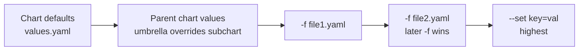

# 06 — Values & Overrides

## Precedence (lowest → highest)

<!-- mermaid:rendered -->
<p align="center"></p>

<details><summary>Mermaid source</summary>

<!-- mermaid:rendered -->
<p align="center"></p>

<details><summary>Mermaid source</summary>

<!-- mermaid:rendered -->
<p align="center"></p>

<details><summary>Mermaid source</summary>



</details>

</details>

</details>

> Right-most wins. `--set` always overrides `-f`.

## Multi-Environment Pattern

```
mychart/
├── values.yaml          # baseline / dev defaults
├── values-dev.yaml
├── values-staging.yaml
└── values-prod.yaml
```

```bash
helm upgrade --install app ./mychart -f values.yaml -f values-prod.yaml -n prod
```

## --set Syntax

| Goal | Syntax |
|---|---|
| Scalar | `--set replicaCount=3` |
| Nested | `--set image.tag=v2` |
| Array | `--set 'envs[0].name=FOO,envs[0].value=bar'` |
| String w/ commas | `--set name="a\,b"` |
| From file | `--set-file dockerconfig=./config.json` |
| String forced | `--set-string image.tag=12345` (avoid number cast) |

## Inspect What's Actually Used

```bash
helm get values <release>           # only user-supplied
helm get values <release> --all     # full computed (defaults + overrides)
helm template <release> ./chart -f vals.yaml | less
```

## Best Practices

- One `values-<env>.yaml` per environment, committed to git.
- Never put secrets in values.yaml — use `helm secrets` (sops) or external secret managers.
- Pin `image.tag` per env. Do not use `latest`.
- Validate with `values.schema.json` (see module 11).
- Avoid deeply nested `--set` in CI; prefer a values file.
