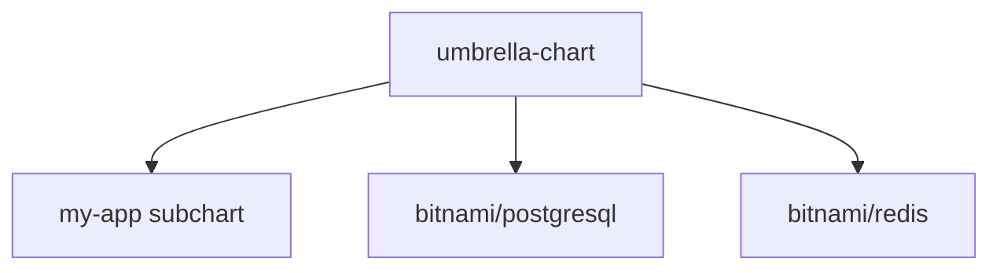

# 07 — Chart Dependencies (Umbrella Charts)

## What is an umbrella chart?

A parent chart that bundles other charts. Useful for deploying a stack (app + db + cache) as one release.

<!-- mermaid:rendered -->
<p align="center"></p>

<details><summary>Mermaid source</summary>

<!-- mermaid:rendered -->
<p align="center"></p>

<details><summary>Mermaid source</summary>

<!-- mermaid:rendered -->
<p align="center"></p>

<details><summary>Mermaid source</summary>



</details>

</details>

</details>

## Declare Dependencies

`Chart.yaml`:
```yaml
apiVersion: v2
name: umbrella
version: 0.1.0
dependencies:
  - name: postgresql
    version: "15.x.x"
    repository: "https://charts.bitnami.com/bitnami"
    condition: postgresql.enabled
    alias: db
  - name: redis
    version: "19.x.x"
    repository: "https://charts.bitnami.com/bitnami"
    tags:
      - cache
```

| Field | Purpose |
|---|---|
| `condition` | Boolean key in values.yaml — disables subchart |
| `tags` | Group multiple deps for batch toggle |
| `alias` | Use under a different name (good for multi-instance) |
| `import-values` | Promote subchart values to parent |

## Workflow

```bash
helm dependency update ./umbrella    # downloads to charts/, writes Chart.lock
helm dependency list ./umbrella
helm dependency build ./umbrella     # rebuild from lock (CI)
```

## Override Subchart Values

```yaml
# parent values.yaml
postgresql:                 # MUST match dep name (or alias)
  enabled: true
  auth:
    postgresPassword: "changeme"
    database: "myapp"
  primary:
    persistence:
      size: 10Gi

redis:
  enabled: false
```

## Install

```bash
helm install stack ./umbrella -n stack --create-namespace
```

See [umbrella-chart-example/](./umbrella-chart-example/).
