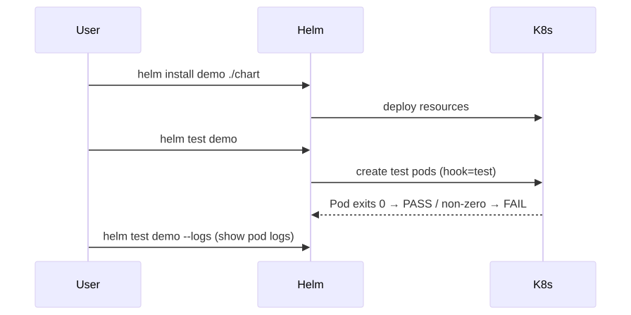
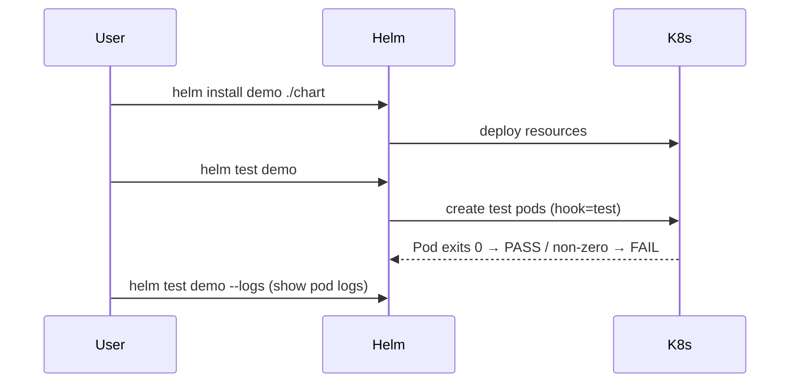

# 09 — Helm Tests

`helm test` runs Pods/Jobs annotated as `helm.sh/hook: test` against a deployed release.

## Flow

<!-- mermaid:rendered -->
<p align="center"></p>

<details><summary>Mermaid source</summary>

<!-- mermaid:rendered -->
<p align="center"></p>

<details><summary>Mermaid source</summary>

<!-- mermaid:rendered -->
<p align="center"></p>

<details><summary>Mermaid source</summary>



</details>

</details>

</details>

## Layout

```
mychart/
└── templates/
    └── tests/
        └── test-connection.yaml
```

## Run

```bash
helm install demo ./mychart
helm test demo
helm test demo --logs       # stream test pod logs
helm test demo --filter name=demo-test-connection
```

## Pattern: Connection Test

See [test-connection.yaml](./test-connection.yaml) — a busybox/wget pod that hits the service and exits 0/1.

## CI Integration

```bash
helm install demo ./mychart --wait --atomic
helm test demo --logs || (helm uninstall demo && exit 1)
helm uninstall demo
```

## Tips

- Always set `hook-delete-policy` so test pods don't accumulate.
- Keep tests fast (< 60s). Long suites belong in proper E2E.
- A failing test rolls back when combined with `--atomic`.
