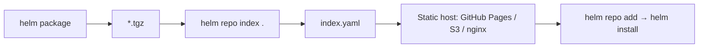

# 10 — Packaging & Publishing

## Package

```bash
helm package ./hello-app
# → hello-app-0.1.0.tgz
helm package ./hello-app --version 0.2.0 --app-version 1.1
```

## Lint Before Publish

```bash
helm lint ./hello-app
helm template ./hello-app | kubectl apply --dry-run=client -f -
```

## Classic HTTP Repository

<!-- mermaid:rendered -->
<p align="center"></p>

<details><summary>Mermaid source</summary>



</details>
```bash
mkdir -p charts/
mv hello-app-0.1.0.tgz charts/
helm repo index charts/ --url https://your.org/charts
# upload charts/ to static host
helm repo add myrepo https://your.org/charts
helm repo update
helm install demo myrepo/hello-app
```

## OCI Registry (Modern, Recommended)

Helm 3 charts can be pushed to any OCI registry: GHCR, ECR, GAR, Harbor, Docker Hub.

```bash
# 1. Login (GHCR uses a PAT with write:packages)
echo $GITHUB_TOKEN | helm registry login ghcr.io -u <github-user> --password-stdin

# 2. Package
helm package ./hello-app   # → hello-app-0.1.0.tgz

# 3. Push
helm push hello-app-0.1.0.tgz oci://ghcr.io/<github-user>

# 4. Install from OCI
helm install demo oci://ghcr.io/<github-user>/hello-app --version 0.1.0

# 5. Pull / inspect
helm pull oci://ghcr.io/<github-user>/hello-app --version 0.1.0
helm show all oci://ghcr.io/<github-user>/hello-app --version 0.1.0
```

## Sign & Verify (provenance)

```bash
helm package ./hello-app --sign --key 'alice@example.com' --keyring ~/.gnupg/secring.gpg
helm verify hello-app-0.1.0.tgz
helm install demo ./hello-app-0.1.0.tgz --verify
```

## CI Skeleton (GitHub Actions)

```yaml
- uses: azure/setup-helm@v4
- run: helm lint ./chart
- run: helm package ./chart
- run: echo "${{ secrets.GHCR_TOKEN }}" | helm registry login ghcr.io -u ${{ github.actor }} --password-stdin
- run: helm push *.tgz oci://ghcr.io/${{ github.repository_owner }}
```
