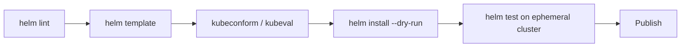

# 11 — Best Practices

## Validation Pipeline

<!-- mermaid:rendered -->
<p align="center"></p>

<details><summary>Mermaid source</summary>



</details>
## Standard Labels (recommended K8s convention)

Always emit these on every resource:

```yaml
labels:
  app.kubernetes.io/name: {{ include "chart.name" . }}
  app.kubernetes.io/instance: {{ .Release.Name }}
  app.kubernetes.io/version: {{ .Chart.AppVersion | quote }}
  app.kubernetes.io/managed-by: {{ .Release.Service }}
  app.kubernetes.io/part-of: <product>
  app.kubernetes.io/component: <component>
  helm.sh/chart: {{ printf "%s-%s" .Chart.Name .Chart.Version }}
```

> **Selector labels must be a stable subset** — `name` + `instance` only. Adding `version` to selectors breaks upgrades.

## Image Tags

- Pin: `image.tag: "1.27.0"` not `latest`.
- Use `--set-string image.tag=12345` to avoid YAML number coercion.
- Override `imagePullPolicy` to `IfNotPresent` for pinned tags, `Always` for floating.

## Secrets

| Don't | Do |
|---|---|
| Commit plaintext in values.yaml | Use sops + helm-secrets plugin |
| Hard-code in templates | External Secrets Operator → SecretStore |
| Use `--set password=` in CI logs | `--set-file password=./secret.txt` |

## values.schema.json

Validate user-supplied values automatically.

```json
{
  "$schema": "https://json-schema.org/draft/2020-12/schema",
  "type": "object",
  "required": ["image", "replicaCount"],
  "properties": {
    "replicaCount": { "type": "integer", "minimum": 1 },
    "image": {
      "type": "object",
      "required": ["repository", "tag"],
      "properties": {
        "repository": { "type": "string" },
        "tag":        { "type": "string" }
      }
    }
  }
}
```

`helm install` will fail fast if values violate the schema.

## Lint

```bash
helm lint ./chart
helm lint ./chart --strict          # warnings → errors
helm lint ./chart --values values-prod.yaml
```

## Universal Rules

1. One chart, one app. Use umbrella for stacks.
2. `Chart.yaml` `version` bumps on **every** template change.
3. Always set resource requests + limits.
4. Always set liveness + readiness probes.
5. Always run as non-root, drop ALL caps, read-only root FS.
6. Always render NOTES.txt with the access URL.
7. Document every value in values.yaml comments.
8. Test rollback: `helm install`, `helm upgrade`, `helm rollback 1`.
9. Avoid CRDs in `templates/` — use `crds/` directory.
10. Never use `latest`. Ever.
