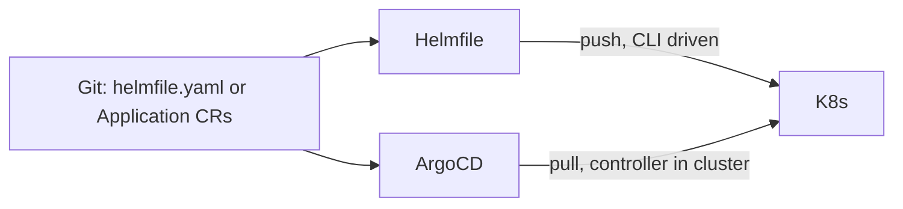

# 12 — Managing Many Releases: Helmfile vs ArgoCD

`helm install` is fine for one chart. Real fleets need declarative orchestration.

## Two Schools

<!-- mermaid:rendered -->
<p align="center"></p>

<details><summary>Mermaid source</summary>



</details>
| | Helmfile | ArgoCD |
|---|---|---|
| Model | Push (CLI from CI) | Pull (in-cluster controller) |
| State | Stateless | Stateful CRDs (`Application`, `AppProject`) |
| GitOps drift detection | No (unless re-run) | Yes (continuous reconcile) |
| UI | None | Yes (rich dashboard) |
| Multi-cluster | Manual context switching | Native (cluster registration) |
| Rollback | `helmfile sync` to old commit | One-click in UI / `argocd app rollback` |
| Best for | Bootstraps, simple pipelines | Production fleet, many teams |

## Helmfile (push)

```yaml
# helmfile.yaml
repositories:
  - name: bitnami
    url: https://charts.bitnami.com/bitnami

releases:
  - name: nginx
    namespace: web
    chart: bitnami/nginx
    version: 18.x.x
    values:
      - values/nginx-{{ .Environment.Name }}.yaml

  - name: postgres
    namespace: data
    chart: bitnami/postgresql
    version: 15.x.x
    values: [values/postgres.yaml]
```

```bash
helmfile -e prod diff
helmfile -e prod apply
helmfile -e prod destroy
```

## ArgoCD ApplicationSet (pull)

One CR generates N Applications from a list/git/cluster generator.

```yaml
apiVersion: argoproj.io/v1alpha1
kind: ApplicationSet
metadata:
  name: hello-app-fleet
  namespace: argocd
spec:
  generators:
    - list:
        elements:
          - cluster: dev
            url:     https://dev.example.com
          - cluster: prod
            url:     https://prod.example.com
  template:
    metadata:
      name: 'hello-{{cluster}}'
    spec:
      project: default
      source:
        repoURL: https://github.com/org/charts
        targetRevision: main
        path: charts/hello-app
        helm:
          valueFiles:
            - values-{{cluster}}.yaml
      destination:
        server: '{{url}}'
        namespace: hello
      syncPolicy:
        automated:
          prune: true
          selfHeal: true
        syncOptions: [CreateNamespace=true]
```

## Decision Matrix

- **Few clusters, CI-driven**: Helmfile.
- **Many clusters, GitOps, audit, RBAC, UI**: ArgoCD (or Flux).
- **Both**: Helmfile to bootstrap ArgoCD itself, then ArgoCD owns everything else.
