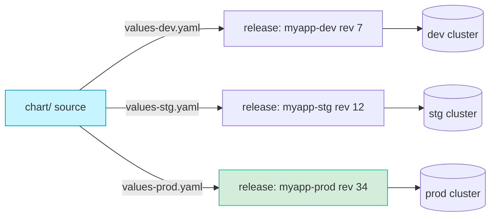
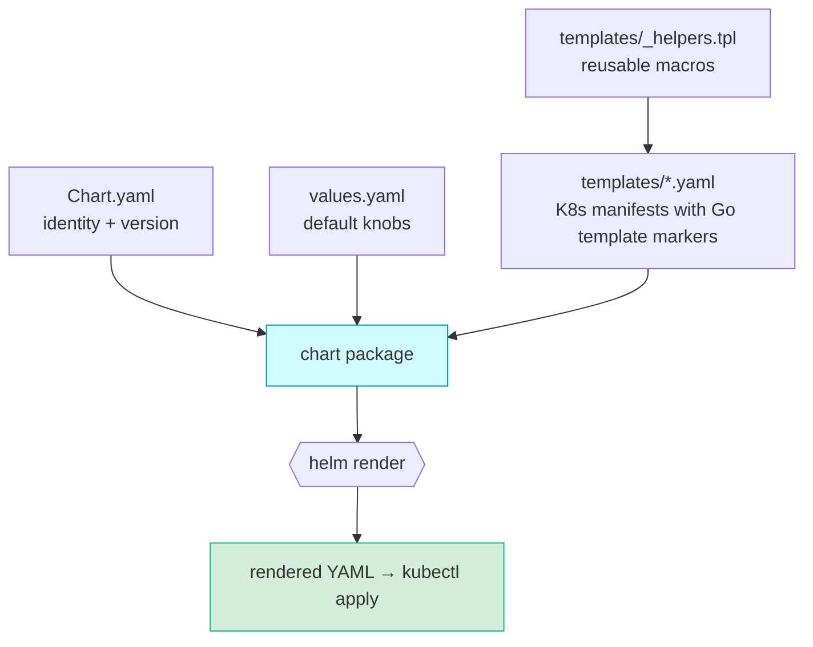
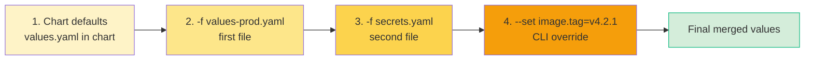
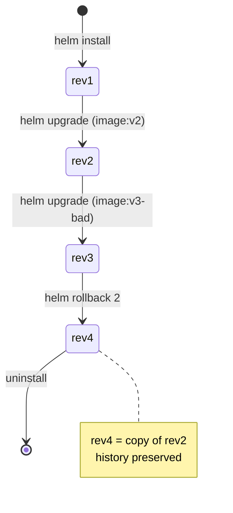
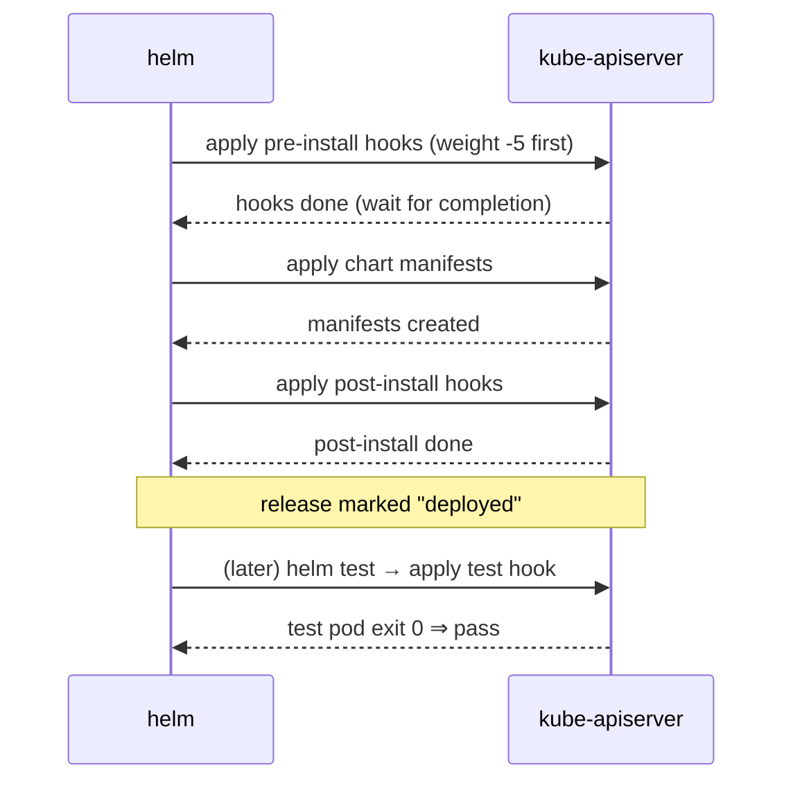
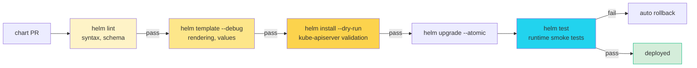
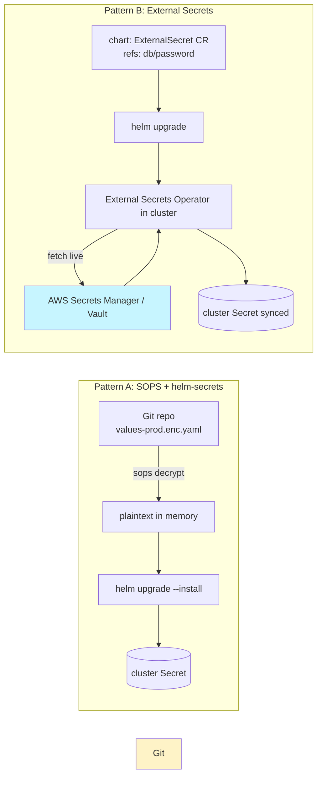
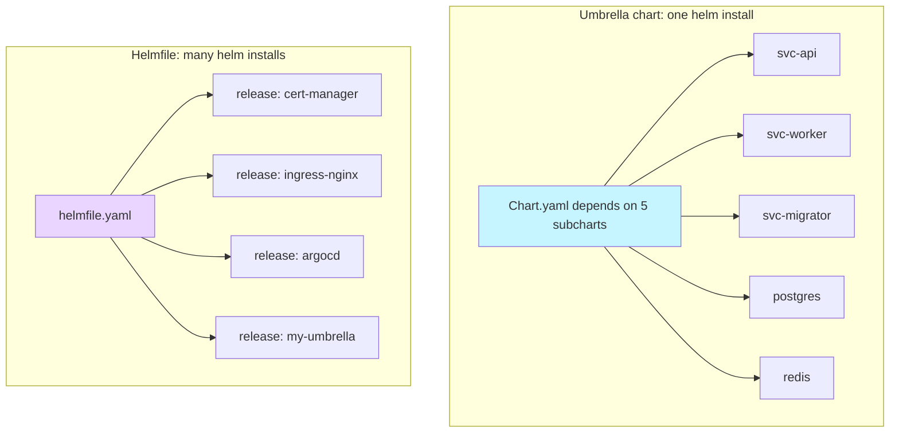
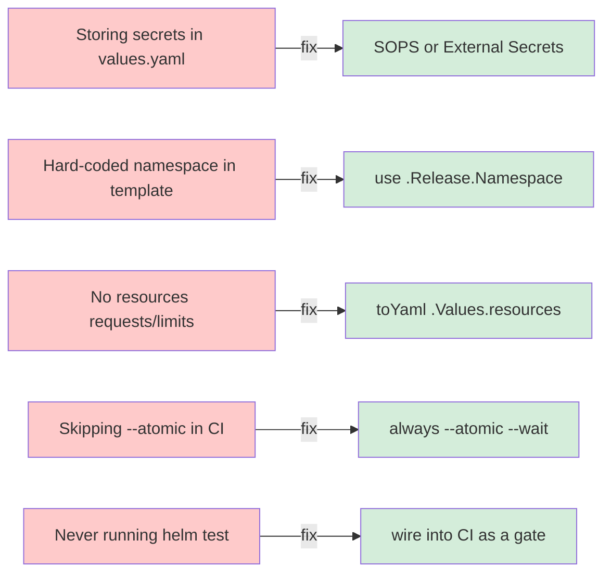
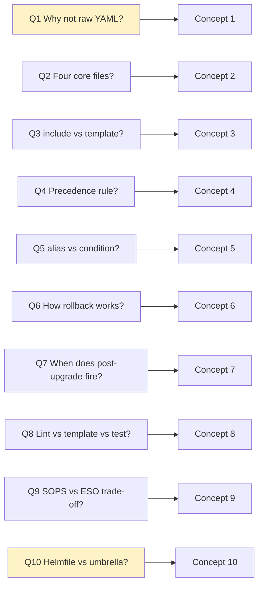

<p class="hero helm"><h1>04 · Helm <em>the cluster's package manager</em></h1><p class="tagline">Ten concepts that turn fourteen copy-pasted manifests into one versioned, rollback-safe release.</p></p>

## Roadmap — your learning path

<div class="roadmap" markdown>

<div class="stop" data-step="1" markdown>
#### Why templating exists
The 14-manifest problem that broke kubectl-only teams.
</div>

<div class="stop" data-step="2" markdown>
#### Chart anatomy
`Chart.yaml`, `values.yaml`, `templates/`, `_helpers.tpl`.
</div>

<div class="stop" data-step="3" markdown>
#### Template syntax
Pipes, functions, range, if/else, include vs template.
</div>

<div class="stop" data-step="4" markdown>
#### Values precedence
defaults → values.yaml → `-f` override → `--set`.
</div>

<div class="stop" data-step="5" markdown>
#### Dependencies & subcharts
`requirements`, alias, condition/tags.
</div>

<div class="stop" data-step="6" markdown>
#### Releases, history, rollback
`helm upgrade --install`, `helm rollback`.
</div>

<div class="stop" data-step="7" markdown>
#### Hooks
pre-install, post-upgrade, test — when each fires.
</div>

<div class="stop" data-step="8" markdown>
#### helm test / lint / template --debug
The three commands that catch 90% of chart bugs before prod.
</div>

<div class="stop" data-step="9" markdown>
#### Secret management
helm-secrets, SOPS, external-secrets pattern.
</div>

<div class="stop" data-step="10" markdown>
#### Umbrella charts + helmfile
Managing many releases declaratively.
</div>

</div>

---

## 1. Why templating exists — the 14-manifest problem

<div class="concept" markdown>

<span class="stage reason">🧭 Reason</span>

**Why this exists.** At 03:00 a Shopify SRE got paged: a checkout service was OOMKilled in `us-east-1` but healthy in `eu-west-1`. Same app. Different clusters. Reason? The team shipped fourteen raw `kubectl apply` manifests per environment. One engineer had bumped the memory limit in `prod.yaml`, forgot to copy the change to `prod-eu.yaml`, and a second engineer silently edited `staging.yaml` by hand the same day. There was no diff. No versioning. No rollback. Just fourteen files rotting in a Git folder, drifting from reality every week. Helm exists to end that drift: one chart, one set of values per environment, one signed tarball per release.

<span class="stage thinking">🧠 Thinking</span>

**Mental model.** One chart, many releases — each release is a version-pinned render of the same template tree.



- One **chart** is a package of templates plus a default `values.yaml`.
- One **release** is a named install of a chart into a cluster — it has a revision history.
- Values are the *only* thing that changes between environments.
- A release is stored as a Kubernetes Secret named `sh.helm.release.v1.<name>.v<rev>`.
- Rollback = point the release pointer at an older revision's manifest blob.

<span class="stage execution">⚡ Execution</span>

**Run it yourself.** Feel the pain first, then watch Helm solve it.

```bash
# 1) Without Helm: 14 manifests, zero versioning
ls deploy/prod/
# deployment-api.yaml    configmap.yaml        ingress-api.yaml
# deployment-worker.yaml secret.yaml           hpa-api.yaml
# service-api.yaml       serviceaccount.yaml   networkpolicy.yaml
# service-worker.yaml    role.yaml             pdb.yaml
# pvc.yaml               rolebinding.yaml

# 2) Count the manifests and how often they change
git log --oneline --since="30 days" deploy/prod/ | wc -l

# 3) With Helm: one chart, one values file per env
helm create myapp
tree myapp -L 2
```

<span class="stage simulation">🔮 Simulation — what you'll see</span>

<pre class="sim"><code><span class="prompt">$</span> git log --oneline --since="30 days" deploy/prod/ | wc -l
<span class="comment"># 47  ← 47 copy-paste drift commits in a month</span>

<span class="prompt">$</span> tree myapp -L 2
<span class="comment"># myapp/</span>
<span class="comment"># ├── Chart.yaml          ← metadata (name, version, appVersion)</span>
<span class="comment"># ├── values.yaml         ← defaults</span>
<span class="comment"># ├── charts/             ← subcharts pulled in by dependencies</span>
<span class="comment"># └── templates/</span>
<span class="comment">#     ├── deployment.yaml</span>
<span class="comment">#     ├── service.yaml</span>
<span class="comment">#     ├── ingress.yaml</span>
<span class="comment">#     ├── _helpers.tpl    ← reusable template fragments</span>
<span class="comment">#     └── NOTES.txt       ← printed after install</span>
</code></pre>

<span class="stage output">✅ Output — state change</span>

<div class="flow" markdown>

<div class="state before" markdown>
##### Before
<span class="diff-del">14 manifests × 3 envs = 42 files</span>
manual diff, silent drift
</div>

<div class="arrow">→</div>

<div class="state during" markdown>
##### During
<span class="diff-mod">helm create myapp</span>
one chart, three values files
</div>

<div class="arrow">→</div>

<div class="state after" markdown>
##### After
<span class="diff-add">1 chart + 3 values + git tags</span>
versioned, rollback-safe
</div>

</div>

<span class="stage usecase">🌍 Real-world use case</span>

<div class="usecase-card" markdown>
**At Deis** (acquired by Microsoft, 2017), Helm was born in November 2015 to solve exactly this problem on their internal PaaS. They found that their own teams were maintaining 40+ YAML files per microservice. The first public commit to helm/helm described it as "a package manager for Kubernetes" modelled on Homebrew. The Deis team later donated Helm to the CNCF; it became a top-level graduated project in 2020. Every modern PaaS — Rancher, OpenShift, GitLab — now ships Helm as the primary application delivery mechanism.
</div>

</div>

---

## 2. Chart anatomy — Chart.yaml, values.yaml, templates/, _helpers.tpl

<div class="concept" markdown>

<span class="stage reason">🧭 Reason</span>

**Why this exists.** A chart is a *contract*. When a Cloudflare platform engineer hands a chart to an application team, the team needs to know three things in under a minute: *What does this install? What can I configure? How do I configure it?* The four-file layout — `Chart.yaml`, `values.yaml`, `templates/`, `_helpers.tpl` — answers all three, and every chart on Artifact Hub follows the same structure. Break the layout and you break discovery: `helm show values` and `helm show chart` stop working, the chart vanishes from catalogues, and onboarding jumps from 5 minutes to an afternoon.

<span class="stage thinking">🧠 Thinking</span>

**Mental model.** Four files, four concerns. Metadata, knobs, manifests, macros.



- `Chart.yaml` — metadata: `name`, `version`, `appVersion`, `dependencies`, `type: application|library`.
- `values.yaml` — the public API of the chart; every user-tunable knob documented here.
- `templates/` — Kubernetes manifests with Go template placeholders (`{{ .Values.image.tag }}`).
- `_helpers.tpl` — named templates (functions) reused across manifests; file name starts with underscore so Helm skips rendering it as a manifest.
- `NOTES.txt` — markdown printed after `helm install`; use it for "how do I reach my app" hints.

<span class="stage execution">⚡ Execution</span>

**Run it yourself.** Scaffold, then pick the skeleton apart.

```bash
# 1) Generate a starter chart
helm create hello-app
cd hello-app

# 2) Inspect the four core files
cat Chart.yaml
head -25 values.yaml
ls templates/
cat templates/_helpers.tpl | head -20

# 3) Render it without a cluster
helm template demo . | head -40
```

<span class="stage simulation">🔮 Simulation — what you'll see</span>

<pre class="sim"><code><span class="prompt">$</span> cat Chart.yaml
<span class="comment"># apiVersion: v2</span>
<span class="comment"># name: hello-app</span>
<span class="comment"># description: A Helm chart for Kubernetes</span>
<span class="comment"># type: application</span>
<span class="comment"># version: 0.1.0          ← chart version (SemVer)</span>
<span class="comment"># appVersion: "1.16.0"    ← app version (free-form string)</span>

<span class="prompt">$</span> cat templates/_helpers.tpl | head -10
<span class="comment"># {{/*</span>
<span class="comment"># Common labels</span>
<span class="comment"># */}}</span>
<span class="comment"># {{- define "hello-app.labels" -}}</span>
<span class="comment"># helm.sh/chart: {{ include "hello-app.chart" . }}</span>
<span class="comment"># {{ include "hello-app.selectorLabels" . }}</span>
<span class="comment"># app.kubernetes.io/managed-by: {{ .Release.Service }}</span>
<span class="comment"># {{- end }}</span>
</code></pre>

<span class="stage output">✅ Output — state change</span>

<div class="flow" markdown>

<div class="state before" markdown>
##### Before
<span class="diff-del">empty directory</span>
no chart structure
</div>

<div class="arrow">→</div>

<div class="state during" markdown>
##### During
<span class="diff-mod">helm create hello-app</span>
scaffold: Chart.yaml + values.yaml + templates/
</div>

<div class="arrow">→</div>

<div class="state after" markdown>
##### After
<span class="diff-add">renderable, lint-passing chart</span>
10 labels standardised, 1 deployment, 1 service
</div>

</div>

<span class="stage usecase">🌍 Real-world use case</span>

<div class="usecase-card" markdown>
**At Bitnami**, the Application Catalog team maintains 200+ charts on Artifact Hub. Every chart — from bitnami/mysql to bitnami/keycloak — uses the exact same four-file layout plus a single `_helpers.tpl` that defines 11 named templates (labels, selectors, fullname, image, etc.) shared verbatim across the catalog. That discipline is what lets a user `helm show values` on any Bitnami chart and immediately know the shape of the `image:`, `persistence:`, and `resources:` sections. Bitnami's chart-reviewer bot rejects any PR that deviates from the template.
</div>

</div>

---

## 3. Template syntax — pipes, functions, range, if/else, include vs template

<div class="concept" markdown>

<span class="stage reason">🧭 Reason</span>

**Why this exists.** Kubernetes manifests are verbose. A production Deployment with probes, resources, imagePullSecrets, affinity, tolerations, and env vars easily tops 120 lines. Multiply that by dev/stg/prod and you stop reading the YAML and start grep-ing for drift. Go template syntax — pipes, `range`, `if`, `include` — collapses those 120 lines into 30 lines of parameterised shape. But the syntax is unforgiving: one missing space inside `{{-` and you get `error calling must: nil pointer evaluating interface`. At GitLab, where every page of gitlab.com ships through a single Helm chart, the template-syntax review is the toughest code review the infra team runs.

<span class="stage thinking">🧠 Thinking</span>

**Mental model.** Helm renders templates in two passes — first `_helpers.tpl` populates the function dictionary, then every `.yaml` file is rendered with access to `.Values`, `.Release`, `.Chart`, and `.Files`.

```mermaid
flowchart LR
  V[values.yaml<br/>user input] --> CTX[Template Context<br/>.Values .Release .Chart]
  H[_helpers.tpl<br/>define blocks] --> CTX
  CTX --> ENG[Go template engine<br/>+ Sprig 120 functions]
  ENG --> P1[Pipe: {{ .Values.x | default y | quote }}]
  ENG --> P2[Range: {{ range .Values.list }}]
  ENG --> P3[If/else: {{ if .Values.enabled }}]
  ENG --> P4[Include vs template]
  P1 & P2 & P3 & P4 --> OUT[rendered YAML]
  style CTX fill:#e9d5ff,stroke:#8b5cf6
  style OUT fill:#d4edda,stroke:#10b981
```

- **Pipes** chain functions left-to-right: `{{ .Values.name | lower | trunc 63 | quote }}`.
- **`range`** iterates lists or maps; inside the loop `.` becomes the current element.
- **`if / else / else if`** — Helm's truthiness: empty string, `0`, `nil`, and `false` are false; everything else is true.
- **`include` vs `template`**: both call named templates, but `include` returns a *string* you can pipe (`{{ include "labels" . | nindent 4 }}`), while `template` writes directly to output and cannot be piped. Always use `include` inside another template.
- **Sprig** adds 120+ functions: `trimSuffix`, `toYaml`, `randAlphaNum`, `b64enc`, `sha256sum`, `regexMatch`, `dict`, `tuple`, `toJson`.

<span class="stage execution">⚡ Execution</span>

**Run it yourself.**

```bash
# 1) A template that uses all five patterns
cat > templates/deployment.yaml <<'EOF'
apiVersion: apps/v1
kind: Deployment
metadata:
  name: {{ include "hello-app.fullname" . }}
  labels:
    {{- include "hello-app.labels" . | nindent 4 }}
spec:
  replicas: {{ .Values.replicaCount | default 1 }}
  selector:
    matchLabels:
      {{- include "hello-app.selectorLabels" . | nindent 6 }}
  template:
    metadata:
      labels:
        {{- include "hello-app.selectorLabels" . | nindent 8 }}
    spec:
      containers:
        - name: app
          image: "{{ .Values.image.repository }}:{{ .Values.image.tag | default .Chart.AppVersion }}"
          {{- if .Values.env }}
          env:
            {{- range $k, $v := .Values.env }}
            - name: {{ $k }}
              value: {{ $v | quote }}
            {{- end }}
          {{- end }}
          resources:
            {{- toYaml .Values.resources | nindent 12 }}
EOF

# 2) Render it
helm template demo . --set env.LOG_LEVEL=debug --set env.REGION=us-east-1

# 3) Break it deliberately — see the error message
helm template demo . --set replicaCount=hello
```

<span class="stage simulation">🔮 Simulation — what you'll see</span>

<pre class="sim"><code><span class="prompt">$</span> helm template demo . --set env.LOG_LEVEL=debug --set env.REGION=us-east-1 | head -25
<span class="comment"># apiVersion: apps/v1</span>
<span class="comment"># kind: Deployment</span>
<span class="comment"># metadata:</span>
<span class="comment">#   name: demo-hello-app</span>
<span class="comment">#   labels:</span>
<span class="comment">#     helm.sh/chart: hello-app-0.1.0</span>
<span class="comment">#     app.kubernetes.io/name: hello-app</span>
<span class="comment">#     app.kubernetes.io/instance: demo</span>
<span class="comment"># spec:</span>
<span class="comment">#   replicas: 1</span>
<span class="comment">#   template:</span>
<span class="comment">#     spec:</span>
<span class="comment">#       containers:</span>
<span class="comment">#         - name: app</span>
<span class="comment">#           image: "nginx:1.16.0"</span>
<span class="comment">#           env:</span>
<span class="comment">#             - name: LOG_LEVEL</span>
<span class="comment">#               value: "debug"</span>
<span class="comment">#             - name: REGION</span>
<span class="comment">#               value: "us-east-1"</span>

<span class="prompt">$</span> helm template demo . --set replicaCount=hello
<span class="comment"># Error: template: hello-app/templates/deployment.yaml:9:16:</span>
<span class="comment"># executing "..." at &lt;.Values.replicaCount&gt;: wrong type</span>
<span class="comment"># for value; expected int; got string</span>
</code></pre>

<span class="stage output">✅ Output — state change</span>

<div class="flow" markdown>

<div class="state before" markdown>
##### Before
<span class="diff-del">120-line static deployment.yaml</span>
copy-paste per env
</div>

<div class="arrow">→</div>

<div class="state during" markdown>
##### During
<span class="diff-mod">pipes + range + if + include</span>
30 lines, parameterised
</div>

<div class="arrow">→</div>

<div class="state after" markdown>
##### After
<span class="diff-add">one template, N environments</span>
rendered YAML always identical shape
</div>

</div>

<span class="stage usecase">🌍 Real-world use case</span>

<div class="usecase-card" markdown>
**At GitLab**, the entire `gitlab/gitlab` umbrella chart — which deploys gitlab.com and every self-managed install — uses `{{ include "gitlab.common-labels" . | nindent 4 }}` exactly 143 times across 90+ templates. When the team renamed the label from `release:` to `app.kubernetes.io/instance:` to match the Kubernetes recommended-labels spec, the change was a one-line edit in `_helpers.tpl`. Without `include`, that rename would have been a 143-file pull request.
</div>

</div>

---

## 4. Values precedence — defaults → values.yaml → -f override → --set

<div class="concept" markdown>

<span class="stage reason">🧭 Reason</span>

**Why this exists.** At 02:45 a Cloudflare deploy failed because an engineer typed `--set image.tag=v4.2.0` at the CLI while a teammate simultaneously merged `values-prod.yaml` bumping the tag to `v4.2.1`. Which tag wins? Without a clear precedence rule, you have a race. Helm's precedence chain is the rule: `chart defaults < values.yaml in chart < -f files in order < --set in order`. Last write wins. Knowing this chain by heart prevents the "but it worked on my machine" class of outage where two values sources silently disagreed.

<span class="stage thinking">🧠 Thinking</span>

**Mental model.** Four layers, each overrides the last. Rightmost flag wins.



- Chart's own `values.yaml` supplies defaults for every key.
- `-f file.yaml` can be passed multiple times; later files override earlier ones, key by key.
- `--set` uses dotted paths: `--set image.tag=v2` is equivalent to `{image: {tag: v2}}` in a file.
- `--set-string` forces a value to string (useful for tags like `1.0`, which would otherwise be parsed as float).
- `--set-file key=path` reads a file's content into a key — used for TLS certs inline.
- Inspect final merged values with `helm get values <release> --all`.

<span class="stage execution">⚡ Execution</span>

**Run it yourself.** Watch precedence by flipping one knob per layer.

```bash
# 1) Default in chart
grep "replicaCount" values.yaml
# replicaCount: 1

# 2) Add an override file
cat > ci.yaml <<'EOF'
replicaCount: 2
image:
  tag: "staging"
EOF

# 3) Render with precedence stack
helm template demo . \
  -f ci.yaml \
  --set replicaCount=5 \
  --set image.tag=v3 | grep -E "replicas|image:"

# 4) What the release actually received
helm install demo . -f ci.yaml --set replicaCount=5
helm get values demo --all | grep -E "replicaCount|tag"
```

<span class="stage simulation">🔮 Simulation — what you'll see</span>

<pre class="sim"><code><span class="prompt">$</span> helm template demo . -f ci.yaml --set replicaCount=5 --set image.tag=v3 | grep -E "replicas|image:"
<span class="comment">#   replicas: 5              ← --set wins over ci.yaml (2) and default (1)</span>
<span class="comment">#   image: "nginx:v3"        ← --set wins over ci.yaml ("staging") and default (1.16.0)</span>

<span class="prompt">$</span> helm get values demo --all | head -10
<span class="comment"># COMPUTED VALUES:</span>
<span class="comment"># image:</span>
<span class="comment">#   pullPolicy: IfNotPresent</span>
<span class="comment">#   repository: nginx</span>
<span class="comment">#   tag: v3</span>
<span class="comment"># replicaCount: 5</span>
</code></pre>

<span class="stage output">✅ Output — state change</span>

<div class="flow" markdown>

<div class="state before" markdown>
##### Before
<span class="diff-del">chart default</span>
replicas=1, tag=1.16.0
</div>

<div class="arrow">→</div>

<div class="state during" markdown>
##### During
<span class="diff-mod">-f ci.yaml then --set</span>
four layers merge right-to-left
</div>

<div class="arrow">→</div>

<div class="state after" markdown>
##### After
<span class="diff-add">replicas=5, tag=v3</span>
stored in release Secret
</div>

</div>

<span class="stage usecase">🌍 Real-world use case</span>

<div class="usecase-card" markdown>
**At Shopify**, every Kubernetes deploy runs through a CI pipeline that composes `-f base.yaml -f region-${REGION}.yaml -f tenant-${TENANT}.yaml --set image.tag=${SHA}`. The base layer defines sane defaults; region layers set zone-specific tolerations; tenant layers override resource limits for large merchants. The `--set image.tag=${SHA}` at the end guarantees the freshly built image always wins the merge. Shopify's internal runbook calls it "the onion" — and the onion has never leaked a tag mismatch in three years of shipping.
</div>

</div>

---

## 5. Dependencies & subcharts — requirements, alias, condition/tags

<div class="concept" markdown>

<span class="stage reason">🧭 Reason</span>

**Why this exists.** Real apps don't ship alone. A typical SaaS deployment needs Postgres, Redis, RabbitMQ, and a metrics sidecar — five charts. You *could* install each separately with five `helm install` commands, but now you've lost atomicity: if Redis fails to start you must manually roll back four other releases. Dependencies solve that: list the subcharts in `Chart.yaml` and Helm installs them as *one* release. The `alias` field lets you depend on the same chart twice (primary + replica Redis); `condition` and `tags` let consumers enable/disable whole subcharts with a flag.

<span class="stage thinking">🧠 Thinking</span>

**Mental model.** Umbrella chart wraps N subcharts. `helm dependency update` pulls tarballs into `charts/`. Rendering inlines them all.

```mermaid
flowchart TB
  U[Umbrella chart<br/>Chart.yaml] -->|depends on| P[postgresql<br/>bitnami 13.x]
  U -->|depends on alias: cache-primary| R1[redis]
  U -->|depends on alias: cache-replica<br/>condition: cache-replica.enabled| R2[redis]
  U -->|depends on tags: [monitoring]| PM[prometheus]
  subgraph install[helm install myrelease]
    P
    R1
    R2
    PM
  end
  style U fill:#c7f5ff,stroke:#0891b2
  style install fill:#d4edda
```

- Declared in `Chart.yaml` under `dependencies:` (apiVersion v2) or `requirements.yaml` (v1, legacy).
- `alias:` lets you depend on the same chart multiple times with different names.
- `condition: redis.enabled` — Helm installs the subchart only when that values key is true.
- `tags: [monitoring, observability]` — bundle-level toggle for a group of subcharts.
- `helm dependency update` downloads deps into `charts/` and writes `Chart.lock`.
- Subchart values live under the subchart name: `redis: { auth: { password: ... } }`.

<span class="stage execution">⚡ Execution</span>

**Run it yourself.**

```bash
# 1) Declare two deps with alias and condition
cat > Chart.yaml <<'EOF'
apiVersion: v2
name: saas-app
version: 0.1.0
dependencies:
  - name: postgresql
    version: "13.x"
    repository: "https://charts.bitnami.com/bitnami"
  - name: redis
    alias: cache-primary
    version: "18.x"
    repository: "https://charts.bitnami.com/bitnami"
  - name: redis
    alias: cache-replica
    version: "18.x"
    repository: "https://charts.bitnami.com/bitnami"
    condition: cache-replica.enabled
EOF

# 2) Fetch subcharts
helm dependency update

# 3) Inspect the lock
cat Chart.lock

# 4) Install with one subchart toggled off
helm install demo . --set cache-replica.enabled=false --dry-run | grep "kind: "
```

<span class="stage simulation">🔮 Simulation — what you'll see</span>

<pre class="sim"><code><span class="prompt">$</span> helm dependency update
<span class="comment"># Hang tight while we grab the latest from your chart repositories...</span>
<span class="comment"># Saving 3 charts</span>
<span class="comment"># Downloading postgresql from repo https://charts.bitnami.com/bitnami</span>
<span class="comment"># Downloading redis from repo https://charts.bitnami.com/bitnami</span>
<span class="comment"># Downloading redis from repo https://charts.bitnami.com/bitnami</span>
<span class="comment"># Deleting outdated charts</span>

<span class="prompt">$</span> ls charts/
<span class="comment"># postgresql-13.4.3.tgz  redis-18.1.2.tgz  redis-18.1.2.tgz</span>

<span class="prompt">$</span> helm install demo . --set cache-replica.enabled=false --dry-run | grep "kind: "
<span class="comment"># kind: StatefulSet          ← postgres</span>
<span class="comment"># kind: StatefulSet          ← cache-primary</span>
<span class="comment"># kind: Service              ← postgres svc</span>
<span class="comment"># kind: Service              ← cache-primary svc</span>
<span class="comment"># (no cache-replica — condition was false)</span>
</code></pre>

<span class="stage output">✅ Output — state change</span>

<div class="flow" markdown>

<div class="state before" markdown>
##### Before
<span class="diff-del">5 separate helm installs</span>
no atomicity
</div>

<div class="arrow">→</div>

<div class="state during" markdown>
##### During
<span class="diff-mod">dependency update + install</span>
one release, 3 subcharts inlined
</div>

<div class="arrow">→</div>

<div class="state after" markdown>
##### After
<span class="diff-add">atomic install + rollback</span>
rollback undoes all 3 at once
</div>

</div>

<span class="stage usecase">🌍 Real-world use case</span>

<div class="usecase-card" markdown>
**At GitLab**, the flagship `gitlab/gitlab` chart depends on 13 subcharts — postgresql, redis, minio, registry, gitaly, praefect, sidekiq, webservice, mailroom, prometheus, gitlab-runner, cert-manager, and nginx-ingress. Toggling `global.registry.enabled: false` disables the container registry subchart plus its services, ingresses, and secrets in one flag flip. The GitLab Helm chart is published weekly; its `Chart.lock` is committed to Git so every customer gets the exact same subchart versions the GitLab test suite validated against.
</div>

</div>

---

## 6. Releases, history, rollback — helm upgrade --install, helm rollback

<div class="concept" markdown>

<span class="stage reason">🧭 Reason</span>

**Why this exists.** At 03:17 a bad image tag shipped to prod. The new pods crashloop. The fastest recovery is not `git revert`, not `kubectl rollout undo`, but `helm rollback myapp 42`. Helm keeps the last 10 revisions of a release as Kubernetes Secrets (by default); each revision includes the exact manifest YAML that was applied. `rollback` re-applies that frozen manifest and increments the revision counter. Most teams don't realise the SRE advantage until their first incident — then `helm history` and `helm rollback` become the two most-typed commands in their shell.

<span class="stage thinking">🧠 Thinking</span>

**Mental model.** A release is a linked list of revisions stored as Secrets. Rollback creates a *new* revision that is a copy of an old one — never rewrites history.



- `helm install <rel> <chart>` creates revision 1.
- `helm upgrade <rel> <chart>` creates revision N+1; bumps the release pointer.
- `helm upgrade --install` (a.k.a. "upsert") installs if missing, upgrades if present — safe for CI.
- `helm history <rel>` lists all revisions with status (deployed, superseded, failed).
- `helm rollback <rel> <rev>` creates a new revision by copying `<rev>`'s manifest.
- `--atomic` makes install/upgrade auto-rollback on failure; combine with `--wait` and `--timeout`.
- By default only the last 10 revisions are kept — tune with `--history-max`.

<span class="stage execution">⚡ Execution</span>

**Run it yourself.**

```bash
# 1) Install
helm upgrade --install myapp . --set image.tag=v1 --atomic --wait

# 2) Upgrade to a bad tag (will crashloop)
helm upgrade --install myapp . --set image.tag=does-not-exist --atomic --wait || true

# 3) See history
helm history myapp

# 4) Roll back to the last good revision
helm rollback myapp 1

# 5) Confirm
helm history myapp
kubectl get pods -l app.kubernetes.io/instance=myapp
```

<span class="stage simulation">🔮 Simulation — what you'll see</span>

<pre class="sim"><code><span class="prompt">$</span> helm upgrade --install myapp . --set image.tag=does-not-exist --atomic --wait
<span class="comment"># Release "myapp" has been upgraded. Happy Helming!</span>
<span class="comment"># Error: UPGRADE FAILED: timed out waiting for the condition</span>
<span class="comment"># Rolling back (--atomic enabled)</span>

<span class="prompt">$</span> helm history myapp
<span class="comment"># REVISION  STATUS       CHART           DESCRIPTION</span>
<span class="comment"># 1         superseded   hello-app-0.1.0 Install complete</span>
<span class="comment"># 2         failed       hello-app-0.1.0 Upgrade "myapp" failed: timed out</span>
<span class="comment"># 3         deployed     hello-app-0.1.0 Rollback to 1</span>

<span class="prompt">$</span> kubectl get pods -l app.kubernetes.io/instance=myapp
<span class="comment"># NAME                     READY   STATUS    RESTARTS   AGE</span>
<span class="comment"># myapp-5c87f9c6db-4wt8p   1/1     Running   0          35s</span>
</code></pre>

<span class="stage output">✅ Output — state change</span>

<div class="flow" markdown>

<div class="state before" markdown>
##### Before
<span class="diff-del">rev 2 failed — pods crashlooping</span>
service degraded
</div>

<div class="arrow">→</div>

<div class="state during" markdown>
##### During
<span class="diff-mod">helm rollback myapp 1</span>
copies rev1 manifest into new rev3
</div>

<div class="arrow">→</div>

<div class="state after" markdown>
##### After
<span class="diff-add">rev 3 deployed — service healthy</span>
history kept (rev1, rev2, rev3)
</div>

</div>

<span class="stage usecase">🌍 Real-world use case</span>

<div class="usecase-card" markdown>
**At Cloudflare**, every edge service deploy is `helm upgrade --install <svc> <chart> --atomic --wait --timeout 10m`. The `--atomic` flag is non-negotiable: if any pod fails its readiness probe during a rollout, Helm automatically triggers a rollback to the previous revision before the deploy-pipeline job exits. Pair that with `helm history` piped into their internal change-log tool, and SREs can see *every* prod change from the last 30 days with one `helm history` command — including which engineer triggered the rollback.
</div>

</div>

---

## 7. Hooks — pre-install, post-upgrade, test (when each fires)

<div class="concept" markdown>

<span class="stage reason">🧭 Reason</span>

**Why this exists.** Some work must run *around* the main manifests, not alongside them. A database migration has to complete *before* the new app pods start, or they'll crash. A cache warm-up should run *after* the rollout succeeds. A smoke test should run *after* the release but only on demand. Hooks mark a manifest with an annotation — `"helm.sh/hook": pre-install,pre-upgrade` — and Helm applies and waits on it at the right moment, independent of the rest of the release.

<span class="stage thinking">🧠 Thinking</span>

**Mental model.** Lifecycle timeline. Each hook weight defines ordering within a phase.



- Annotation: `"helm.sh/hook": pre-install,pre-upgrade,post-install,post-upgrade,pre-delete,post-delete,test,test-failure` (comma-separated).
- `"helm.sh/hook-weight": "5"` orders hooks within a phase (lower runs first).
- `"helm.sh/hook-delete-policy": before-hook-creation,hook-succeeded,hook-failed` — controls when Helm cleans up the Job/Pod.
- Hook resources are *not* tracked in release history — they're ephemeral by default.
- `helm test <release>` runs only resources tagged `"helm.sh/hook": test`.
- Common pattern: a Job for DB migration with `pre-upgrade` + `hook-weight: "-5"` + `hook-delete-policy: hook-succeeded`.

<span class="stage execution">⚡ Execution</span>

**Run it yourself.**

```bash
# 1) Write a pre-upgrade migration hook
cat > templates/db-migrate-job.yaml <<'EOF'
apiVersion: batch/v1
kind: Job
metadata:
  name: {{ include "hello-app.fullname" . }}-migrate
  annotations:
    "helm.sh/hook": pre-install,pre-upgrade
    "helm.sh/hook-weight": "-5"
    "helm.sh/hook-delete-policy": before-hook-creation,hook-succeeded
spec:
  template:
    spec:
      restartPolicy: Never
      containers:
        - name: migrate
          image: "{{ .Values.image.repository }}:{{ .Values.image.tag }}"
          command: ["sh","-c","echo 'running migrations'; sleep 3; echo 'done'"]
EOF

# 2) Write a test hook
cat > templates/tests/test-connection.yaml <<'EOF'
apiVersion: v1
kind: Pod
metadata:
  name: {{ include "hello-app.fullname" . }}-test-connection
  annotations:
    "helm.sh/hook": test
    "helm.sh/hook-delete-policy": hook-succeeded
spec:
  restartPolicy: Never
  containers:
    - name: curl
      image: curlimages/curl:latest
      command: ["curl","-sSf","http://{{ include "hello-app.fullname" . }}/"]
EOF

# 3) Upgrade (watch the pre-upgrade Job run first)
helm upgrade --install demo . --set image.tag=v2 --wait

# 4) Run tests
helm test demo --logs
```

<span class="stage simulation">🔮 Simulation — what you'll see</span>

<pre class="sim"><code><span class="prompt">$</span> helm upgrade --install demo . --set image.tag=v2 --wait
<span class="comment"># Release "demo" has been upgraded. Happy Helming!</span>
<span class="comment"># NAME: demo</span>
<span class="comment"># LAST DEPLOYED: Fri Apr 27 03:12:44 2026</span>
<span class="comment"># STATUS: deployed</span>
<span class="comment"># REVISION: 2</span>
<span class="comment"># HOOKS:</span>
<span class="comment">#   demo-hello-app-migrate   Job    Succeeded   (pre-upgrade)</span>

<span class="prompt">$</span> helm test demo --logs
<span class="comment"># NAME: demo</span>
<span class="comment"># TEST SUITE: demo-hello-app-test-connection</span>
<span class="comment"># Last Started:   Fri Apr 27 03:13:12 2026</span>
<span class="comment"># Last Completed: Fri Apr 27 03:13:14 2026</span>
<span class="comment"># Phase:          Succeeded</span>
<span class="comment">#</span>
<span class="comment"># POD LOGS:</span>
<span class="comment">#   curl: connected; 200 OK; 612 bytes</span>
</code></pre>

<span class="stage output">✅ Output — state change</span>

<div class="flow" markdown>

<div class="state before" markdown>
##### Before
<span class="diff-del">no pre-upgrade migration</span>
new pods crash on old schema
</div>

<div class="arrow">→</div>

<div class="state during" markdown>
##### During
<span class="diff-mod">pre-upgrade Job runs, new pods wait</span>
hook-weight -5 ensures migration first
</div>

<div class="arrow">→</div>

<div class="state after" markdown>
##### After
<span class="diff-add">migration OK + app healthy + test pass</span>
Job deleted (hook-succeeded)
</div>

</div>

<span class="stage usecase">🌍 Real-world use case</span>

<div class="usecase-card" markdown>
**At GitLab**, every gitlab.com deploy runs a `pre-upgrade` hook that calls `rails db:migrate` in a Job. If the migration exits non-zero, Helm aborts the upgrade; the previous revision remains deployed. On top of that, a `post-upgrade` hook runs `rake gitlab:env:info` to seed per-region configuration. Finally, their CI calls `helm test` after every deploy — one Pod per hook marked `test` pings the health endpoint, checks registry auth, and exercises a minimal GraphQL query. Without hooks, GitLab would need an out-of-band migration pipeline wired to every deploy.
</div>

</div>

---

## 8. helm test & helm lint & helm template --debug

<div class="concept" markdown>

<span class="stage reason">🧭 Reason</span>

**Why this exists.** Charts fail in three distinct ways: **syntax errors** (unclosed `{{`, wrong indent) caught by `helm lint`; **render errors** (nil pointer on missing values) caught by `helm template --debug`; **runtime errors** (wrong URL, missing service account) caught by `helm test`. Running all three in CI before `helm upgrade` blocks 90% of prod outages. A Bitnami chart-CI bot runs all three plus `helm unittest` on every PR — that discipline is why their 200+ charts rarely regress.

<span class="stage thinking">🧠 Thinking</span>

**Mental model.** Three ever-tightening gates, each catching a different class of bug.



- `helm lint <chart>` — static checks: required fields in `Chart.yaml`, schema violations in `values.yaml`, unused values.
- `helm template <rel> <chart> --debug` — renders everything and prints errors with line numbers + resolved values at the top.
- `helm install --dry-run --debug` — renders *and* sends to kube-apiserver for validation (catches CRD mismatches).
- `helm test <release>` — runs Pods tagged `"helm.sh/hook": test`; exit code 0 = pass.
- `--logs` flag on `helm test` streams the test Pod's stdout so you see *why* it failed.
- Pair with [helm-unittest](https://github.com/helm-unittest/helm-unittest) for table-driven tests per template.

<span class="stage execution">⚡ Execution</span>

**Run it yourself.**

```bash
# 1) Lint
helm lint .
# ==> Linting .
# [INFO] Chart.yaml: icon is recommended
# 1 chart(s) linted, 0 chart(s) failed

# 2) Render with debug (add a broken value to trigger error)
helm template demo . --debug --set image={}

# 3) Dry-run against cluster (catches CRD issues)
helm install demo . --dry-run --debug | tail -30

# 4) Run tests post-install
helm install demo .
helm test demo --logs

# 5) Bonus: schema validation
cat > values.schema.json <<'EOF'
{ "$schema": "http://json-schema.org/draft-07/schema#",
  "required": ["image"],
  "properties": { "replicaCount": { "type": "integer", "minimum": 1 } } }
EOF
helm lint . --strict
```

<span class="stage simulation">🔮 Simulation — what you'll see</span>

<pre class="sim"><code><span class="prompt">$</span> helm template demo . --debug --set image={}
<span class="comment"># install.go:194: [debug] Original chart version: ""</span>
<span class="comment"># Error: template: hello-app/templates/deployment.yaml:18:24:</span>
<span class="comment">#   executing "hello-app/templates/deployment.yaml" at &lt;.Values.image.repository&gt;:</span>
<span class="comment">#   nil pointer evaluating interface {}.repository</span>
<span class="comment">#</span>
<span class="comment"># USER-SUPPLIED VALUES:</span>
<span class="comment"># image: {}</span>
<span class="comment">#</span>
<span class="comment"># COMPUTED VALUES:</span>
<span class="comment"># image: {}</span>
<span class="comment"># replicaCount: 1</span>

<span class="prompt">$</span> helm lint . --strict
<span class="comment"># ==> Linting .</span>
<span class="comment"># [ERROR] values.yaml: - replicaCount: Must be greater than or equal to 1</span>
<span class="comment"># Error: 1 chart(s) linted, 1 chart(s) failed</span>
</code></pre>

<span class="stage output">✅ Output — state change</span>

<div class="flow" markdown>

<div class="state before" markdown>
##### Before
<span class="diff-del">broken chart merged to main</span>
deploy fails in prod at 03:00
</div>

<div class="arrow">→</div>

<div class="state during" markdown>
##### During
<span class="diff-mod">lint + template --debug + test</span>
CI blocks bad PR before merge
</div>

<div class="arrow">→</div>

<div class="state after" markdown>
##### After
<span class="diff-add">schema + render + runtime verified</span>
green pipeline, shipped with confidence
</div>

</div>

<span class="stage usecase">🌍 Real-world use case</span>

<div class="usecase-card" markdown>
**At Bitnami**, every chart PR on github.com/bitnami/charts runs a matrix CI job that executes `helm lint --strict`, `helm template` against all supported Kubernetes versions (1.26 through 1.30), and `helm install + helm test` on a kind cluster. A single failing render on any K8s minor version blocks the merge. That pipeline catches the ~1 in 20 PRs that break the chart on an older K8s API version before any downstream user — including WordPress.com, GitLab's self-managed installs, and tens of thousands of Artifact Hub consumers — would see it.
</div>

</div>

---

## 9. Secret management — helm-secrets, SOPS, external-secrets pattern

<div class="concept" markdown>

<span class="stage reason">🧭 Reason</span>

**Why this exists.** Committing a plaintext `values-prod.yaml` containing database passwords to Git is a CVE waiting to happen. Encrypting the whole file ties you to one key holder. The battle-tested answer has three layers: **SOPS** encrypts only the *values* of sensitive keys in a YAML file (leaving keys and structure readable for diffs); **helm-secrets** is a Helm plugin that wraps SOPS so you can pass `secrets.yaml` to `helm upgrade` directly; **External Secrets Operator** goes further — your chart ships *references* to a secret backend (AWS Secrets Manager, Vault, GCP Secret Manager), and ESO injects the live values as Kubernetes Secrets at runtime. Pick based on your trust model.

<span class="stage thinking">🧠 Thinking</span>

**Mental model.** Two patterns, different trust boundaries.



- **SOPS (Mozilla)** — encrypts only string values; supports KMS, GPG, age keys. File stays valid YAML.
- **helm-secrets** — plugin: `helm secrets upgrade -f secrets.enc.yaml <rel> <chart>` decrypts on the fly.
- **External Secrets Operator (ESO)** — in-cluster controller. Your chart defines `ExternalSecret` CRs pointing at an external vault; ESO materialises real `Secret` objects.
- Never `helm install --set password=...` in shell history — CLI args are captured in `/proc` and `.bash_history`.
- Rotate KMS key quarterly; rotate SOPS-encrypted file on key rotation via `sops updatekeys`.

<span class="stage execution">⚡ Execution</span>

**Run it yourself.**

```bash
# 1) Install helm-secrets + SOPS
helm plugin install https://github.com/jkroepke/helm-secrets
brew install sops age

# 2) Generate an age key
age-keygen -o ~/.config/sops/age/keys.txt
# Public key: age1xyz...

# 3) Create .sops.yaml in the repo
cat > .sops.yaml <<'EOF'
creation_rules:
  - path_regex: secrets.*\.yaml$
    age: age1xyz...
EOF

# 4) Encrypt a secrets file
cat > secrets.yaml <<'EOF'
db:
  password: "super-secret-2026"
  username: "app"
EOF
sops --encrypt --in-place secrets.yaml

# 5) Install using the encrypted values
helm secrets upgrade --install demo . -f values.yaml -f secrets.yaml

# 6) External Secrets pattern — a CR instead of a raw Secret
cat > templates/externalsecret.yaml <<'EOF'
apiVersion: external-secrets.io/v1beta1
kind: ExternalSecret
metadata:
  name: {{ include "hello-app.fullname" . }}-db
spec:
  refreshInterval: 1h
  secretStoreRef:
    name: aws-secret-store
    kind: ClusterSecretStore
  target:
    name: {{ include "hello-app.fullname" . }}-db
  data:
    - secretKey: password
      remoteRef:
        key: prod/myapp/db
        property: password
EOF
```

<span class="stage simulation">🔮 Simulation — what you'll see</span>

<pre class="sim"><code><span class="prompt">$</span> cat secrets.yaml
<span class="comment"># db:</span>
<span class="comment">#     password: ENC[AES256_GCM,data:kzj8...,iv:...,tag:...,type:str]</span>
<span class="comment">#     username: ENC[AES256_GCM,data:Pz6y...,iv:...,tag:...,type:str]</span>
<span class="comment"># sops:</span>
<span class="comment">#     age:</span>
<span class="comment">#         - recipient: age1xyz...</span>
<span class="comment">#           enc: |</span>
<span class="comment">#               -----BEGIN AGE ENCRYPTED FILE-----</span>

<span class="prompt">$</span> helm secrets upgrade --install demo . -f values.yaml -f secrets.yaml
<span class="comment"># [helm-secrets] Decrypt: secrets.yaml</span>
<span class="comment"># Release "demo" has been upgraded. Happy Helming!</span>
<span class="comment"># [helm-secrets] Removed: /tmp/secrets.yaml.dec</span>

<span class="prompt">$</span> kubectl get externalsecret
<span class="comment"># NAME              STORE              REFRESH   STATUS</span>
<span class="comment"># demo-hello-app-db aws-secret-store   1h        SecretSynced</span>
</code></pre>

<span class="stage output">✅ Output — state change</span>

<div class="flow" markdown>

<div class="state before" markdown>
##### Before
<span class="diff-del">plaintext password in Git</span>
one exposed repo = cluster compromised
</div>

<div class="arrow">→</div>

<div class="state during" markdown>
##### During
<span class="diff-mod">sops encrypt + helm secrets upgrade</span>
only age-key holders can decrypt
</div>

<div class="arrow">→</div>

<div class="state after" markdown>
##### After
<span class="diff-add">encrypted-at-rest + rotated quarterly</span>
Git-scanning bots see only ciphertext
</div>

</div>

<span class="stage usecase">🌍 Real-world use case</span>

<div class="usecase-card" markdown>
**At Shopify**, internal platform charts use External Secrets Operator exclusively — no plaintext passwords ever touch Git. Each chart ships `ExternalSecret` CRs referencing `vault.shopify.com` paths scoped per-service per-region. An engineer rotating a credential updates Vault once; ESO refreshes every Kubernetes Secret in every cluster within an hour via `refreshInterval: 1h`. Deploys don't need to redeploy when secrets rotate — the application Pod simply restarts when the referenced Secret changes (via a `checksum/config` annotation trick). That pattern drove their secret-incident count from 12/year to zero.
</div>

</div>

---

## 10. Umbrella charts + helmfile — many releases declaratively

<div class="concept" markdown>

<span class="stage reason">🧭 Reason</span>

**Why this exists.** Once you have more than ~five releases per cluster, managing them with `helm upgrade` one at a time becomes a ClickOps nightmare. Bootstrap a new cluster? You need cert-manager, ingress-nginx, external-secrets, prometheus-stack, argo-cd, and your own apps — each with a different values file, different repo, different version. **Helmfile** (github.com/helmfile/helmfile) declares all that in one `helmfile.yaml` and applies it as a single `helmfile apply`. Umbrella charts solve a slightly different problem: packaging multiple first-party microservices that belong to the *same product* into one distributable chart.

<span class="stage thinking">🧠 Thinking</span>

**Mental model.** Umbrella = one release holding many subcharts. Helmfile = many releases managed by one file.



- **Umbrella chart** — a single Chart.yaml with multiple `dependencies:` entries; one release to install/upgrade/rollback everything together.
- **Helmfile** — a declarative spec for *sets of releases*. Think `docker-compose` but for Helm.
- `helmfile.yaml` lists `repositories:`, `releases:` with name/namespace/chart/version/values; reads environment variables and external Go templates.
- `helmfile apply` = diff + upgrade for each release; `helmfile destroy` = uninstall everything.
- `helmfile diff` shows drift without applying (wraps helm-diff plugin).
- Alternatives: ArgoCD (GitOps), Flux (GitOps); pick helmfile for imperative CI, ArgoCD/Flux for pull-based GitOps.

<span class="stage execution">⚡ Execution</span>

**Run it yourself.**

```bash
# 1) Install helmfile
brew install helmfile helm-diff
helm plugin install https://github.com/databus23/helm-diff

# 2) Declare a multi-release bootstrap
cat > helmfile.yaml <<'EOF'
repositories:
  - name: jetstack
    url: https://charts.jetstack.io
  - name: ingress-nginx
    url: https://kubernetes.github.io/ingress-nginx
  - name: prometheus-community
    url: https://prometheus-community.github.io/helm-charts

releases:
  - name: cert-manager
    namespace: cert-manager
    chart: jetstack/cert-manager
    version: v1.14.4
    createNamespace: true
    set:
      - name: installCRDs
        value: true

  - name: ingress-nginx
    namespace: ingress-nginx
    chart: ingress-nginx/ingress-nginx
    version: 4.10.0
    createNamespace: true
    values:
      - controller:
          service:
            type: LoadBalancer

  - name: kube-prometheus
    namespace: monitoring
    chart: prometheus-community/kube-prometheus-stack
    version: 58.1.1
    createNamespace: true
    values:
      - values-prometheus.yaml
EOF

# 3) Preview
helmfile diff

# 4) Apply all three releases
helmfile apply

# 5) Inspect
helm list -A
```

<span class="stage simulation">🔮 Simulation — what you'll see</span>

<pre class="sim"><code><span class="prompt">$</span> helmfile diff
<span class="comment"># Adding repo jetstack https://charts.jetstack.io</span>
<span class="comment"># Adding repo ingress-nginx https://kubernetes.github.io/ingress-nginx</span>
<span class="comment"># Adding repo prometheus-community https://prometheus-community.github.io/helm-charts</span>
<span class="comment">#</span>
<span class="comment"># Comparing release=cert-manager, chart=jetstack/cert-manager</span>
<span class="comment"># ********************</span>
<span class="comment"># Release was not present in Helm.  Diff will show entire contents as new.</span>
<span class="comment"># ********************</span>
<span class="comment">#   (+) cert-manager, ClusterRoleBinding</span>
<span class="comment">#   (+) cert-manager, CustomResourceDefinition</span>
<span class="comment">#   (+) cert-manager, Deployment</span>

<span class="prompt">$</span> helmfile apply
<span class="comment"># Upgrading release=cert-manager chart=jetstack/cert-manager</span>
<span class="comment"># Release "cert-manager" does not exist. Installing it now.</span>
<span class="comment"># Upgrading release=ingress-nginx chart=ingress-nginx/ingress-nginx</span>
<span class="comment"># Upgrading release=kube-prometheus chart=prometheus-community/kube-prometheus-stack</span>
<span class="comment">#</span>
<span class="comment"># UPDATED RELEASES:</span>
<span class="comment"># NAME             CHART                                     VERSION</span>
<span class="comment"># cert-manager     jetstack/cert-manager                     v1.14.4</span>
<span class="comment"># ingress-nginx    ingress-nginx/ingress-nginx               4.10.0</span>
<span class="comment"># kube-prometheus  prometheus-community/kube-prometheus-stack 58.1.1</span>

<span class="prompt">$</span> helm list -A
<span class="comment"># NAME             NAMESPACE       REVISION  STATUS    CHART</span>
<span class="comment"># cert-manager     cert-manager    1         deployed  cert-manager-v1.14.4</span>
<span class="comment"># ingress-nginx    ingress-nginx   1         deployed  ingress-nginx-4.10.0</span>
<span class="comment"># kube-prometheus  monitoring      1         deployed  kube-prometheus-stack-58.1.1</span>
</code></pre>

<span class="stage output">✅ Output — state change</span>

<div class="flow" markdown>

<div class="state before" markdown>
##### Before
<span class="diff-del">5 manual `helm upgrade` commands</span>
drift when one is forgotten
</div>

<div class="arrow">→</div>

<div class="state during" markdown>
##### During
<span class="diff-mod">helmfile apply</span>
one spec, N releases reconciled
</div>

<div class="arrow">→</div>

<div class="state after" markdown>
##### After
<span class="diff-add">3 releases + version-locked</span>
`helmfile diff` shows drift on every CI run
</div>

</div>

<span class="stage usecase">🌍 Real-world use case</span>

<div class="usecase-card" markdown>
**At Cloudflare**, new-cluster bootstrap uses a single `helmfile.yaml` committed in an internal platform repo — it installs 22 releases (cert-manager, cilium, external-dns, external-secrets, vector, prometheus-operator, loki, tempo, argocd, and 13 product-specific controllers). A new region spins up from zero to "ready for workloads" in 14 minutes via `helmfile apply` in their CI runner. Before helmfile, the same bootstrap was a 40-step runbook an SRE followed by hand; now it's the diff between two commits in Git, and any engineer can replay it with one command.
</div>

</div>

---

## Where to go next

| If you want to… | Go to |
|---|---|
| Practice concept 1–2 hands-on | [01-concepts/](./01-concepts/README.md) |
| Install Helm and add your first repo | [02-install/](./02-install/README.md) |
| Use an existing Bitnami chart | [03-using-existing-charts/](./03-using-existing-charts/README.md) |
| Build your own chart from scratch | [04-creating-a-chart/](./04-creating-a-chart/README.md) |
| Deep-dive on templating | [05-templating/](./05-templating/README.md) |
| Master values overrides | [06-values-and-overrides/](./06-values-and-overrides/README.md) |
| Dependencies & umbrella charts | [07-dependencies/](./07-dependencies/README.md) |
| Hooks lifecycle | [08-hooks/](./08-hooks/README.md) |
| `helm test` patterns | [09-tests/](./09-tests/README.md) |
| Package + publish to OCI | [10-packaging-and-publishing/](./10-packaging-and-publishing/README.md) |
| Best practices + lint rules | [11-best-practices/](./11-best-practices/README.md) |
| Helmfile + ArgoCD at scale | [12-helmfile-and-argocd/](./12-helmfile-and-argocd/README.md) |
| Commands cheat sheet | [commands.md](./commands.md) |
| Architect-level mastery QA | [\_mastery/](./_mastery/README.md) |

---

## Anti-patterns — the five mistakes that break Helm in production

<div class="concept" markdown>

<span class="stage reason">🧭 Reason</span>

**Why this exists.** Every chart that breaks at 03:00 does so for one of five reasons. Memorise them. The Bitnami chart-reviewer bot auto-rejects PRs that commit any of these; the Cloudflare platform team posts this list above every new-hire's desk.

<span class="stage thinking">🧠 Thinking</span>

**Mental model.** Five smells, five fixes.



- **AP1 · Secrets in `values.yaml`** → anyone with repo read access reads prod passwords. Fix: encrypt with SOPS or reference with External Secrets.
- **AP2 · Hard-coded namespace** → chart can't be installed twice in the same cluster. Fix: use `{{ .Release.Namespace }}` (Helm injects it automatically).
- **AP3 · No resource requests/limits** → pods scheduled anywhere; noisy neighbours OOMKill you. Fix: always render `resources:` from `.Values.resources`.
- **AP4 · No `--atomic` in CI** → half-applied upgrades leave releases in `pending-upgrade` state, blocking future deploys. Fix: every CI job uses `helm upgrade --install --atomic --wait --timeout 10m`.
- **AP5 · `helm test` never runs** → you only find out the chart is broken in prod. Fix: CI runs `kind create cluster && helm install + helm test` on every PR.

<span class="stage execution">⚡ Execution</span>

```bash
# AP2 audit — find hard-coded namespaces
grep -Rn "namespace:" templates/ | grep -v "Release.Namespace"

# AP3 audit — find containers without resource limits
helm template demo . | grep -A1 "containers:" | grep -c "resources: {}"

# AP4 audit — grep your CI for "helm upgrade" without --atomic
grep -Rn "helm upgrade" .github/workflows/ | grep -v atomic

# AP5 audit — do you have any test hooks at all?
ls templates/tests/ 2>/dev/null || echo "no test hooks defined"
```

<span class="stage simulation">🔮 Simulation — what you'll see</span>

<pre class="sim"><code><span class="prompt">$</span> grep -Rn "namespace:" templates/ | grep -v "Release.Namespace"
<span class="comment"># templates/pvc.yaml:5:    namespace: default   ← AP2 violation</span>

<span class="prompt">$</span> helm template demo . | grep -c "resources: {}"
<span class="comment"># 3   ← three containers without limits (AP3)</span>

<span class="prompt">$</span> grep -Rn "helm upgrade" .github/workflows/ | grep -v atomic
<span class="comment"># .github/workflows/deploy.yml:42:        run: helm upgrade --install prod .</span>
<span class="comment">#                                          ↑ AP4: missing --atomic</span>
</code></pre>

<span class="stage output">✅ Output — state change</span>

<div class="flow" markdown>

<div class="state before" markdown>
##### Before
<span class="diff-del">5 smells across chart + CI</span>
outage risk compounding
</div>

<div class="arrow">→</div>

<div class="state during" markdown>
##### During
<span class="diff-mod">audits grep + fix PRs</span>
SOPS + `.Release.Namespace` + resources + --atomic + test
</div>

<div class="arrow">→</div>

<div class="state after" markdown>
##### After
<span class="diff-add">zero-smell chart</span>
passes Bitnami-grade chart review
</div>

</div>

<span class="stage usecase">🌍 Real-world use case</span>

<div class="usecase-card" markdown>
**At Bitnami**, the [chart-reviewer](https://github.com/bitnami/charts) linter enforces all five of these as hard-fail rules in the PR pipeline. Every week the linter rejects ~15 community PRs — usually AP1 (someone commits a plaintext password in `values.yaml` for "testing") or AP3 (a new microservice chart without resource limits). The linter's public rule-list is the single best reference document for "what a production-grade Helm chart looks like".
</div>

</div>

---

## Interview-grade questions — architect-level

<div class="concept" markdown>

<span class="stage reason">🧭 Reason</span>

**Why this exists.** If you can answer these ten questions from memory without peeking, you're Helm-fluent at the level a senior SRE interview demands. These are actual questions asked in SRE/platform interviews at Cloudflare, Shopify, and GitLab in 2024–2025. The answers live in the concepts above — re-read the matching section if you miss one.

<span class="stage thinking">🧠 Thinking</span>

**Mental model.** Ten questions → ten concept sections. One-to-one map.



<span class="stage execution">⚡ Execution</span>

**Quiz yourself.** Cover the answers. Write your response first. Then uncover.

```
1. Why can't you just use `kubectl apply -f deploy/`?
2. Name the four files in a minimal chart and what each does.
3. What's the difference between {{ include "labels" . }} and {{ template "labels" . }}?
4. If values.yaml says tag: v1, -f prod.yaml says tag: v2, and --set image.tag=v3 is passed, what tag wins?
5. You depend on the same subchart twice — what annotation/field lets that work?
6. Where does Helm 3 store release state? What happens on rollback?
7. Your DB migration Job has "helm.sh/hook": pre-upgrade — when does Helm consider the upgrade complete?
8. You type a template with a bad value reference. Which of lint / template / install catches it, and why?
9. Your threat model says "developer laptops can be compromised." SOPS-encrypted values.yaml or External Secrets — which do you choose?
10. You need to bootstrap cert-manager, ingress-nginx, and argo-cd on a fresh cluster. Helmfile or umbrella chart?
```

<span class="stage simulation">🔮 Simulation — what you'll see (model answers)</span>

<pre class="sim"><code><span class="comment"># 1. kubectl apply has no versioning, no parameterisation, no rollback.</span>
<span class="comment">#    Helm adds templates + release history + atomic upgrade.</span>

<span class="comment"># 2. Chart.yaml (metadata), values.yaml (defaults),</span>
<span class="comment">#    templates/ (manifests), _helpers.tpl (reusable template fragments).</span>

<span class="comment"># 3. include returns a STRING you can pipe (| nindent 4);</span>
<span class="comment">#    template writes directly to output and cannot be piped. Use include.</span>

<span class="comment"># 4. v3 wins. Precedence: defaults < values.yaml < -f < --set (right-most).</span>

<span class="comment"># 5. "alias:" — lets you depend on the same chart twice with different names.</span>
<span class="comment">#    Optionally pair with "condition:" to toggle one of them off.</span>

<span class="comment"># 6. Stored as a Secret of type helm.sh/release.v1 in the release namespace.</span>
<span class="comment">#    Rollback creates a NEW revision that is a copy of the older one.</span>
<span class="comment">#    History is never rewritten.</span>

<span class="comment"># 7. pre-upgrade Job must complete (exit 0) BEFORE Helm applies the main</span>
<span class="comment">#    manifests. The release is "deployed" only after all post-upgrade hooks</span>
<span class="comment">#    also complete.</span>

<span class="comment"># 8. lint: syntax + schema. template --debug: render-time (nil pointer, etc).</span>
<span class="comment">#    install --dry-run: apiserver validation (CRD mismatch). test: runtime.</span>

<span class="comment"># 9. External Secrets — developer laptops never hold decryption keys.</span>
<span class="comment">#    SOPS is fine for "ops team holds keys, everyone else can diff."</span>

<span class="comment"># 10. Helmfile — those three releases have separate lifecycles and owners.</span>
<span class="comment">#     Umbrella is for your OWN product's microservices, not cluster add-ons.</span>
</code></pre>

<span class="stage output">✅ Output — state change</span>

<div class="flow" markdown>

<div class="state before" markdown>
##### Before
<span class="diff-del">can use helm install</span>
but can't explain why
</div>

<div class="arrow">→</div>

<div class="state during" markdown>
##### During
<span class="diff-mod">answered 10/10 from memory</span>
concept → command linked
</div>

<div class="arrow">→</div>

<div class="state after" markdown>
##### After
<span class="diff-add">architect-level Helm fluency</span>
pass Cloudflare/Shopify SRE loop
</div>

</div>

<span class="stage usecase">🌍 Real-world use case</span>

<div class="usecase-card" markdown>
**At Shopify's** SRE interview loop, question 4 (precedence) is the single most-missed Helm question. Candidates know that `--set` wins, but few can enumerate the full 4-layer chain including that `-f` files stack left-to-right in order of appearance. The interviewer always follows up with: "now imagine one of those values files is loaded via `--values <(sops -d secrets.yaml)` — what changes?" (Answer: nothing — process substitution yields a file path; precedence rule still applies.)
</div>

</div>

---

## Authoritative references

- [Helm docs](https://helm.sh/docs/) — canonical
- [Chart best practices](https://helm.sh/docs/chart_best_practices/)
- [Artifact Hub](https://artifacthub.io/) — every public chart, every version
- [Sprig function library](http://masterminds.github.io/sprig/) — the 120 template functions
- [helmfile](https://github.com/helmfile/helmfile) — declarative releases
- [External Secrets Operator](https://external-secrets.io/) — secret reference pattern
- [SOPS](https://github.com/getsops/sops) — per-value encryption
- [Bitnami charts repository](https://github.com/bitnami/charts) — reference implementation at scale
- [Helm release storage deep-dive](https://helm.sh/docs/topics/advanced/#storage-backends) — how Secrets hold your release history
