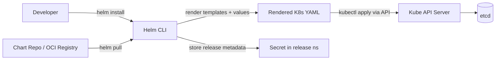

# 06 — Helm: The Kubernetes Package Manager

Helm packages, versions, installs, and upgrades Kubernetes apps using reusable templates called **charts**.

## Why Helm

| Without Helm | With Helm |
|---|---|
| Hand-craft 10 YAMLs per env | One chart, multiple `values.yaml` |
| `kubectl apply -f` chains | `helm install/upgrade/rollback` |
| Copy-paste manifests | Templated, parameterised |
| No release history | Built-in revision tracking |

## Architecture (Helm 3)

<!-- mermaid:rendered -->
<p align="center"></p>

<details><summary>Mermaid source</summary>

<!-- mermaid:rendered -->
<p align="center"></p>

<details><summary>Mermaid source</summary>

<!-- mermaid:rendered -->
<p align="center"></p>

<details><summary>Mermaid source</summary>



</details>

</details>

</details>

Helm 3 is **client-only**: no Tiller, no cluster-side component. Release metadata is stored as a `Secret` in the release namespace.

## Install (one-liner)

```bash
# macOS
brew install helm
# Linux
curl https://raw.githubusercontent.com/helm/helm/main/scripts/get-helm-3 | bash
# Verify
helm version
```

## Learning Path

| # | Module | Outcome |
|---|---|---|
| 01 | Concepts | Vocabulary: chart/release/repo/values |
| 02 | Install | Helm CLI + repo configuration |
| 03 | Using existing charts | Install bitnami/nginx, override values, rollback |
| 04 | Creating a chart | Build hello-app from scratch |
| 05 | Templating | Go templates + sprig |
| 06 | Values & overrides | Multi-env strategy |
| 07 | Dependencies | Umbrella charts |
| 08 | Hooks | Lifecycle automation (migrations) |
| 09 | Tests | `helm test` |
| 10 | Packaging & publishing | OCI registry (GHCR) |
| 11 | Best practices | Lint, schema, label conventions |
| 12 | Helmfile / ArgoCD | Many releases at scale |

## Quick Sanity Check

```bash
helm repo add bitnami https://charts.bitnami.com/bitnami
helm repo update
helm search repo nginx
helm install demo bitnami/nginx --dry-run --debug
```
