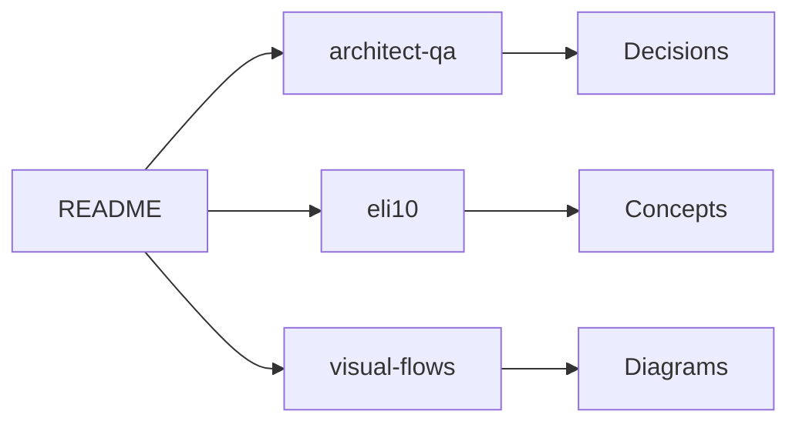
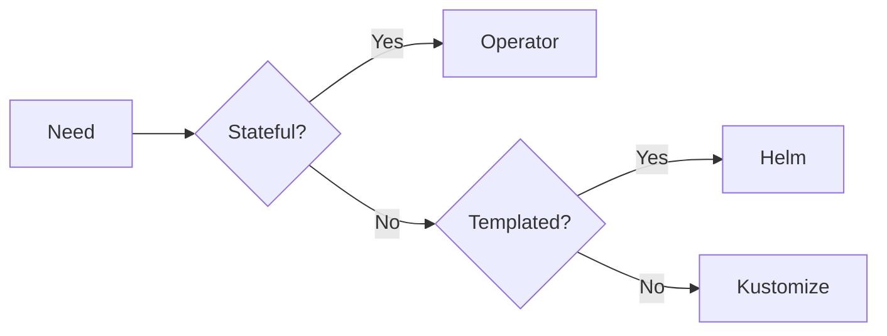

# Helm Mastery

A focused mastery folder for Helm: architect-level Q&A, ELI10 explanations,
and visual flows. Use this as the canonical reference when designing chart
strategy, reviewing PRs, or onboarding new engineers.

## Why this folder exists

Most Helm content is either reference docs (good for `helm install` syntax)
or beginner tutorials (good for the first chart). This folder fills the gap:
*how to think about Helm at scale*. Decisions like umbrella vs library,
schema enforcement, OCI registry strategy, and GitOps integration matter far
more than memorizing template syntax.

## Folder organization

<!-- mermaid:rendered -->

Mermaid source

## Files in this folder

| File | Audience | When to read |
|---|---|---|
| `README.md` | Everyone | Start here, navigation |
| `architect-qa.md` | Senior / staff engineers | Designing chart strategy, RFC reviews |
| `eli10.md` | Anyone new to Helm | First contact, mental models |
| `visual-flows.md` | Visual learners, debugging | When you forget what a command does |

## Reading order

If you are brand new to Helm:

1. `eli10.md` — build the right mental models
2. `visual-flows.md` — see the lifecycle visually
3. `architect-qa.md` — understand the trade-offs

If you are an experienced engineer joining a Helm-heavy org:

1. `architect-qa.md` — what decisions have already been made
2. `visual-flows.md` — confirm your operational model is correct
3. `eli10.md` — only as a refresher

## Core concepts in one screen

| Concept | One-line definition |
|---|---|
| Chart | A versioned package of Kubernetes manifests with templates |
| Values | The user-supplied inputs that fill in the template |
| Release | A specific install of a chart into a namespace |
| Revision | A snapshot of a release; rollbacks target revisions |
| Repository | A place to host chart packages (HTTP or OCI) |
| Hook | A manifest annotated to run at a specific lifecycle phase |
| Subchart | A chart depended upon by a parent chart |
| Library chart | A chart of templates only, never installed directly |

## Decision framework

When asked "should we use X with Helm?", apply this order:

<!-- mermaid:rendered -->

Mermaid source

## What this folder is NOT

- Not a `helm` CLI cheat sheet — see `../cheatsheet.md` for that
- Not chart authoring tutorials — see `../04-creating-a-chart/` for that
- Not a substitute for the official docs — see helm.sh/docs

## Maintenance

These files are reviewed quarterly. The Q&A in `architect-qa.md` reflects
real production decisions from teams running 100+ services on Helm. If a
decision in here no longer reflects reality, open a PR and update the entry
along with a short rationale in the commit message.

## Quick links to deeper material

| Topic | Reference |
|---|---|
| Chart anatomy | `../04-creating-a-chart/` |
| Templating language | `../05-templating/` |
| Values overrides | `../06-values-and-overrides/` |
| Subchart dependencies | `../07-dependencies/` |
| Hooks | `../08-hooks/` |
| Tests | `../09-tests/` |
| Packaging | `../10-packaging-and-publishing/` |
| Best practices | `../11-best-practices/` |
| Helmfile / ArgoCD | `../12-helmfile-and-argocd/` |

## How to use the Q&A

The `architect-qa.md` file is opinionated. Each answer reflects a position
that has been defended in production. If you disagree, the format makes it
easy to write a counter-argument. Treat answers as starting points for a
conversation, not as immutable truths.

## How to use the ELI10 file

The `eli10.md` file uses concrete physical analogies (cookies, blueprints,
forms) for every Helm concept. The goal is that a non-engineer reading it
should be able to explain what a Helm release is. If they cannot, the
analogy is broken and the file needs an update.

## How to use the visual flows

Each diagram in `visual-flows.md` has a maximum of six nodes. This is
deliberate: if a flow needs more than six nodes, it is two flows. When you
debug a Helm command and need to understand "what happens next?", these are
the canonical answers.

## Contributing

- Keep diagrams to six nodes max
- No literal `\n` in Mermaid labels
- No nested quotes inside labels
- Add a date stamp to any new architect Q&A entry
- ELI10 entries must include analogy plus real plus diagram plus steps

## Glossary index

For one-word lookups:

- chart, values, release, revision, hook, dependency, subchart, library,
  umbrella, OCI, registry, repository, helmfile, lint, package, template,
  notes, schema, namespace, kubeconfig, post-renderer, pre-install hook

Each term is defined in `eli10.md` (informal) and `architect-qa.md` (formal).

## Status

Current as of 2026-04. Maintained by the platform team. File issues in the
parent repo if any content is stale or incorrect. The mastery folder is a
living document and pull requests are welcome.

## Anti-patterns to watch for

The following patterns recur across teams and consistently produce pain.
This list exists so reviewers can point at it during PR reviews instead of
re-litigating the argument every time.

- Storing plaintext secrets in `values.yaml` and committing to Git
- Using `latest` as the default image tag in a chart
- Wrapping every microservice in a single umbrella chart
- Skipping `values.schema.json` because it is "optional"
- Hooks without a delete policy, leaking Jobs into the namespace
- Charts that template out a hundred tenant resources from one install
- Floating chart version tags pulled at install time in production
- CRDs in `templates/` instead of `crds/`
- No NOTES.txt, leaving users without next steps
- Bare `helm install` in CI without `--atomic` and `--timeout`
- Same chart, different versions across dev and prod
- `helm upgrade --force` used as a workaround for immutable field changes
- Subchart values overridden by accident through global value collisions

## Recommended toolchain

A working toolchain looks roughly like this:

| Layer | Tool |
|---|---|
| Linting | `helm lint` plus `ct lint` |
| Validation | `kubeconform` against target Kubernetes version |
| Policy | `kyverno` or `datree` |
| Docs | `helm-docs` generating README from values comments |
| Testing | `helm test` post-install plus `kind` in CI |
| Diff | `helm diff` plugin before any prod upgrade |
| Signing | `cosign` keyless via OIDC |
| Registry | OCI registry with image and chart RBAC |
| Orchestration | Helmfile for CI, ArgoCD for in-cluster reconciliation |
| Secrets | external-secrets-operator or sealed-secrets |

If your toolchain is missing more than three of these, the team is likely
spending engineering hours on problems that already have known solutions.

## Operational checklist

Before promoting a chart to production for the first time, confirm:

- Schema file present and CI-enforced
- Values documented via `helm-docs`
- Image tag pinned, never `latest`
- Resource requests and limits set with sane defaults
- Liveness and readiness probes defined
- NOTES.txt prints next steps and verification commands
- `helm test` exists and passes
- Hooks have explicit delete policies
- Chart packaged and pushed to OCI registry with signature
- Rollback path tested in a staging environment

This list lives here so it is not lost in a wiki nobody reads.
