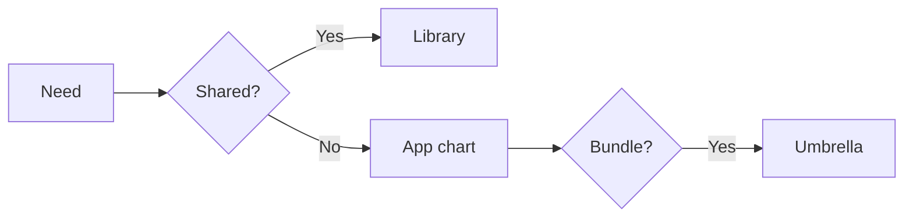

# Helm Architect Q&A

Thirty-plus opinionated answers to the questions senior engineers actually
ask when scaling Helm. Each entry: question, short answer, rationale,
trade-offs, and a recommendation.

---

## 1. How do we structure charts when we have 100+ services?

**Short answer:** One chart per service, plus a thin shared library chart
for boilerplate. Avoid umbrella charts as the primary deployment unit.

**Rationale:** Umbrella charts couple the release lifecycle of unrelated
services. A bug in service B blocks deploys of service A. With one chart per
service and GitOps, each service has an independent revision history.

**Recommendation:** chart-per-service plus shared library plus environment
overlays in values files.

---

## 2. Umbrella charts vs library charts vs application charts?

**Short answer:** Application chart for what you deploy. Library chart for
shared template helpers. Umbrella chart only for tightly coupled bundles
shipped as a single product.

**Rationale:** Library charts have `type: library`, are never installed, and
exist only to expose `define` blocks. They eliminate copy-paste of
deployment, service, and ingress templates across 100 charts.

---

## 3. Should we enforce values.schema.json?

**Short answer:** Yes, in any chart shared across teams. Make CI fail if
schema is missing.

**Rationale:** Schema turns silent template failures into loud install
failures with line numbers. The cost is one file per chart; the benefit is
catching typos before they reach prod.

---

## 4. Where do secrets live?

**Short answer:** Never in `values.yaml`. Use external-secrets-operator,
sealed-secrets, or a CSI secrets driver. Helm only renders the reference.

**Rationale:** Values files end up in Git, in CI logs, and in
`helm get values` output. Even encrypted values via SOPS are an anti-pattern
once you have an external secret store.

---

## 5. GitOps with Helm vs raw Kustomize?

**Short answer:** Helm for packaged third-party software, Kustomize for your
own workloads, or Helm everywhere if your team already lives in templates.

**Rationale:** Kustomize wins on simplicity and explicit overlays. Helm wins
on reusability and a real package manager (versions, dependencies, OCI
registries). Mixed shops use both: Helm for Postgres operator, Kustomize for
your microservice manifests.

---

## 6. OCI registries vs classic HTTP repos?

**Short answer:** OCI for everything new in 2026. Classic repos only for
legacy compatibility.

**Rationale:** OCI gives you the same registry, auth, signing, and RBAC as
container images. One artifact store, one mental model.

---

## 7. How do we sign and verify charts?

**Short answer:** Cosign with keyless signing tied to the OIDC identity of
your CI pipeline. Verify in admission controller.

**Rationale:** PGP signing in Helm v2 was nobody used. Cosign integrates
with Sigstore, Rekor transparency log, and Kyverno policies.

---

## 8. Lifecycle hook gotchas?

**Short answer:** Hook resources are not tracked by the release; if you fail
to clean them up they leak forever. Use `helm.sh/hook-delete-policy`.

**Rationale:** A `pre-install` Job that succeeds remains in the namespace
unless you set `hook-succeeded` deletion. Multiply by 100 deploys per day
and your namespace fills with stale Jobs.

---

## 9. When should we NOT use Helm?

**Short answer:** Stateful workloads with complex lifecycle (use an
operator), one-off scripts (use kubectl apply), and heavily dynamic configs
(use a controller).

---

## 10. How do we handle CRDs in charts?

**Short answer:** Put them in `crds/`, not `templates/`. Accept that Helm
will not upgrade or delete them.

**Rationale:** Helm's CRD handling is intentionally conservative because
CRDs are cluster-scoped and removal cascades. For lifecycle, bundle a
`pre-upgrade` hook or use an operator.

---

## 11. Should every chart have a NOTES.txt?

**Short answer:** Yes, with concrete next-steps and the exact commands.

**Rationale:** NOTES.txt is the only output a user sees after install. A
good NOTES.txt links to dashboards, prints the service URL, and shows the
verification command.

---

## 12. How do we manage chart versions across environments?

**Short answer:** Same chart version everywhere. Differences live in values
files, never in chart code.

**Rationale:** If dev runs chart v1.4 and prod runs v1.2, you cannot trust
the test results. Pin chart versions in your GitOps tool per environment.

---

## 13. SemVer for charts: major, minor, patch?

**Short answer:** Major when values structure breaks. Minor when new values
or templates added. Patch for bug fixes that need no values change.

---

## 14. How do we test charts?

**Short answer:** `helm lint`, `helm template`, then `helm test` (a
post-install hook running probes), and finally a real install in CI against
kind or k3d.

---

## 15. Static analysis: what tools?

**Short answer:** kubeconform for manifest validation, datree or kyverno for
policy, helm-docs for value docs, chart-testing (`ct`) for end-to-end.

---

## 16. How do we handle multi-tenancy in a single chart?

**Short answer:** Don't. Use one release per tenant with a release name
prefix and tenant-scoped namespace.

**Rationale:** A chart that templates 100 tenant resources becomes a single
unit of failure. One bad tenant value breaks all 100 deploys.

---

## 17. Helmfile vs ArgoCD ApplicationSet?

**Short answer:** Helmfile for imperative orchestration from CI. ArgoCD for
declarative GitOps reconciliation in cluster.

**Rationale:** They solve different problems. Helmfile is a deploy tool;
ArgoCD is a controller. Many teams use Helmfile to render and ArgoCD to
sync.

---

## 18. How do we version values files?

**Short answer:** Tie values file path to environment plus chart major
version. Example: `values/prod/v2/myapp.yaml`.

**Rationale:** When you bump the chart major and the values structure
breaks, you can keep both versions of values around without if-blocks.

---

## 19. Should charts include resource limits by default?

**Short answer:** Yes, with sane defaults that work for the smallest viable
deployment, and a clear path to override.

**Rationale:** Charts without limits create noisy neighbors. Charts with
production-only limits break dev clusters. Default to small.

---

## 20. How do we handle image tags?

**Short answer:** `image.tag` defaults to chart `appVersion`. Never default
to `latest`. Always allow override.

---

## 21. How do we make charts testable in isolation?

**Short answer:** No external dependencies in templates (no API calls, no
file reads). Only inputs from values, plus standard Helm built-ins.

---

## 22. Should we expose every Kubernetes field as a value?

**Short answer:** No. Expose what users need to configure, hide the rest.
Add new values when a real user asks.

**Rationale:** Every value is API surface you must support forever.

---

## 23. How do we deprecate values?

**Short answer:** Keep the old value for one major version, log a warning in
NOTES.txt or a `fail` in `_helpers.tpl` when set, then remove.

---

## 24. Hook ordering: how to enforce sequence?

**Short answer:** Use `helm.sh/hook-weight`. Lower weights run first.
Negative numbers are valid.

---

## 25. How to roll back safely with hooks involved?

**Short answer:** Hooks do not run on rollback by default for `pre/post-`
phases unless declared. Test rollback paths in CI.

---

## 26. How do we package and publish to OCI?

**Short answer:** `helm package` then `helm push chart.tgz oci://registry`.
Tag with chart version. Sign with cosign in the same CI step.

---

## 27. Chart dependency strategy: vendored or downloaded?

**Short answer:** Downloaded with `helm dependency update` and the lock file
committed. Vendored only for air-gapped environments.

---

## 28. How do we observe Helm itself?

**Short answer:** Capture `helm list`, release histories, and revision
diffs. Ship them to your normal observability stack.

---

## 29. How do we handle a chart that needs cluster-admin to install?

**Short answer:** Split into two charts: a privileged install (CRDs, RBAC)
done once by a cluster admin, and a workload chart deployed by app teams.

---

## 30. What about Helm in air-gapped environments?

**Short answer:** Mirror an OCI registry, vendor dependencies, and use
`helm pull` to pre-stage everything. Test the install path with no internet
access.

---

## 31. How do we handle stateful upgrades like database schema migrations?

**Short answer:** Pre-upgrade hook running a Job that runs the migration.
Make it idempotent. Block the upgrade if it fails.

---

## 32. Can we do canary deploys with Helm?

**Short answer:** Not natively. Use Argo Rollouts or Flagger as a wrapper
around the workload that Helm deploys.

---

## 33. How do we keep chart docs in sync with values.yaml?

**Short answer:** `helm-docs` in CI. Comments in values.yaml become README
sections automatically.

---

## 34. Chart testing matrix: which Kubernetes versions?

**Short answer:** Three versions: oldest supported, current minor, next
minor. Drop the oldest when EOL.

---

## 35. How do we handle config drift detection?

**Short answer:** GitOps tool reconciles. Without GitOps, run
`helm diff upgrade` periodically and alert on non-empty diff.

---

## 36. Is `--wait` always safe?

**Short answer:** No. `--wait` blocks on readiness probes; if a probe is
broken the deploy hangs forever. Set `--timeout` and have a rollback plan.

---

## Decision matrix summary

<!-- mermaid:rendered -->

Mermaid source

## Closing principle

Helm is a package manager, not a deployment engine. Treat charts like
libraries: small, well-versioned, well-documented, with stable APIs. The
deployment engine is whatever sits above Helm — Helmfile, ArgoCD, Flux —
and that is where orchestration logic belongs.
