# Helm Explained Like You Are 10

Helm is the way grown-ups put apps onto a giant computer playground called
Kubernetes. The playground is huge and confusing, so Helm helps you set
things up by filling out a form instead of building from scratch.

This file uses cookies, blueprints, and forms. By the end, you will be able
to explain Helm to your friend.

---

## 1. Chart = blueprint with blanks

**Analogy:** A chart is like a coloring book page that has the outline
already drawn but the colors are missing. Or a recipe card that says
"add ___ cups of sugar".

**Real:** A chart is a folder of YAML files with placeholders inside curly
braces, like `{{ .Values.replicas }}`. The placeholders get filled in when
you install the chart.

**Diagram:**

<!-- mermaid:rendered -->


Mermaid source

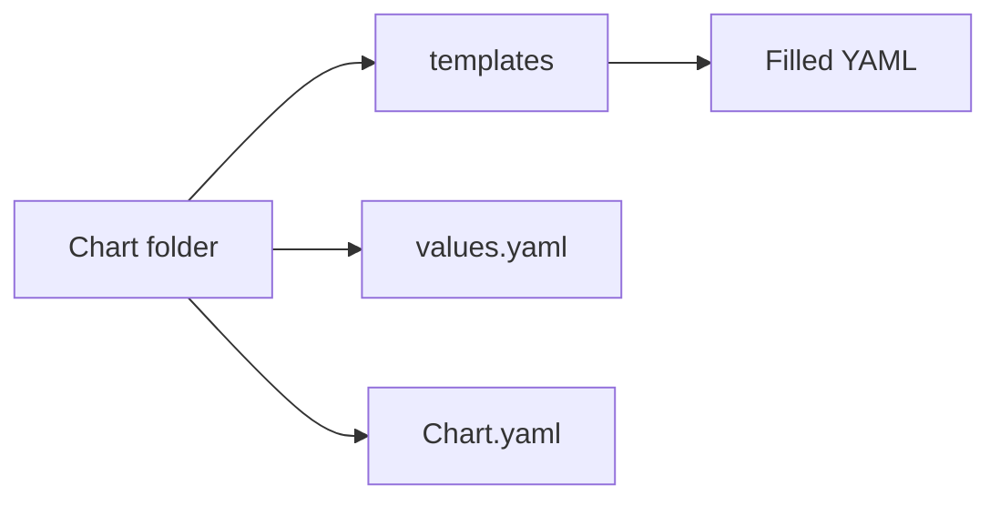

**Helm steps:**

1. Someone writes the chart once
2. You download it
3. You install it with your own values
4. You get real Kubernetes resources

---

## 2. Values = fill-in-the-blanks form

**Analogy:** A values file is the form you fill out at the doctor's office.
Name? Age? Allergies? You give answers; the doctor uses them.

**Real:** `values.yaml` lists every blank in the chart and what the default
answer is. You override only what you want to change.

**Diagram:**

<!-- mermaid:rendered -->


Mermaid source

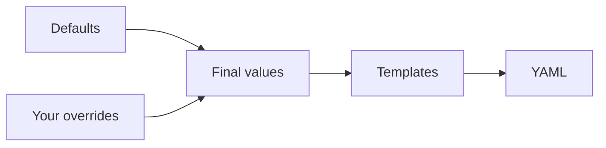

**Helm steps:**

1. Read `values.yaml` to see all the blanks
2. Make your own `my-values.yaml` with only the changes
3. Run `helm install -f my-values.yaml`

---

## 3. Release = the cookie you actually baked

**Analogy:** The recipe is the chart. The cookie is the release. You can
bake the same recipe ten times and get ten different cookies, each with its
own name like "Tuesday Cookie" or "Birthday Cookie".

**Real:** A release is one specific install of a chart in a cluster, with a
name. You can install the same chart twice with two different names and get
two releases living side by side.

**Diagram:**

<!-- mermaid:rendered -->


Mermaid source

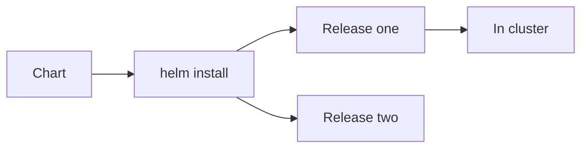

**Helm steps:**

1. `helm install my-app ./mychart`
2. `helm list` shows your release
3. `helm uninstall my-app` removes it

---

## 4. Revision = save game

**Analogy:** Every time you save your video game you get a save slot. You
can load any slot. A revision is a save slot for your release.

**Real:** Each upgrade or rollback creates a new revision. Helm keeps the
history so you can see what changed.

**Diagram:**

<!-- mermaid:rendered -->


Mermaid source

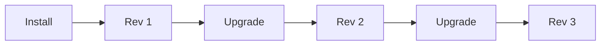

**Helm steps:**

1. `helm install` creates revision 1
2. `helm upgrade` creates revision 2
3. `helm history my-app` shows them all

---

## 5. Rollback = go back to last week's cookie

**Analogy:** You baked cookies on Monday and they were great. On Tuesday you
tried a new recipe and they were burnt. You go back to Monday's recipe.
That is a rollback.

**Real:** `helm rollback` restores a previous revision of a release. Helm
re-applies the YAML from that revision.

**Diagram:**

<!-- mermaid:rendered -->


Mermaid source

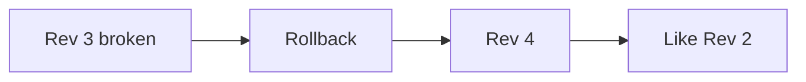

**Helm steps:**

1. `helm history my-app` to see revisions
2. `helm rollback my-app 2` to go back to revision 2
3. Helm makes a new revision that matches the old one

---

## 6. Hook = rules like wash hands before baking

**Analogy:** Before you bake cookies you must wash your hands. After you
bake you must clean the oven. Hooks are rules about what to do before or
after the main event.

**Real:** Hooks are templates marked with annotations like `pre-install` or
`post-upgrade`. Helm runs them at the right moment.

**Diagram:**

<!-- mermaid:rendered -->


Mermaid source

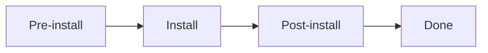

**Helm steps:**

1. Add annotation `helm.sh/hook: pre-install`
2. Helm sees it and runs that resource first
3. The main install only proceeds if the hook succeeded

---

## 7. Repository = chart store

**Analogy:** A chart repository is like an app store on your phone. You
search for apps, you install them, you get updates.

**Real:** A repo is an HTTP server or an OCI registry that hosts packaged
chart files (`.tgz`).

**Diagram:**

<!-- mermaid:rendered -->


Mermaid source

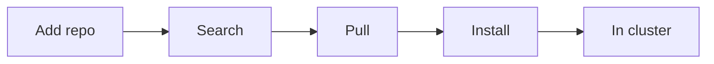

**Helm steps:**

1. `helm repo add bitnami https://charts.bitnami.com`
2. `helm search repo postgres`
3. `helm install mydb bitnami/postgresql`

---

## 8. Dependency = recipe inside a recipe

**Analogy:** A birthday cake recipe might say "use the frosting recipe from
page 12". The frosting is a dependency of the cake.

**Real:** A chart can depend on other charts listed in `Chart.yaml`. Helm
downloads them into a `charts/` folder and installs them together.

**Diagram:**

<!-- mermaid:rendered -->


Mermaid source

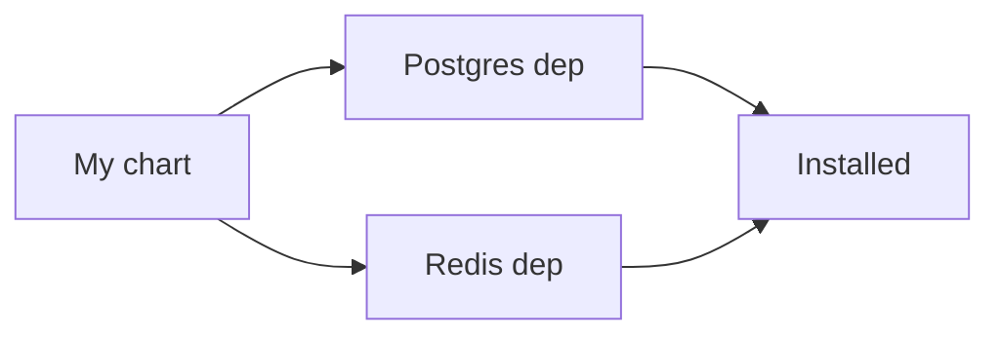

**Helm steps:**

1. List dependencies in `Chart.yaml`
2. `helm dependency update`
3. Subcharts download into `charts/`
4. `helm install` installs all of them

---

## 9. Subchart = a chart inside a chart

**Analogy:** A LEGO set inside a bigger LEGO set. The small set is complete
by itself but it is also part of the big build.

**Real:** Subcharts are dependencies that ship inside the parent chart's
`charts/` folder. Parent values can override subchart values.

**Diagram:**

<!-- mermaid:rendered -->


Mermaid source

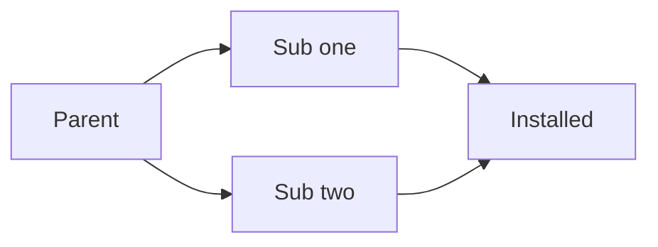

---

## 10. Template = the recipe with blanks

**Analogy:** A Mad Libs page where some words are missing and you have to
fill them in. The page is the template.

**Real:** A template is a YAML file with Go template syntax. Helm runs it
through the templating engine and out comes a real YAML file.

**Diagram:**

<!-- mermaid:rendered -->


Mermaid source

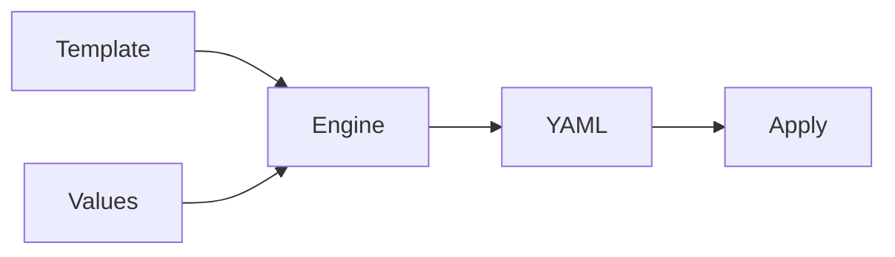

---

## 11. NOTES.txt = thank-you card

**Analogy:** When you order food, the bag has a note that says "thank you,
your tracking number is 123". NOTES.txt is the message you see after
install.

**Real:** A template that prints a message after `helm install` finishes.
Use it to print URLs, credentials, and next steps.

**Diagram:**

<!-- mermaid:rendered -->


Mermaid source

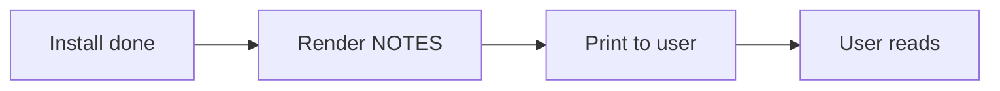

---

## 12. Lint = spell check

**Analogy:** Spell check on your essay. It looks for mistakes before your
teacher sees the paper.

**Real:** `helm lint` looks at your chart for common mistakes: missing
values, bad YAML, unused templates.

**Diagram:**

<!-- mermaid:rendered -->


Mermaid source

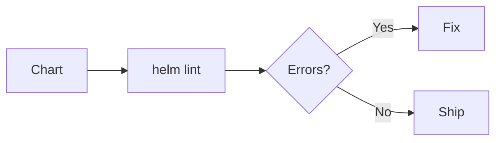

---

## 13. Package = zip the recipe

**Analogy:** Printing your recipe as a PDF and emailing it. Anyone with the
PDF can bake the cookies.

**Real:** `helm package` makes a `.tgz` file from your chart folder. You
upload the `.tgz` to a repo so others can install it.

**Diagram:**

<!-- mermaid:rendered -->


Mermaid source

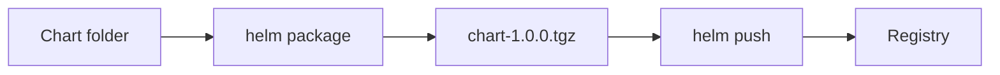

---

## 14. OCI registry = same shelf as your container images

**Analogy:** Instead of having two different cupboards (one for cookies and
one for cake), you put both on the same shelf. OCI lets charts and
container images share storage.

**Real:** OCI is the standard format for container registries. Modern Helm
can push and pull charts from any OCI registry.

**Diagram:**

<!-- mermaid:rendered -->


Mermaid source

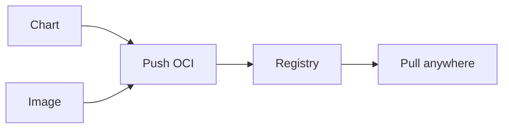

---

## 15. Wrap-up

Cookies, blueprints, forms, save slots, rules. Helm is just a careful way
to fill out forms and bake cookies in a shared kitchen called Kubernetes.
