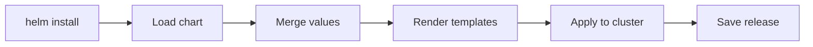
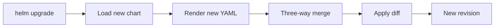
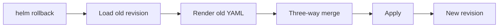
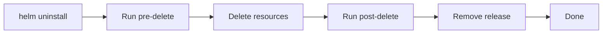
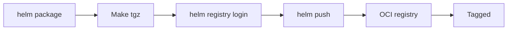
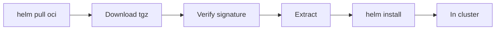
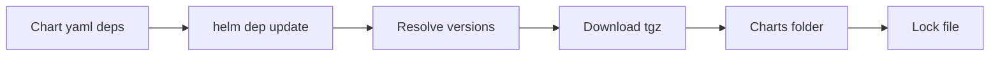
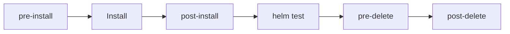
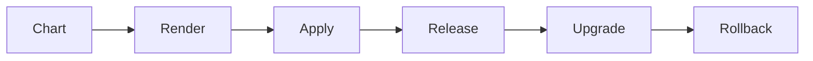

# Helm Visual Flows

Eight diagrams covering the operational lifecycle of a Helm chart. Each
diagram has six nodes or fewer. Read top to bottom; each section explains
the diagram, the command that triggers it, and what to look for when it
goes wrong.

---

## 1. helm install path

The most important flow. Understand this and most other flows are obvious.

<!-- mermaid:rendered -->

Mermaid source

**Trigger:** `helm install my-app ./mychart -f values.yaml`

**What happens:**

1. Helm loads the chart from disk or registry
2. Default values plus user values are merged into a single tree
3. Templates run through the engine producing real YAML
4. Helm sends the YAML to the Kubernetes API
5. A release record is saved as a Secret in the namespace

**Common failure points:** Schema validation rejects values; template
errors with line numbers; API server rejects manifest; resource conflicts
with existing objects.

**Debug commands:** `helm template`, `helm install --dry-run --debug`,
`helm get manifest`.

---

## 2. helm upgrade flow

Upgrades are diffs applied carefully. The dangerous part is what counts as
"the same resource".

<!-- mermaid:rendered -->

Mermaid source

**Trigger:** `helm upgrade my-app ./mychart -f values.yaml`

**What happens:**

1. Helm loads the new chart version
2. Templates render with new values
3. Three-way merge between old release manifest, new manifest, and live
   cluster state
4. Only diffs are applied to the cluster
5. A new revision is recorded

**Common failure points:** Immutable fields changed (selector labels);
resources renamed (treated as delete and create); CRDs not upgraded;
hook ordering breaks.

**Tip:** Always run `helm diff upgrade` before `helm upgrade` in prod.

---

## 3. helm rollback flow

Rollback is just an upgrade targeting an old revision. Same merge logic.

<!-- mermaid:rendered -->

Mermaid source

**Trigger:** `helm rollback my-app 5`

**What happens:**

1. Helm fetches revision 5 from history
2. The stored manifest is re-rendered if needed
3. Three-way merge against current cluster state
4. Diffs applied
5. A new revision is created (it is not literally revision 5 again)

**Common failure points:** Old PVC still bound; CRDs that moved schema;
hooks that no longer succeed; secrets rotated since revision 5.

**Tip:** `helm history my-app` shows what is rollbackable.

---

## 4. helm uninstall flow

Removal is mostly straightforward but hooks and CRDs make it tricky.

<!-- mermaid:rendered -->

Mermaid source

**Trigger:** `helm uninstall my-app`

**What happens:**

1. Pre-delete hooks run
2. All tracked resources are deleted from the cluster
3. Post-delete hooks run
4. The release record is removed (unless `--keep-history`)

**What is NOT deleted:** CRDs in `crds/`, PVCs, anything created outside the
chart, anything created by hooks without delete annotations.

---

## 5. OCI push flow

Publishing a chart to an OCI registry. Looks just like pushing an image.

<!-- mermaid:rendered -->

Mermaid source

**Trigger:** `helm package ./mychart && helm push mychart-1.0.0.tgz oci://registry.example.com/charts`

**What happens:**

1. Chart folder is packaged into a `.tgz`
2. You log in to the registry
3. The package is pushed as an OCI artifact
4. The chart is now stored alongside container images
5. The version becomes the tag

**Common failure points:** Auth scope wrong; registry does not support OCI
artifacts; chart name collides with an image name in the same repo path.

---

## 6. OCI pull and install flow

Pulling and installing from OCI. The reverse of push.

<!-- mermaid:rendered -->

Mermaid source

**Trigger:** `helm install my-app oci://registry.example.com/charts/mychart --version 1.0.0`

**What happens:**

1. Helm pulls the chart artifact from the OCI registry
2. The package is downloaded to local cache
3. Optional cosign verification
4. Chart extracted and rendered
5. Standard install path takes over

**Tip:** Pin chart versions explicitly. Floating tags break GitOps.

---

## 7. dependency update flow

Subcharts are downloaded into the parent's `charts/` folder before install.

<!-- mermaid:rendered -->

Mermaid source

**Trigger:** `helm dependency update ./mychart`

**What happens:**

1. Helm reads the `dependencies` array in `Chart.yaml`
2. Versions are resolved against the configured repos
3. Each dependency is downloaded as a `.tgz`
4. They are placed into the `charts/` subfolder
5. A `Chart.lock` file is written for reproducibility

**Common failure points:** Repo not added; version constraint impossible;
network blocked; OCI auth missing for one of the deps.

**Tip:** Commit `Chart.lock` to source control. Treat it like
`package-lock.json`.

---

## 8. hook lifecycle flow

The order in which hooks fire during an install or upgrade.

<!-- mermaid:rendered -->

Mermaid source

**Trigger:** Any chart install with annotated hook resources.

**What happens:**

1. Resources annotated `pre-install` run first, in weight order
2. Main install applies the rest of the manifests
3. `post-install` resources run after main install succeeds
4. `helm test` runs separately, on demand
5. Later, `pre-delete` runs before uninstall
6. Finally `post-delete` runs after resources are removed

**Common failure points:** Hook Job leaks because `hook-delete-policy` is
not set; hooks block forever because they never reach completion;
weight ordering misunderstood (lower numbers run first); rollback skips
hooks unless explicitly annotated.

**Tip:** Use `hook-delete-policy: hook-succeeded,before-hook-creation` for
most hooks.

---

## Putting it all together

The eight flows above cover ninety percent of operational Helm work:

| Flow | Frequency | Risk |
|---|---|---|
| install | Daily | Low |
| upgrade | Daily | Medium |
| rollback | Weekly | Medium |
| uninstall | Occasional | High |
| OCI push | Per release | Low |
| OCI pull | Daily | Low |
| dep update | Per chart edit | Low |
| hook lifecycle | Embedded | High |

When a Helm command does not behave as you expect, find the matching flow
above and walk through each node. The failure is almost always at one
specific node, and naming it is half the fix.

---

## Quick mental model

<!-- mermaid:rendered -->

Mermaid source

Everything else is detail. Charts get rendered, manifests get applied,
releases get tracked, and history gives you a way back.
