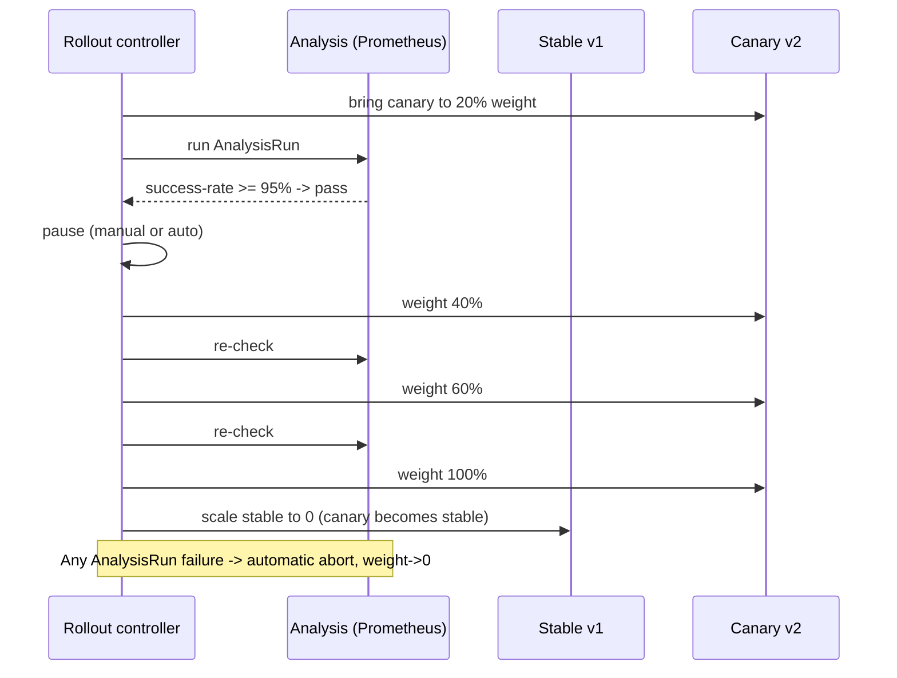

# 05 — Canary with Argo Rollouts

> Replace `Deployment` with `Rollout` (CRD). Argo Rollouts manages traffic-percentage steps, automated metric analysis, and automatic abort.

## Concept

Argo Rollouts is a controller that:

- Watches `Rollout` resources (a superset of `Deployment`).
- Performs **stepped** canary rollouts: e.g. 20% → pause → 40% → pause → 60% → 100%.
- Optionally runs **AnalysisRuns** that query Prometheus / Datadog / Wavefront and abort if SLIs degrade.
- Integrates with service meshes (Istio, Linkerd, SMI) and ingress controllers (NGINX, ALB) for **real** traffic shifting (not just replica ratios).

## When to use

- You want stepped, paused, automatically gated canary releases.
- You have a metrics provider (Prometheus is the most common).
- You're ready to invest in extra tooling.

## Drawbacks

- New CRD to learn (`Rollout`, `AnalysisTemplate`, `AnalysisRun`, `Experiment`).
- Requires the Argo Rollouts controller installed cluster-wide.
- Real traffic-percentage routing requires a mesh / ingress integration; otherwise it falls back to replica-ratio (same caveats as manual canary).

## Pod & traffic transition (steps: 20 → 40 → 60 → 100)



## Files

- [`install.md`](./install.md) — install Argo Rollouts + kubectl plugin
- [`rollout.yaml`](./rollout.yaml) — `Rollout` with stepped canary
- [`analysistemplate.yaml`](./analysistemplate.yaml) — Prometheus success-rate template

## Run

```bash
# Install (one time)
cat install.md

# Apply
kubectl apply -f analysistemplate.yaml
kubectl apply -f rollout.yaml

# Trigger v2 rollout
kubectl argo rollouts set image hello-rollout hello=gcr.io/google-samples/hello-app:2.0

# Watch the live UI
kubectl argo rollouts dashboard
# or terminal:
kubectl argo rollouts get rollout hello-rollout --watch
```

## Verify

```bash
kubectl argo rollouts status hello-rollout
kubectl get rollout hello-rollout -o jsonpath='{.status.currentStepIndex}/{.status.canary.weights.canary.weight}'; echo
```

## Promote / Abort

```bash
kubectl argo rollouts promote hello-rollout       # advance past pause
kubectl argo rollouts abort   hello-rollout       # back to 100% stable
kubectl argo rollouts retry   hello-rollout       # restart aborted rollout
```

## Cleanup

```bash
kubectl delete -f rollout.yaml -f analysistemplate.yaml --ignore-not-found
```

> **Gotcha:** Without a mesh/ingress integration, `Rollout`'s traffic weights are realized as replica counts — same imprecision as the manual canary. For real percentage routing, configure `spec.strategy.canary.trafficRouting`.

> **Gotcha:** AnalysisTemplates need a reachable Prometheus. In a vanilla cluster you'll need to install kube-prometheus-stack first or remove the analysis steps.
