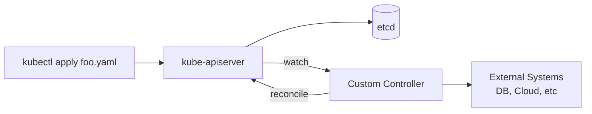

# 01 — CRDs and Operators

CustomResourceDefinitions extend the Kubernetes API with new object kinds. An **operator** is a CRD plus a controller that reconciles the desired state.

## CRD anatomy
- `group` + `version` + `kind` + `plural` define the API surface.
- `schema.openAPIV3Schema` validates the spec.
- `subresources.status` separates spec from status.
- `additionalPrinterColumns` controls `kubectl get` columns.

## Controller pattern
1. **Watch** resources via informers (cached, event-driven).
2. **Enqueue** keys on add/update/delete.
3. **Reconcile**: read desired (spec), read actual (cluster + external), diff, act.
4. Reconciliation must be **idempotent** — it will run many times.

See [controller-pattern.md](controller-pattern.md).

## Operator pattern
An operator encodes operational knowledge (backup, failover, upgrade) for a specific app (Postgres, Kafka, Elasticsearch).

| Aspect | Kubebuilder | Operator SDK |
|--------|-------------|--------------|
| Language | Go (primary) | Go, Ansible, Helm |
| Project layout | controller-runtime | controller-runtime + scaffolding |
| Maturer | upstream SIG | RedHat-led, builds on Kubebuilder |
| OLM integration | manual | first-class |

Pick **Kubebuilder** if you want a thin Go-only operator. Pick **Operator SDK** if you want OLM bundles, Helm-based operators, or multi-language support.

## Files
- [example-crd.yaml](example-crd.yaml)
- [controller-pattern.md](controller-pattern.md)
