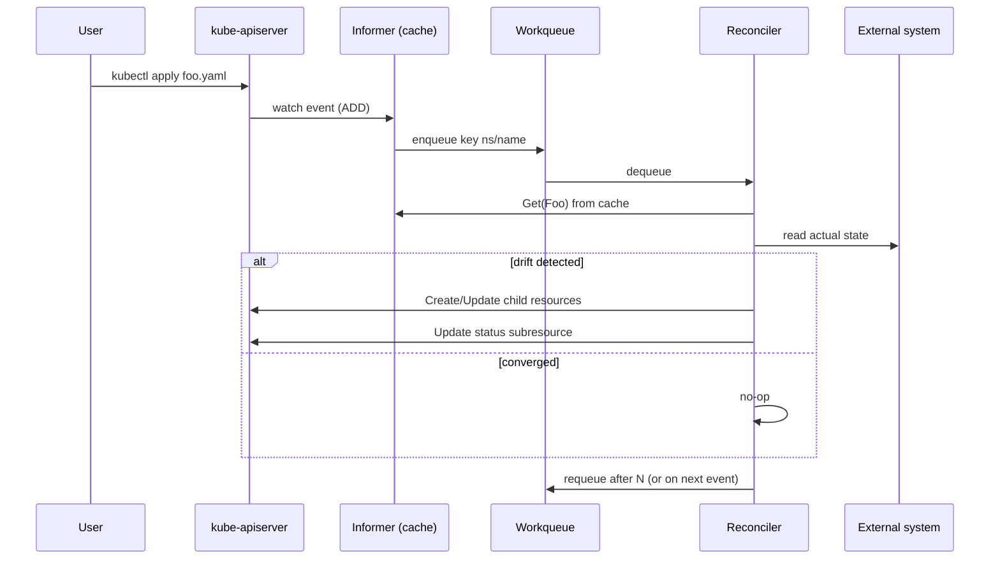

# Controller Reconcile Loop

## Rules
- **Idempotent**: same input -> same action, safe to retry.
- **Level-triggered**, not edge-triggered: always reconcile from current state, never from the event payload.
- **Status vs Spec**: write status only via the `/status` subresource to avoid optimistic-lock churn.
- **Finalizers**: add a finalizer string in `metadata.finalizers` to defer deletion until cleanup completes; remove it when done.
- **Owner references**: set `ownerReferences` on child objects so they GC when the parent is deleted.
- **Backoff**: use rate-limited workqueues (controller-runtime does this by default).

## Common traps
- Mutating cached objects from the informer — always `DeepCopy()` first.
- Long-running work in Reconcile — return early and requeue instead.
- Forgetting to handle "not found" (object deleted) — return nil, do not error.
