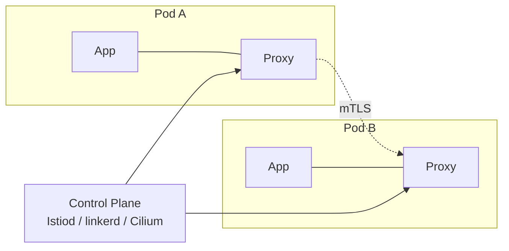

# 04 — Service Mesh

A service mesh adds L7 traffic management, mTLS, and telemetry **without code changes**, by injecting a data plane next to (or under) every workload.

## Comparison

| | Istio | Linkerd | Cilium Service Mesh |
|---|-------|---------|---------------------|
| Data plane | Envoy sidecar (or ambient ztunnel + waypoint) | Linkerd2-proxy (Rust, micro-proxy) | eBPF + optional Envoy waypoint |
| mTLS | yes | yes (default-on, simple) | yes |
| API | Istio CRDs + Gateway API | Linkerd CRDs + Gateway API | Cilium CRDs + Gateway API |
| Footprint | larger, most features | smallest, fewer features | shares CNI, no per-pod sidecar |
| Mode | sidecar OR ambient | sidecar | sidecarless (eBPF) |

## Sidecar vs Ambient/eBPF
- **Sidecar**: each pod gets a proxy container — strong isolation, higher resource cost, requires pod restarts on upgrade.
- **Ambient (Istio)**: shared per-node `ztunnel` for L4/mTLS, optional `waypoint` proxy for L7 — lower cost, no pod restart for mesh upgrades.
- **eBPF (Cilium)**: kernel-level redirection, no userspace proxy for L4 — best performance, L7 still uses Envoy waypoint.

## When to use what
- Need lots of L7 features today + multi-cluster: **Istio**.
- Want simplicity and "it just works" mTLS: **Linkerd**.
- Already on Cilium CNI and value performance: **Cilium**.

## Files
- [istio-install.md](istio-install.md)
- [istio-virtualservice.yaml](istio-virtualservice.yaml)
