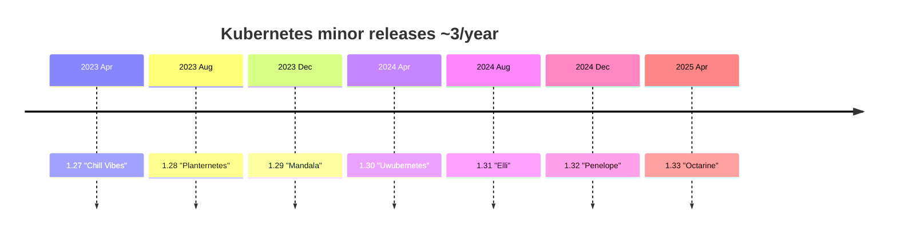
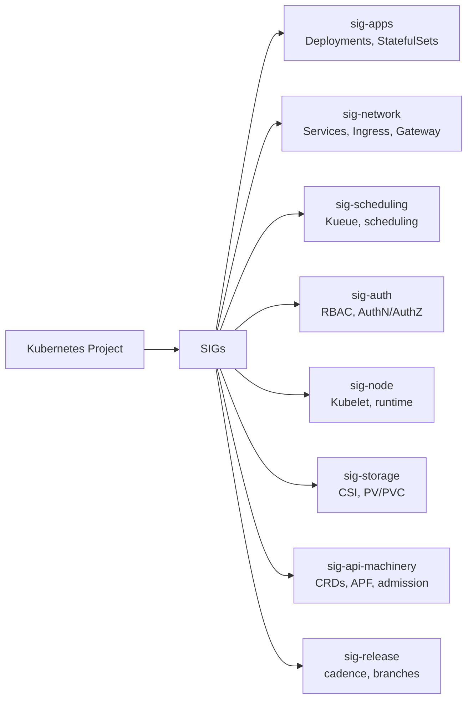

# 10 — Kubernetes Changelog (1.27 → 1.33)

## How to read a Kubernetes release

1. **Release blog**: `https://kubernetes.io/blog/YYYY/MM/DD-kubernetes-vX-YY-release/` — narrative summary.
2. **CHANGELOG-X.YY.md**: `https://github.com/kubernetes/kubernetes/blob/master/CHANGELOG/CHANGELOG-X.YY.md` — the source of truth, every PR.
3. **Enhancements (KEP) tracker**: `https://github.com/kubernetes/enhancements` — KEPs (Kubernetes Enhancement Proposals) with stage (alpha/beta/stable).
4. **Feature gates**: `https://kubernetes.io/docs/reference/command-line-tools-reference/feature-gates/` — what is on/off by default per version.

## SIG structure (who writes what)

Cadence: ~3 minor releases/year. Patch releases monthly (sometimes faster for CVEs).

## Index

| Version | Release date (approx) | File |
|---------|----------------------|------|
| 1.27 | 2023-04-11 | [1.27.md](1.27.md) |
| 1.28 | 2023-08-15 | [1.28.md](1.28.md) |
| 1.29 | 2023-12-13 | [1.29.md](1.29.md) |
| 1.30 | 2024-04-17 | [1.30.md](1.30.md) |
| 1.31 | 2024-08-13 | [1.31.md](1.31.md) |
| 1.32 | 2024-12-11 | [1.32.md](1.32.md) |
| 1.33 | 2025-04-23 | [1.33.md](1.33.md) |

Plus:
- [feature-gates-reference.md](feature-gates-reference.md)
- [upgrade-guide.md](upgrade-guide.md)

> Conservative facts only. Where this doc says "verify with official release notes", treat it as a TODO before relying on it in production.
