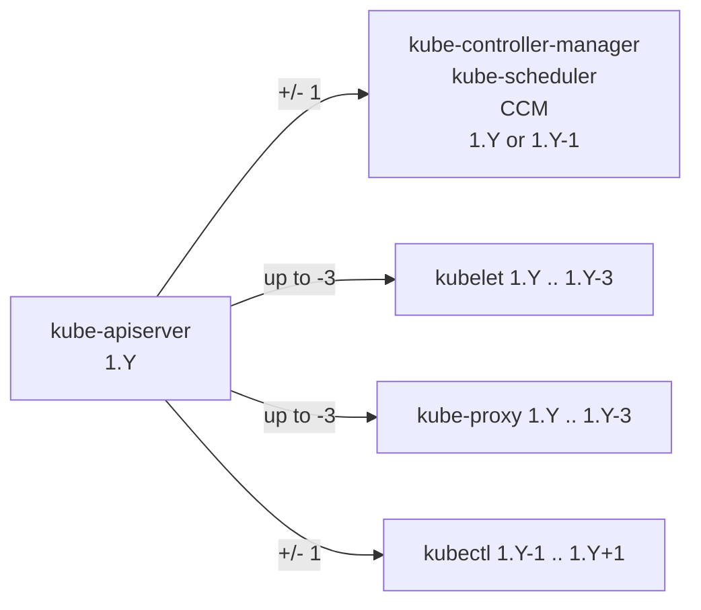

# Kubernetes Upgrade Guide

## Version skew policy (the rules)



- **kube-apiserver**: highest version in the control plane.
- **kube-controller-manager / scheduler / CCM**: same minor as apiserver, may be one minor older during upgrade.
- **kubelet / kube-proxy**: must not be newer than apiserver; up to **3 minors older** (relaxed in 1.28).
- **kubectl**: within ±1 minor of apiserver.

You **must upgrade one minor at a time** (no jumps). 1.27 → 1.29 means 1.27 → 1.28 → 1.29.

## kubeadm upgrade (sketch)

```bash
# On the FIRST control-plane node:
sudo apt update && sudo apt install -y kubeadm=1.YY.x-*
sudo kubeadm upgrade plan
sudo kubeadm upgrade apply v1.YY.x

# Then upgrade kubelet + kubectl on this node:
sudo apt install -y kubelet=1.YY.x-* kubectl=1.YY.x-*
sudo systemctl daemon-reload && sudo systemctl restart kubelet

# On OTHER control-plane nodes:
sudo kubeadm upgrade node

# On WORKER nodes (one at a time):
kubectl drain <node> --ignore-daemonsets --delete-emptydir-data
sudo kubeadm upgrade node
sudo apt install -y kubelet=1.YY.x-* kubectl=1.YY.x-*
sudo systemctl daemon-reload && sudo systemctl restart kubelet
kubectl uncordon <node>
```

## Deprecation strategy
- **GA APIs** are supported for at least 12 months or 3 releases after deprecation, whichever is longer.
- **Beta APIs** in `*.k8s.io` groups removed N+9 months or N+3 releases after deprecation. (The famous PSP removal in 1.25, ingress.networking.k8s.io/v1beta1 removal in 1.22, etc.)
- **Alpha APIs** can be removed any release. Never depend on them.

## Pre-upgrade checklist
- [ ] Read the release notes for **every** minor between source and target.
- [ ] `kubectl get apiservices` — make sure no APIServices are unhealthy.
- [ ] `kubectl get --raw=/metrics | grep apiserver_requested_deprecated_apis` — find clients still calling deprecated APIs.
- [ ] Back up etcd (snapshot + offsite).
- [ ] Check CSI drivers, CNI, ingress, mesh, operators for **target version** support.
- [ ] Test upgrade on a staging cluster of similar shape first.
- [ ] Have a rollback plan (etcd snapshot + previous binaries).

## Post-upgrade
- [ ] `kubectl get nodes` — all Ready, correct version.
- [ ] `kubectl get pods -A` — no CrashLoopBackOff / ImagePullBackOff.
- [ ] Smoke-test admission webhooks, autoscaling, ingress.
- [ ] Watch `apiserver_requested_deprecated_apis` for new warnings.
