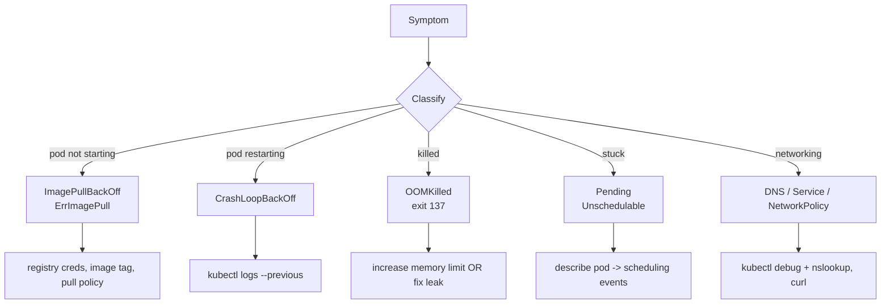

# 11 — Troubleshooting Deep Dive



## Tooling

| Need | Command |
|------|---------|
| Inject a debug container into a running pod | `kubectl debug -it <pod> --image=nicolaka/netshoot --target=<container>` |
| Debug a node (privileged pod on the host) | `kubectl debug node/<node> -it --image=busybox` |
| Copy a pod for tweaking | `kubectl debug <pod> --copy-to=debug --container=<c> --set-image=<c>=busybox -- sh` |
| Previous container logs | `kubectl logs <pod> --previous` |
| Recent events | `kubectl get events --sort-by=.lastTimestamp -A` |
| Live resource usage | `kubectl top pod` / `kubectl top node` |
| Profile control plane | `kubectl get --raw /debug/pprof/heap > heap.out` (with custom profiling endpoints) |
| Audit log | apiserver `--audit-policy-file` + `--audit-log-path` |

## Ephemeral containers
- Added by `kubectl debug` against a running pod.
- Share the pod's PID and network namespace via `--target=<container>` (so you can `nsenter`-like inspect the target's process).
- Cannot be removed — they live for the pod's lifetime.

## Root-cause cheatsheet

| Symptom | Common root causes |
|---------|--------------------|
| **ImagePullBackOff / ErrImagePull** | Wrong image:tag, private registry without imagePullSecret, rate-limited (Docker Hub anonymous), `imagePullPolicy: Always` against an offline registry |
| **CrashLoopBackOff** | App crashes on startup (config, missing secret), failing readiness/liveness probe, exit code != 0, missing volume |
| **OOMKilled (exit 137)** | Memory limit too low, leak, JVM/Node heap not aligned with cgroup limit |
| **Pending / Unschedulable** | No node has resources, taint without matching toleration, `nodeSelector` / affinity does not match, PVC pending (no provisioner) |
| **Init:CrashLoopBackOff** | Init container failing — check its logs explicitly with `-c <init-name>` |
| **Terminating forever** | Finalizer left by a controller that no longer exists — `kubectl patch ... -p '{"metadata":{"finalizers":null}}'` |
| **DNS NXDOMAIN inside pod** | CoreDNS down, NetworkPolicy blocking egress to kube-dns, wrong `dnsPolicy` |
| **Service has no endpoints** | Selector typo, all pods Not Ready, headless without subdomain set |

## Audit logs
```yaml
# audit-policy.yaml
apiVersion: audit.k8s.io/v1
kind: Policy
omitStages: ["RequestReceived"]
rules:
  - level: Metadata
    resources:
      - group: ""
        resources: ["secrets","configmaps"]
  - level: RequestResponse
    verbs: ["create","update","patch","delete"]
    resources:
      - group: "rbac.authorization.k8s.io"
```

## Files
- [debug-pod.yaml](debug-pod.yaml)
