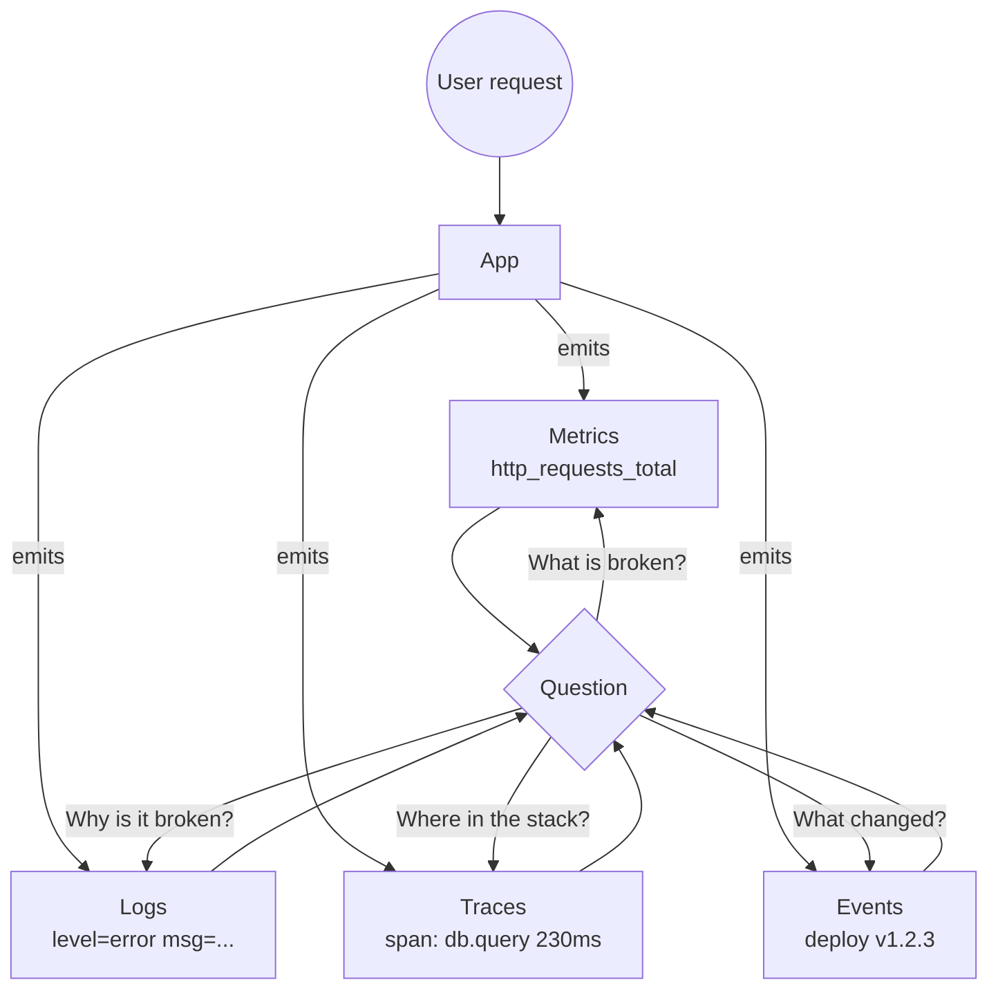

# 01 — The Three (Four) Pillars of Observability

## TL;DR

| Signal | Shape | Best at | Storage cost |
|--------|-------|---------|--------------|
| **Metrics** | Numeric time series w/ labels | Trends, alerting, dashboards | Cheap |
| **Logs** | Timestamped text/JSON lines | Forensics, debugging an instance | Expensive |
| **Traces** | Causal tree of spans across services | Latency root cause across services | Medium |
| **Events** | Discrete state changes (deploys, k8s events) | Correlating spikes with changes | Cheap |

## Mental model

<!-- mermaid:rendered -->

Mermaid source

<!-- mermaid:rendered -->

Mermaid source

<!-- mermaid:rendered -->

Mermaid source

## Metrics

- **Counter** — monotonically increasing (requests, errors). Use `rate()` over it.
- **Gauge** — point-in-time value (memory, queue depth).
- **Histogram** — distribution buckets (latency). Use `histogram_quantile()`.
- **Summary** — pre-computed quantiles (avoid; can't aggregate across instances).

Rule: **never alert on raw counters**, always on `rate()` or derived rates.

## Logs

Structured JSON > unstructured text. Always include: `timestamp, level, service, trace_id, span_id, message`. The `trace_id` is the bridge between pillars.

## Traces

A **trace** is a DAG of **spans**. Context is propagated via headers (`traceparent` per W3C Trace Context). Sampling is mandatory at scale (head-based or tail-based).

## SLI / SLO / SLA

| Term | Meaning | Owner |
|------|---------|-------|
| **SLI** (Indicator) | The measurement: `successful_requests / total_requests` | SRE |
| **SLO** (Objective) | The internal target: `99.9% over 28d` | Eng + Product |
| **SLA** (Agreement) | The contract with money attached: `99.5% or refund` | Legal + Sales |

**Error budget** = `1 - SLO`. If SLO is 99.9%, you have **0.1% × 28d ≈ 40m 19s** of failure per month before you stop shipping features and focus on reliability.

## The "RED" and "USE" methods

- **RED** (services): **R**ate, **E**rrors, **D**uration — what your users experience.
- **USE** (resources): **U**tilization, **S**aturation, **E**rrors — what your hardware experiences.

Use both. RED tells you something is wrong; USE tells you why.

## Golden Signals (Google SRE)

1. Latency
2. Traffic
3. Errors
4. Saturation

Memorize these. Every dashboard should answer all four for every service.
