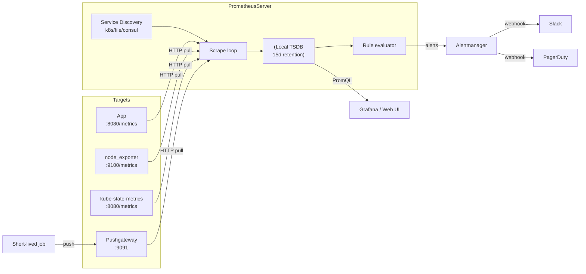

# 02 — Prometheus

Prometheus is a **pull-based**, **dimensional** time-series database with a powerful query language (PromQL). It scrapes HTTP `/metrics` endpoints on a schedule, stores samples locally, and evaluates rules.

## Architecture

<!-- mermaid:rendered -->
<p align="center"></p>

<details><summary>Mermaid source</summary>



</details>
## Components

| Component | Purpose | Image |
|-----------|---------|-------|
| `prometheus` | Scrape, store, query, rule eval | `prom/prometheus:v2.54.1` |
| `alertmanager` | Dedupe, group, route alerts | `prom/alertmanager:v0.27.0` |
| `node_exporter` | Host metrics (CPU, mem, disk, net) | `prom/node-exporter:v1.8.2` |
| `pushgateway` | Sink for short-lived/batch jobs | `prom/pushgateway:v1.10.0` |
| `kube-state-metrics` | k8s object state as metrics | `registry.k8s.io/kube-state-metrics/kube-state-metrics:v2.13.0` |

## Pull vs Push

**Pull** wins for service discovery, easy health checks, and uniform retries. **Push** (via Pushgateway) is *only* for ephemeral jobs (cron, CI). Don't push from long-running services.

## Files in this folder

- `prometheus.yml` — scrape configs for k8s + node-exporter
- `alert-rules.yml` — CPU, memory, pod restart, disk-full alerts
- `recording-rules.yml` — pre-computed expensive queries
- `promql-cheatsheet.md` — query patterns

## Quick start (Docker)

```bash
docker run -d --name prom -p 9090:9090 \
  -v $PWD/prometheus.yml:/etc/prometheus/prometheus.yml \
  -v $PWD/alert-rules.yml:/etc/prometheus/alert-rules.yml \
  -v $PWD/recording-rules.yml:/etc/prometheus/recording-rules.yml \
  prom/prometheus:v2.54.1
# UI: http://localhost:9090
```

## Storage facts

- Default retention: 15 days. Change with `--storage.tsdb.retention.time=30d`.
- Sample size: ~1-2 bytes after compression.
- Cardinality kills you, not volume. See `10-cost-and-cardinality`.
