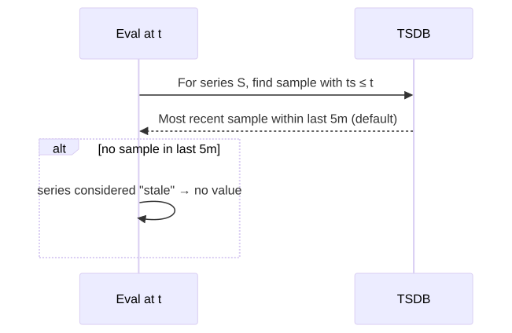
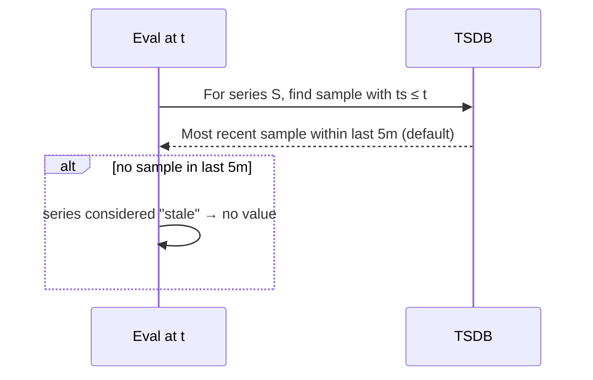
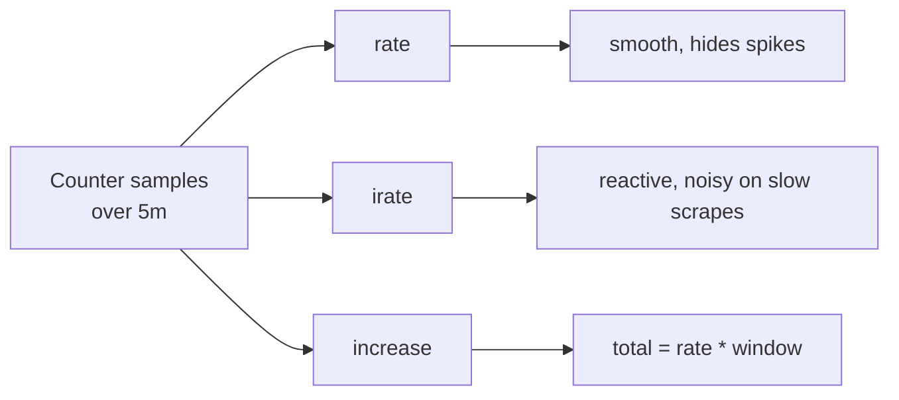
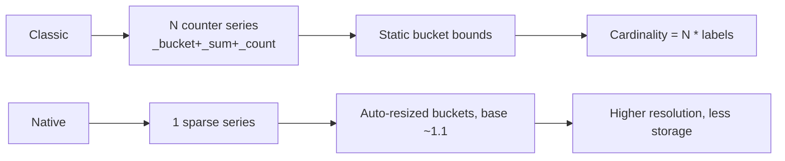

# PromQL Execution Deep Dive

## Why this matters

PromQL looks like math but evaluates as a typed pipeline over time series. Most production query bugs (wrong rates, missing data points, broken alerts) come from confusing instant vs range vectors, misusing `rate` vs `irate`, ignoring the lookback delta, or comparing classic histograms incorrectly. Understanding the engine separates "queries that load" from "queries that mean what you think".

## Mental Model

PromQL has four types and four selector forms. Every function and operator has a strict input type. Most "Error executing query: ..." messages are type mismatches.

| Type | Example | Yields |
|------|---------|--------|
| Instant vector | `http_requests_total` | One sample per series at eval time |
| Range vector | `http_requests_total[5m]` | Per series, ALL samples in [eval-5m, eval] |
| Scalar | `5`, `scalar(...)` | Single number |
| String | `"prod"` | Only used in label_replace |

**Critical:** Range vectors cannot be plotted, alerted on, or arithmetic'd directly. They MUST be passed through a range function (`rate`, `increase`, `avg_over_time`, ...) which collapses them back to an instant vector.

```mermaid
flowchart LR
    A[Selector with [5m]] --> B[Range vector]
    B --> C[rate / increase / avg_over_time / ...]
    C --> D[Instant vector]
    D --> E[Aggregation: sum by le]
    E --> F[histogram_quantile]
    F --> G[Alert / dashboard]
```

## Instant vs Range queries

The Prometheus HTTP API has two query endpoints:

| Endpoint | Eval | Use |
|----------|------|-----|
| `/api/v1/query` | At a single timestamp `t` | Console, alerts |
| `/api/v1/query_range` | At every step in `[start, end]` with interval `step` | Graphs |

Range queries evaluate the SAME expression at each step. Inside that expression, `[5m]` always means "the previous 5 minutes from THIS step" — not the whole range.

## Lookback Delta

<!-- mermaid:rendered -->
<p align="center"></p>

<details><summary>Mermaid source</summary>



</details>

The default lookback delta is **5 minutes**. If a series hasn't reported within 5m of eval time, it's omitted. This is why short-lived pods or scrape gaps cause "missing data" in graphs. Adjust with `--query.lookback-delta=10m` (rarely advisable — usually fix the scrape gap instead).

Stale markers: when a series disappears (target deleted), Prometheus injects a stale NaN sample so queries immediately drop the series rather than waiting 5m.

## rate vs irate vs increase

For counters only. All three handle counter resets (a drop to lower value = reset; the engine extrapolates).

| Function | Computes | Use when |
|----------|----------|----------|
| `rate(c[5m])` | Avg per-second rate over the entire window, linearly extrapolated | Alerting & dashboards (smoothed) |
| `irate(c[5m])` | Per-second rate using ONLY the last two samples in the window | High-resolution graphs of volatile signals |
| `increase(c[5m])` | Total increase over the window (= rate * window seconds) | "How many events happened?" |

<!-- mermaid:rendered -->
<p align="center"></p>

<details><summary>Mermaid source</summary>



</details>

**Trap:** If your range `[5m]` doesn't contain at least 2 samples, `rate` returns nothing. Range MUST be ≥ 4× scrape_interval as a rule of thumb.

**Trap:** `irate` for alerting is dangerous — single-sample noise can fire/clear alerts. Use `rate` for alerting.

## Histograms — Classic vs Native

### Classic histograms

Stored as multiple counter series with `_bucket{le="..."}`, `_sum`, `_count`. Compute quantiles at query time:

```promql
histogram_quantile(
  0.95,
  sum by (le) (rate(http_request_duration_seconds_bucket[5m]))
)
```

Pitfalls:
- `le` label MUST be preserved in the aggregation (`sum by (le)`).
- Bucket boundaries are static — chosen at instrumentation time. Bad bucket choice = inaccurate quantiles forever.
- Each bucket = one series → cardinality cost scales with bucket count × label combinations.
- Quantiles are interpolated within buckets; `+Inf` bucket is required.

### Native histograms (Prometheus 2.40+)

A single sparse, dynamically-bucketed series per histogram. Massive cardinality savings + much higher resolution.

```promql
histogram_quantile(0.95, sum(rate(http_request_duration_seconds[5m])))
```

Note: no `_bucket` suffix, no `by (le)`. The function works directly on the native histogram series.

<!-- mermaid:rendered -->
<p align="center"></p>

<details><summary>Mermaid source</summary>



</details>

## Annotated query walkthrough

```promql
# 95th percentile request latency, per service, over 5m
histogram_quantile(
  0.95,                                          # quantile to compute
  sum by (service, le) (                         # aggregate across instances
    rate(                                        # per-second bucket increase
      http_request_duration_seconds_bucket[5m]   # range vector
    )
  )
)
```

Order of operations matters. Common bug: putting `sum` outside `histogram_quantile` aggregates after quantile computation, which is mathematically wrong (you can't average percentiles).

## Common Interview Questions

> [!IMPORTANT]
> **Q1: Why does `http_requests_total[5m]` not graph?**
> A: It's a range vector. Graphs need instant vectors. Wrap in `rate()`, `avg_over_time()`, etc.
>
> **Q2: rate vs irate for alerts?**
> A: Always `rate`. `irate` uses only the last 2 samples — single noisy data point can fire/resolve alerts. `rate` smooths over the window.
>
> **Q3: Why might a graph have gaps despite the target being up?**
> A: Lookback delta (5m default) — if no sample in the last 5m, series is omitted. Or stale markers were injected. Or `[5m]` range had < 2 samples.
>
> **Q4: How does `histogram_quantile` work?**
> A: Linearly interpolates within the bucket whose cumulative count crosses the requested quantile. Requires `le` label preserved through aggregation and a `+Inf` bucket.
>
> **Q5: Why is averaging quantiles wrong?**
> A: Quantiles are nonlinear. p95 across 3 instances ≠ avg of each instance's p95. Correct: aggregate buckets first (`sum by (le)`), then `histogram_quantile`.
>
> **Q6: What's the cardinality difference between classic and native histograms?**
> A: Classic = one series per bucket boundary per label combination. Native = one series total per histogram, sparse buckets. Native can cut series count 10–100×.
>
> **Q7: How does `rate` handle counter resets?**
> A: When a sample is lower than the previous, the engine assumes a reset and treats the value as the increment from 0. Then linearly extrapolates the rate over the window.
>
> **Q8: Difference between instant and range query endpoints?**
> A: `/api/v1/query` evaluates at one timestamp. `/api/v1/query_range` evaluates the SAME expression repeatedly across `[start, end]` at `step` resolution. Range vectors `[5m]` inside still mean "5m before THIS step".

## Sources

- PromQL basics: https://prometheus.io/docs/prometheus/latest/querying/basics/
- Functions: https://prometheus.io/docs/prometheus/latest/querying/functions/
- Histograms & quantiles: https://prometheus.io/docs/practices/histograms/
- Native histograms: https://prometheus.io/docs/specs/native_histograms/
- HTTP API: https://prometheus.io/docs/prometheus/latest/querying/api/
