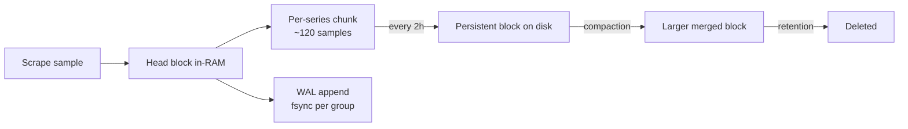
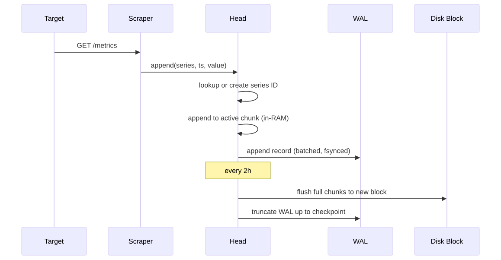
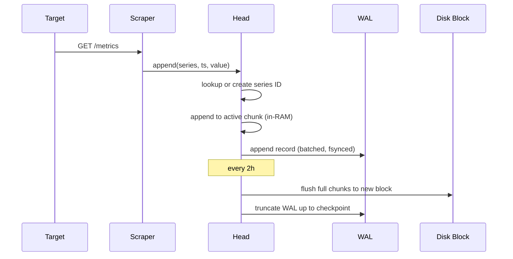
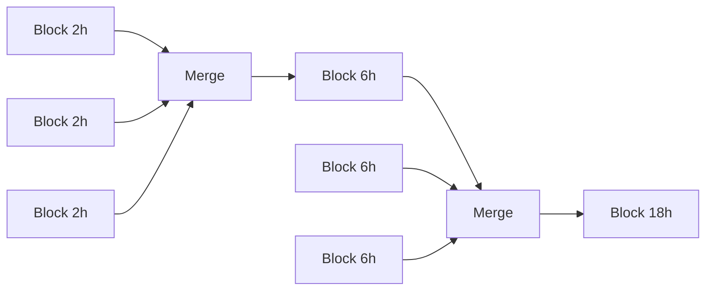
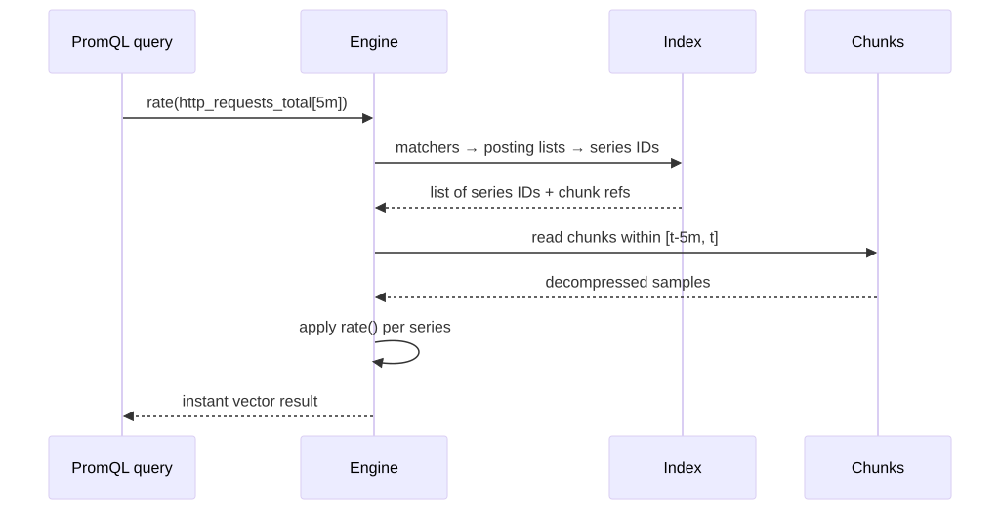
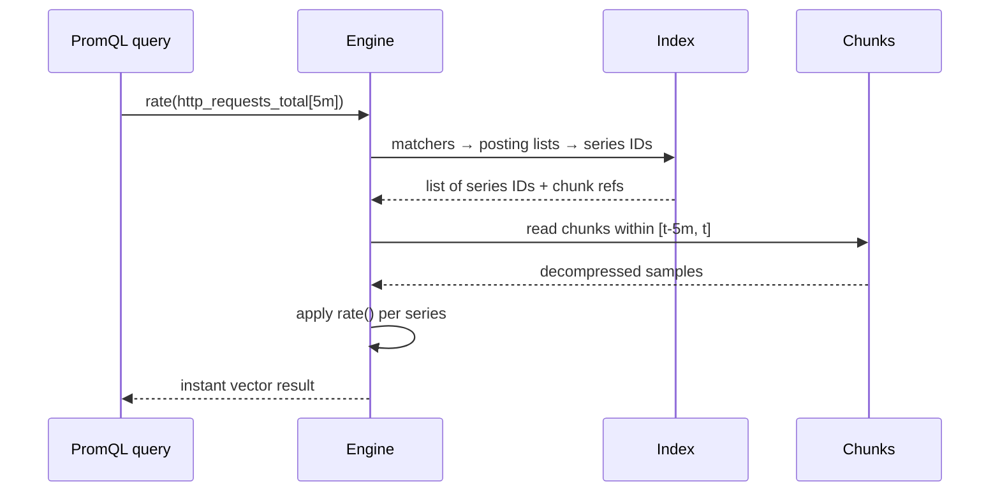

# Prometheus TSDB Internals Deep Dive

## Why this matters

Every Prometheus performance issue, OOM, and "queries are slow" alert traces back to the TSDB: head series, chunks, blocks, WAL, cardinality. Understanding the on-disk and in-memory layout is what lets you size a Prometheus instance, reason about query cost, and avoid the cardinality cliff that takes down monitoring stacks.

## Mental Model

Prometheus TSDB is a **write-optimized, append-only time series store** with a hot in-memory "head" and immutable on-disk "blocks" compacted in the background. Every metric+label combination is a unique series; series are written to a WAL for crash recovery and into per-series chunks (~120 samples each). Chunks flush to a 2h block; blocks compact into bigger blocks (max ~10% of retention).

<!-- mermaid:rendered -->
<p align="center"></p>

<details><summary>Mermaid source</summary>



</details>

## Storage Layout on Disk

```mermaid
flowchart TB
    DATA[/data/prometheus] --> WAL[wal/]
    DATA --> CHUNKS_HEAD[chunks_head/]
    DATA --> B1[01HXYZ.../]
    DATA --> B2[01HABC.../]
    WAL --> SEG1[00000123]
    WAL --> SEG2[00000124]
    WAL --> CP[checkpoint.000122/]
    B1 --> M[meta.json]
    B1 --> CHK[chunks/000001]
    B1 --> IDX[index]
    B1 --> TOMB[tombstones]
```

| Path | Purpose |
|------|---------|
| `wal/` | Write-ahead log segments (128MB each), replayed on startup |
| `chunks_head/` | Memory-mapped head chunks not yet flushed to a block |
| `01HXYZ.../` | A persistent block (ULID-named) covering a time range |
| `meta.json` | Block metadata: minTime, maxTime, stats, compaction level |
| `chunks/` | Compressed sample data (varbit / Gorilla / native histograms) |
| `index` | Inverted index: label → posting lists → series → chunk refs |
| `tombstones` | Deletion markers (from `delete_series` API) |

## The Head — what actually consumes RAM

The head holds the last ~3h of data in memory + memory-mapped chunks. Memory cost ≈ `active_series * ~3KB` (rule of thumb). 1M active series ≈ 3GB head RAM, plus query and index overhead.

<!-- mermaid:rendered -->
<p align="center"></p>

<details><summary>Mermaid source</summary>



</details>

### Chunk lifecycle

1. Series gets a new chunk every 120 samples OR every 2h, whichever first.
2. Closed chunks stay in `chunks_head/` mmap-ed.
3. At block boundary (default 2h), all closed chunks flush to a persistent block.
4. WAL is checkpointed and old segments deleted.

## Compaction

<!-- mermaid:rendered -->
<p align="center"></p>

<details><summary>Mermaid source</summary>



</details>

Compaction merges adjacent blocks, deduplicates samples, removes tombstoned data, and rebuilds the index. Max block size is `min(31d, 10% of retention)`. Compaction is CPU/IO heavy — schedule retention with this in mind.

## Cardinality — the silent killer

**Cardinality** = unique combinations of metric name + label values. Each unique combination = one series = persistent memory + index cost.

```promql
# Top 10 metric names by series count
topk(10, count by (__name__)({__name__=~".+"}))

# Series count per job
count by (job)({__name__=~".+"})
```

Cardinality explosions almost always come from labels with unbounded values:

| Bad label | Why |
|-----------|-----|
| `user_id` | One series per user, grows forever |
| `request_id` | Unique per request — instant death |
| `path` (raw URLs with IDs) | `/users/123`, `/users/124`, ... |
| `error_message` | Free-form strings |

**Rule:** Labels should have bounded, low-cardinality values (status codes, regions, environments, route templates). Move high-cardinality data to logs/traces.

### Annotated config — controlling cardinality

```yaml
scrape_configs:
  - job_name: api
    static_configs:
      - targets: [api:8080]
    metric_relabel_configs:
      # Drop the dangerous "instance_id" label entirely
      - action: labeldrop
        regex: instance_id
      # Drop a noisy histogram metric
      - source_labels: [__name__]
        regex: 'http_request_duration_seconds_bucket'
        action: drop

global:
  scrape_interval: 30s
  external_labels:
    cluster: prod-east-1     # external labels add to EVERY series — keep tiny
storage:
  tsdb:
    retention.time: 15d
    retention.size: 100GB    # whichever hits first triggers deletion
    wal-compression: true    # halves WAL size, small CPU cost
```

## Query Path

<!-- mermaid:rendered -->
<p align="center"></p>

<details><summary>Mermaid source</summary>



</details>

## Common Interview Questions

> [!IMPORTANT]
> **Q1: What is "cardinality" and why is it dangerous?**
> A: The number of unique series (metric+label-value combinations). Memory and index cost scale linearly. Unbounded labels (user IDs, UUIDs) cause series counts to grow without bound, OOMing Prometheus.
>
> **Q2: Why is there a WAL if data is in memory?**
> A: To survive crashes. The WAL is fsync-batched on append; on startup Prometheus replays it to rebuild head state.
>
> **Q3: What's a "block" and how big can it get?**
> A: An immutable directory containing chunks + index + meta.json for a fixed time range. Initial blocks are 2h; compaction merges them up to `min(31d, 10% retention)`.
>
> **Q4: Difference between `chunks_head/` and a persistent block?**
> A: `chunks_head/` is memory-mapped sample data for the in-RAM head not yet flushed. Blocks are immutable, indexed, and can be queried after a restart without WAL replay.
>
> **Q5: Why does Prometheus use ~3KB per active series?**
> A: Per-series labels in the head index, the mmap'd active chunk, posting list entries, and metadata. Rule of thumb: 1M series ≈ 3GB head RAM (excluding query overhead).
>
> **Q6: How does retention work — time vs size?**
> A: `retention.time` and `retention.size` both apply; whichever triggers first removes the OLDEST blocks. Deletion is at block granularity.
>
> **Q7: What does compaction do besides merging?**
> A: Deduplicates samples, removes tombstoned series, rebuilds the index for faster queries, reduces total block count.
>
> **Q8: What's the difference between `count` and `count_values` for cardinality analysis?**
> A: `count by (label)({__name__=~".+"})` counts series per label value. `count_values` counts distinct values of a sample value (rarely used). For cardinality audits use `topk(10, count by (__name__)({__name__=~".+"}))`.

## Sources

- Prometheus Storage docs: https://prometheus.io/docs/prometheus/latest/storage/
- TSDB format spec: https://github.com/prometheus/prometheus/tree/main/tsdb/docs/format
- "Writing a TSDB from scratch" by Fabian Reinartz: https://fabxc.org/tsdb/
- Cardinality management: https://prometheus.io/docs/practices/naming/
