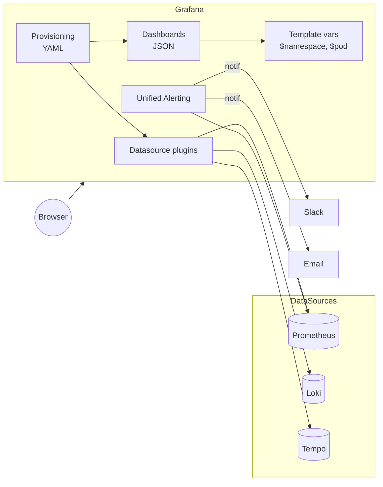

# 03 — Grafana

Grafana is the **query and visualization** layer. It connects to many time-series & log stores (Prometheus, Loki, Tempo, Elastic, MySQL, etc.) and renders dashboards, panels, variables, and alerts.

## Architecture

<!-- mermaid:rendered -->
<p align="center"></p>

<details><summary>Mermaid source</summary>



</details>
## Concepts

| Concept | Notes |
|---------|-------|
| **Datasource** | Connection to a backend (Prometheus URL, auth, etc.). Provisioned via `datasources.yaml`. |
| **Dashboard** | JSON file. A grid of panels with variables. |
| **Panel** | One viz: time series, stat, table, gauge, heatmap, logs. |
| **Variable** | `$namespace`, `$pod` — populated by `label_values()` or static lists. |
| **Annotations** | Markers on graphs (deploys, incidents). |
| **Unified Alerting** | Grafana 8+ alerts work across datasources, route via Alertmanager-compatible contact points. |
| **Folder/Org/Team** | RBAC scoping. |

## Provisioning

In production, **never click your way to a dashboard**. Use `provisioning/`:

- `datasources.yaml` → tells Grafana which backends to connect to on startup
- `dashboards.yaml` → tells Grafana to load dashboard JSON from a folder

Mount these into the container at `/etc/grafana/provisioning/{datasources,dashboards}/`.

## Quick start (Docker)

```bash
docker run -d --name grafana -p 3000:3000 \
  -v $PWD/provisioning:/etc/grafana/provisioning \
  -v $PWD/dashboard-k8s-cluster.json:/var/lib/grafana/dashboards/k8s.json \
  -e GF_SECURITY_ADMIN_PASSWORD=admin \
  grafana/grafana:11.2.0
# UI: http://localhost:3000  (admin / admin)
```

## Files

- `provisioning/datasources.yaml` — Prometheus + Loki + Tempo wired with trace correlation
- `provisioning/dashboards.yaml` — folder-based dashboard provider
- `dashboard-k8s-cluster.json` — minimal valid dashboard

## Panel patterns to memorize

| Need | Panel | Query example |
|------|-------|---------------|
| RPS over time | Time series | `sum(rate(http_requests_total[5m]))` |
| Current error % | Stat | `100 * <error ratio recording rule>` |
| Top-N noisy services | Bar chart | `topk(10, sum by (service)(...))` |
| Latency distribution | Heatmap | `sum by (le)(rate(..._bucket[5m]))` |
| Live logs | Logs | `{namespace="$ns",pod="$pod"}` (LogQL) |

## Variables (the productivity unlock)

```text
namespace  =  label_values(kube_pod_info, namespace)
pod        =  label_values(kube_pod_info{namespace="$namespace"}, pod)
```

Then use `{namespace="$namespace",pod="$pod"}` everywhere. One dashboard → all pods.
