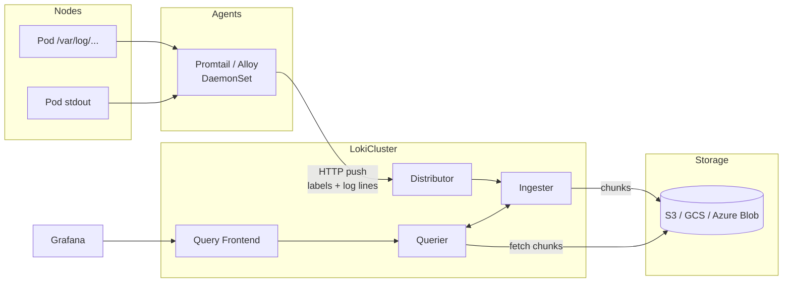

# 04 — Loki (Log Aggregation)

Loki is "Prometheus for logs": it indexes only **labels**, not the log content. This makes it 10-100x cheaper than ELK at the cost of needing label discipline up front.

## Architecture

<!-- mermaid:rendered -->
<p align="center"></p>

<details><summary>Mermaid source</summary>



</details>
## Loki vs ELK (Elastic)

| | Loki | ELK |
|---|------|-----|
| Indexes | Labels only | Full text |
| Storage | Cheap (S3, gzip chunks) | Expensive (inverted index on disk) |
| Query speed | Slower for free-text | Fast for everything |
| Ops complexity | Low (single binary mode) | High (cluster, JVM tuning) |
| Best for | k8s logs at scale, cost-sensitive | Forensics, security, NLP-style search |

## LogQL — quick tour

LogQL = Prometheus selector + log filtering + metric extraction.

```logql
# Stream selector (must)
{namespace="prod", app="api"}

# Line filters
{app="api"} |= "error"                  # contains
{app="api"} != "healthcheck"            # excludes
{app="api"} |~ "5\\d\\d"                # regex
{app="api"} !~ "debug|trace"

# Parsing
{app="api"} | json                       # parse JSON, expose fields as labels
{app="api"} | logfmt                     # k=v pairs
{app="api"} | regexp "(?P<status>\\d+)"

# Filter on parsed fields
{app="api"} | json | status >= 500 | duration > 1s

# Metrics from logs
sum(rate({app="api"} |= "error" [5m]))                   # error rps
sum by (status) (count_over_time({app="api"} | json [5m]))
```

## Promtail vs Grafana Alloy

- **Promtail** — long-standing log shipper, k8s-aware, simple.
- **Grafana Alloy** — newer unified agent (logs + metrics + traces in one binary, OTel-native). **Use Alloy for new deployments.** Promtail still works fine.

## Files

- `loki-config.yaml` — single-binary Loki config with filesystem storage (dev) and S3 stub (prod)
- `promtail-config.yaml` — DaemonSet config to scrape `/var/log/pods`

## Quick start (Docker)

```bash
docker network create obs
docker run -d --name loki --network obs -p 3100:3100 \
  -v $PWD/loki-config.yaml:/etc/loki/local-config.yaml \
  grafana/loki:3.2.0 -config.file=/etc/loki/local-config.yaml

docker run -d --name promtail --network obs \
  -v $PWD/promtail-config.yaml:/etc/promtail/config.yml \
  -v /var/log:/var/log:ro \
  grafana/promtail:3.2.0 -config.file=/etc/promtail/config.yml
```

## Label hygiene rules

1. **Low cardinality only** as labels: `namespace`, `app`, `pod`, `container`, `level`. **Never** put `user_id`, `request_id`, `trace_id` as labels — keep them in the line and parse with `| json`.
2. Aim for **< 100k active streams** per tenant. Each unique label combo = one stream.
3. Drop noisy fields aggressively in `pipeline_stages`.
