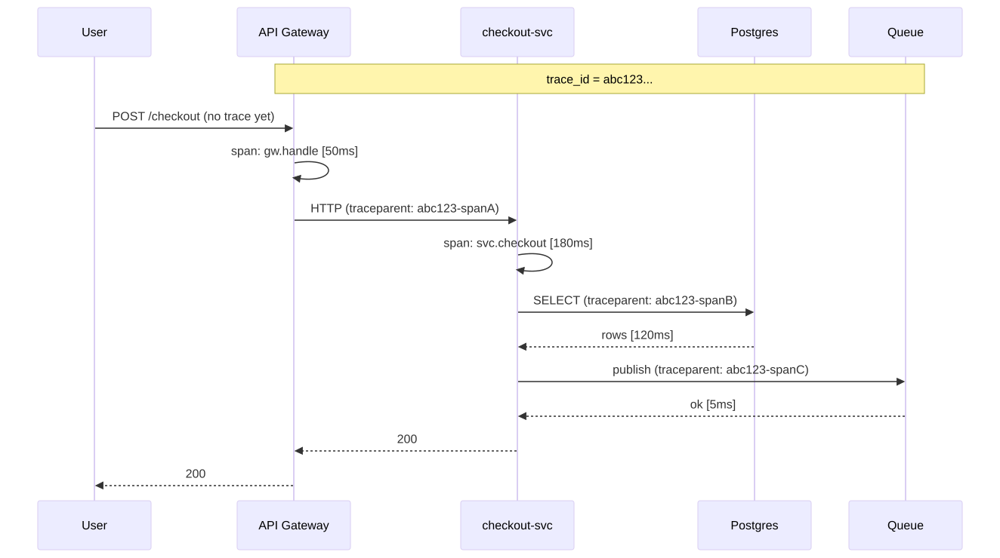
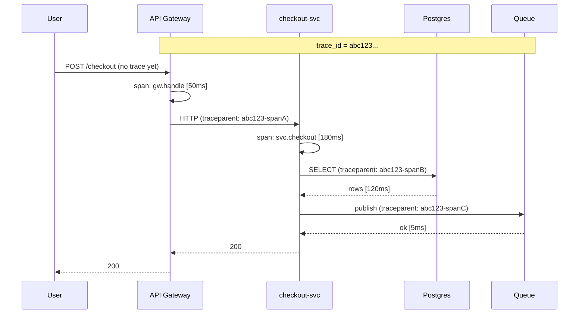
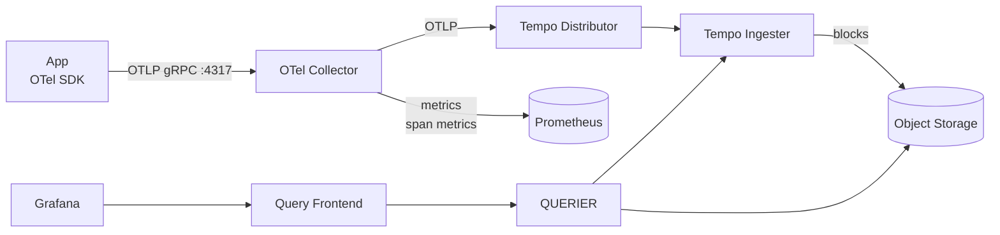

# 05 — Tempo & Distributed Tracing

A **trace** answers "where did the time go?" across services. It's a tree of **spans**, each representing one unit of work (HTTP call, DB query, function).

## Concepts

| Term | Meaning |
|------|---------|
| **Trace** | A single end-to-end request, identified by `trace_id` (16 bytes hex). |
| **Span** | One operation within a trace, identified by `span_id` (8 bytes). Has start, duration, attributes, events. |
| **Parent span** | The span that caused this one. Spans form a tree per trace. |
| **Context propagation** | Passing `trace_id` + `span_id` between processes. Standard: **W3C Trace Context** (`traceparent` header). |
| **Sampling** | Keep a fraction of traces. Head-based (decide at start) or tail-based (decide after seeing the whole trace — needed for "keep all errors"). |

## Trace anatomy

<!-- mermaid:rendered -->
<p align="center"></p>

<details><summary>Mermaid source</summary>



</details>
## Tempo architecture

<!-- mermaid:rendered -->
<p align="center"></p>

<details><summary>Mermaid source</summary>



</details>
## Tempo vs Jaeger

| | Tempo | Jaeger |
|---|-------|--------|
| Backing store | Object storage (S3/GCS/Azure) — cheap | Cassandra/Elasticsearch — expensive |
| Search | TraceQL (Tempo 2.x) + by `trace_id` | Full search via index |
| Best for | Cost-sensitive, "always-on" tracing | Rich UI search, smaller scale |
| Integration | Native Grafana | Has its own UI |

Pick Tempo if you're already in the Grafana stack and store traces in object storage.

## Sampling strategies

```
Head-based (cheap, lossy):  sample 1% at trace start
Tail-based (smart, costly): collector buffers, keeps:
  - all errors
  - all slow traces (> 500ms)
  - 1% of normal
```

Tail sampling lives in the **OTel Collector** (see `06-opentelemetry/`).

## Quick start (Docker)

```bash
docker run -d --name tempo -p 3200:3200 -p 4317:4317 -p 4318:4318 \
  -v $PWD/tempo-config.yaml:/etc/tempo.yaml \
  grafana/tempo:2.6.0 -config.file=/etc/tempo.yaml
```

## TraceQL example

```
{ resource.service.name = "checkout-svc" && duration > 500ms && status = error }
```

## File

- `tempo-config.yaml` — minimal single-binary Tempo with filesystem storage + span metrics generator.
