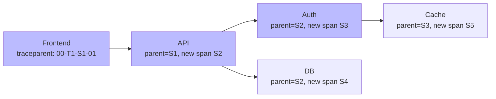
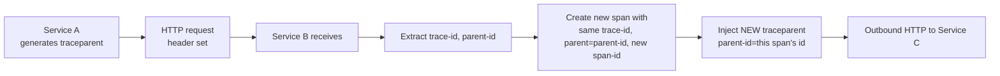
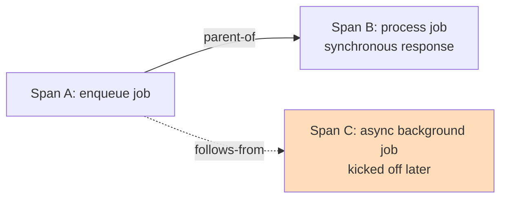
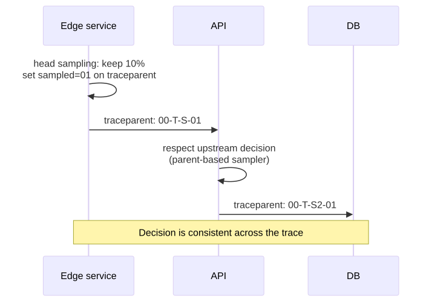
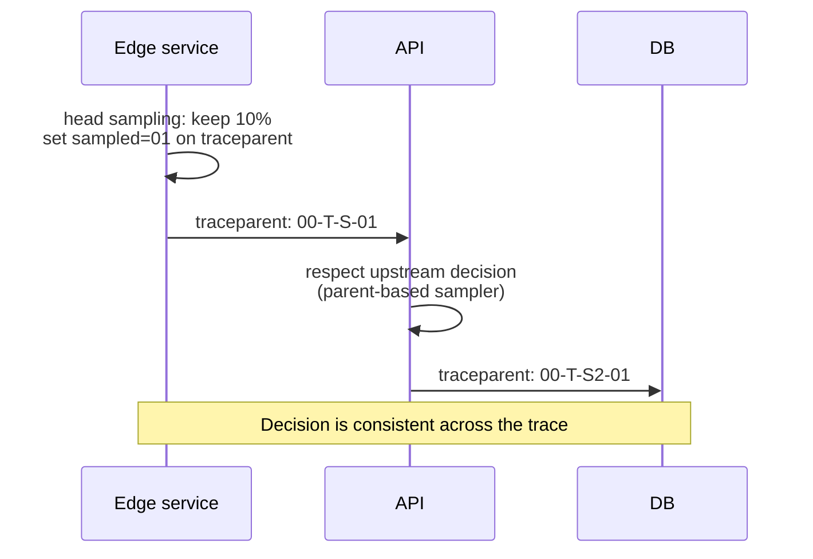

# Trace Context Propagation Deep Dive

## Why this matters

A distributed trace is only as good as its propagation. If a service drops the `traceparent` header — or generates a new trace ID at every hop — your "distributed" trace becomes a pile of orphaned spans. W3C Trace Context is the standardized way services pass causality across HTTP/gRPC/messaging boundaries, and getting sampling decisions consistent across that chain is what makes head-based sampling actually work.

## Mental Model

A trace is a DAG of spans. Propagation = passing the **trace identity** + **immediate parent span ID** + **sampling decision** + arbitrary **baggage** across every network hop. Without propagation, the receiving service starts a brand-new trace.

<!-- mermaid:rendered -->
<p align="center"></p>

<details><summary>Mermaid source</summary>



</details>

All five spans share `T1` (the trace ID) and form a parent/child tree.

## The W3C Traceparent Header

```text
traceparent: 00-4bf92f3577b34da6a3ce929d0e0e4736-00f067aa0ba902b7-01
             ^^ ^^^^^^^^^^^^^^^^^^^^^^^^^^^^^^ ^^^^^^^^^^^^^^^^ ^^
             |  |                                |                |
             |  trace-id (16 bytes hex)          |                trace-flags
             version                             parent-id (8 bytes hex)
```

| Field | Bytes | Meaning |
|-------|-------|---------|
| version | 1 | Always `00` today |
| trace-id | 16 | Globally unique trace identifier (NOT the span ID) |
| parent-id | 8 | The span ID of the IMMEDIATE caller (this becomes the child's parent) |
| trace-flags | 1 | Bit 0 = "sampled". `01` = recorded, `00` = not recorded |

<!-- mermaid:rendered -->
<p align="center"></p>

<details><summary>Mermaid source</summary>



</details>

## Tracestate — vendor-specific extensions

```text
tracestate: vendor1=value1,vendor2=value2,otel=...
```

Comma-separated key=value list. Vendors append entries; max 32 entries / 512 chars total. Used for vendor-specific routing/sampling hints (e.g. `dd=p:1` from Datadog). Most apps don't touch it directly.

## Baggage — application-level context

```text
baggage: userId=alice,tenant=acme,featureFlag=v2
```

Free-form key/value pairs that propagate alongside the trace context to ALL downstream services. Common uses:
- Tenant ID for multi-tenant request isolation
- Feature flag values (so all services see the same flag for a request)
- Request-level routing hints

**Trap:** Baggage propagates everywhere — including external API calls. Don't put PII in baggage. Don't make it large.

## Parent vs Follows-From — span links

<!-- mermaid:rendered -->
<p align="center"></p>

<details><summary>Mermaid source</summary>



</details>

| Relationship | When |
|--------------|------|
| Parent / child | Caller waits for callee. Standard request/response. |
| Follows-from (Span Link) | Caller does NOT wait. Async job, message queue consumer, batched downstream work. The new span has no parent in the same trace; it has a *Link* to the originating span. |

In OpenTelemetry, this is `SpanLink` with attributes — used heavily for batch processors that consume N upstream messages into one downstream span.

## Sampling decisions

<!-- mermaid:rendered -->
<p align="center"></p>

<details><summary>Mermaid source</summary>



</details>

### Sampler types

| Sampler | Decision basis | Use |
|---------|---------------|-----|
| `AlwaysOn` | Always sample | Dev/staging |
| `AlwaysOff` | Never sample | Disable tracing |
| `TraceIdRatioBased(0.1)` | Hash of trace ID → keep 10% | Stateless, consistent across services |
| `ParentBased(root=ratio_0.1)` | If parent context present, follow its sampled flag; else apply root sampler | Production default |
| Tail sampler (Collector-side) | Decide AFTER all spans collected | Keep all error traces, slow traces |

**Critical:** With head-based sampling, the EDGE service's decision wins. All downstream services must use `ParentBased` to honor `trace-flags`. If a middle service runs its own ratio sampler, decisions diverge and you get half-sampled traces (orphans).

## Annotated propagation example (Go OTel)

```go
// Outbound: inject context into HTTP request
import "go.opentelemetry.io/otel/propagation"

prop := propagation.NewCompositeTextMapPropagator(
    propagation.TraceContext{},   // W3C traceparent + tracestate
    propagation.Baggage{},        // W3C baggage
)

req, _ := http.NewRequest("GET", "https://downstream/api", nil)
prop.Inject(ctx, propagation.HeaderCarrier(req.Header))
// req.Header now contains: traceparent, tracestate, baggage

// Inbound: extract context from incoming request
ctx := prop.Extract(r.Context(), propagation.HeaderCarrier(r.Header))
// ctx now carries the upstream span context — child spans will inherit
```

The composite propagator is critical — register every propagator format you need to read/write. Missing `Baggage{}` silently drops baggage.

## Multi-protocol propagation

| Transport | Carrier |
|-----------|---------|
| HTTP/HTTPS | Request headers |
| gRPC | Metadata (key/value pairs) |
| Kafka | Message headers (since Kafka 0.11) |
| AWS SQS/SNS | Message attributes (limit: 10 attrs — packs trace+baggage tightly) |
| Lambda | `Traceparent` request context attribute |

Each requires the language SDK's matching instrumentation library. Manual injection is error-prone — use the official packages.

## Common Interview Questions

> [!IMPORTANT]
> **Q1: What's in a `traceparent` header?**
> A: `version-trace-id-parent-id-flags`, e.g. `00-<32hex>-<16hex>-01`. Version, 16-byte trace ID, 8-byte parent span ID, 1-byte flags (bit 0 = sampled).
>
> **Q2: Difference between trace-id, span-id, and parent-id?**
> A: trace-id is the same across ALL spans of a trace. span-id is unique per span. parent-id (in the header) = the caller's span-id, which the receiving service uses to set the parent of its new span.
>
> **Q3: tracestate vs baggage?**
> A: `tracestate` carries vendor-specific tracing metadata (sampling priorities, vendor IDs). `baggage` carries application-defined key/values for request context (userId, tenant) and propagates everywhere.
>
> **Q4: What is `ParentBased` sampler?**
> A: A sampler that follows the upstream's `trace-flags` decision when a parent context exists, applying its root sampler only at the trace's origin. Required for consistent head-based sampling across services.
>
> **Q5: Parent vs Follows-From?**
> A: Parent = synchronous causality, caller waits. Follows-from (Span Link) = async causality, no wait. Use Links for queue consumers and batch processors.
>
> **Q6: What happens if a service doesn't propagate traceparent?**
> A: The downstream span starts a NEW trace with no parent. The trace tree splits — you get orphaned subtrees you can't correlate.
>
> **Q7: Why use tail sampling over head sampling?**
> A: Head sampling decides at the edge before knowing if the trace is interesting. Tail sampling waits until all spans arrive at the Collector and can keep traces matching policies (errors, latency, specific service paths). Cost: memory & latency in the Collector.
>
> **Q8: Risks of putting data in baggage?**
> A: Baggage propagates to ALL downstream services including external APIs. PII leaks, header size growth (load balancer rejection), and accidental exposure are real risks. Keep baggage tiny and non-sensitive.

## Sources

- W3C Trace Context: https://www.w3.org/TR/trace-context/
- W3C Baggage: https://www.w3.org/TR/baggage/
- OpenTelemetry Propagation: https://opentelemetry.io/docs/concepts/context-propagation/
- OTel Sampling: https://opentelemetry.io/docs/concepts/sampling/
- Tempo sampling guide: https://grafana.com/docs/tempo/latest/configuration/sampling/
