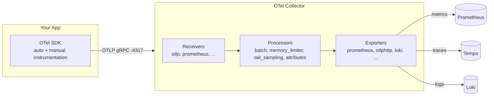

# 06 — OpenTelemetry (OTel)

OpenTelemetry is the **vendor-neutral standard** for instrumenting applications. One SDK in your code; one wire protocol (OTLP); any backend (Prometheus, Tempo, Jaeger, Datadog, New Relic, etc.).

## The three signals OTel covers

| Signal | Status | Notes |
|--------|--------|-------|
| Traces | Stable | Most mature |
| Metrics | Stable | Replaces Prometheus client libs over time |
| Logs | Stable | Bridges to existing log libraries |

## SDK vs Collector

<!-- mermaid:rendered -->
<p align="center"></p>

<details><summary>Mermaid source</summary>

<!-- mermaid:rendered -->
<p align="center"></p>

<details><summary>Mermaid source</summary>

<!-- mermaid:rendered -->
<p align="center"></p>

<details><summary>Mermaid source</summary>



</details>

</details>

</details>

**Rule:** apps speak only OTLP to a local collector. The collector handles routing, sampling, retries, and batching. Never let apps talk to backends directly.

## OTLP

The wire protocol. Two flavors:
- **gRPC** on `:4317` (preferred, binary, efficient)
- **HTTP/protobuf** on `:4318`

## Semantic Conventions

OTel defines **standard attribute names** so dashboards built for one app work for all. Examples:

| Attribute | Example value |
|-----------|---------------|
| `service.name` | `checkout-svc` |
| `service.version` | `1.4.2` |
| `deployment.environment` | `prod` |
| `http.request.method` | `POST` |
| `http.response.status_code` | `200` |
| `url.path` | `/api/orders` |
| `db.system` | `postgresql` |
| `db.statement` | `SELECT * FROM orders WHERE id=$1` |
| `messaging.system` | `kafka` |

**Use these names.** Don't invent your own.

## Collector deployment patterns

| Pattern | Use when |
|---------|----------|
| **Sidecar** (per-pod) | Low latency, per-app sampling |
| **DaemonSet** (per-node) | Default for k8s — local socket, host metrics |
| **Gateway** (cluster service) | Tail sampling, cross-tenant routing |

Most production setups: **DaemonSet → Gateway → backends**.

## File

- `otel-collector.yaml` — k8s ConfigMap + Deployment with OTLP receivers, batch + memory_limiter processors, exporters to Prometheus/Tempo/Loki
- `instrumentation-examples.md` — Python, Go, Node snippets

## Quick test

```bash
# Run the contrib collector locally
docker run --rm -p 4317:4317 -p 4318:4318 \
  -v $PWD/otel-collector-config.yaml:/etc/otelcol-contrib/config.yaml \
  otel/opentelemetry-collector-contrib:0.110.0
```
