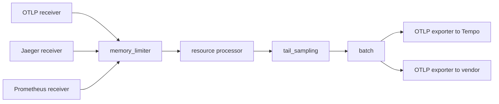
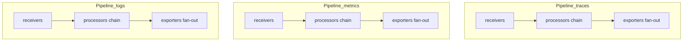
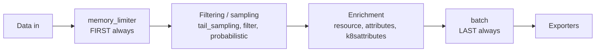
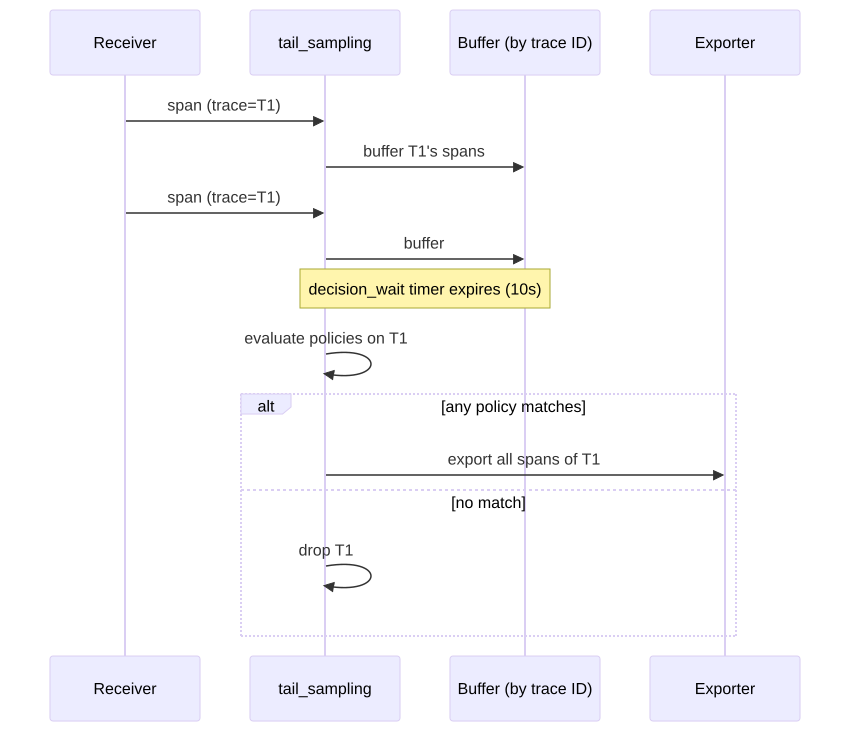
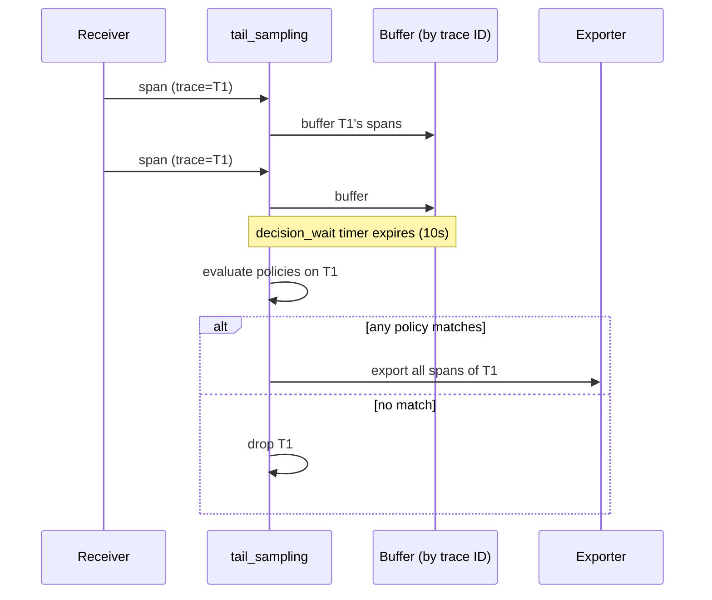
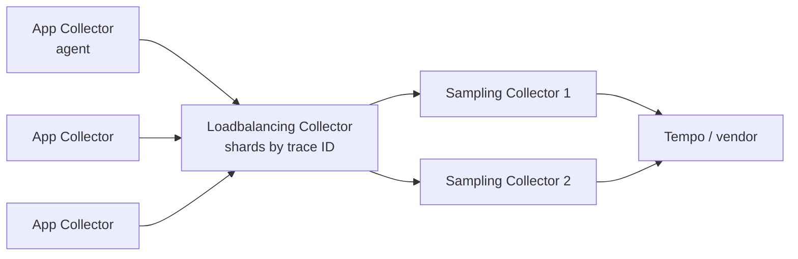

# OpenTelemetry Collector Pipelines Deep Dive

## Why this matters

The OTel Collector is the universal telemetry router — receivers in, processors in the middle, exporters out — and pipeline misconfiguration is the most common cause of dropped data, OOM kills, and incomplete traces. Processor ORDER matters (memory_limiter must come first), batching is required for backpressure, and tail sampling needs special positioning. Mis-ordering a 4-line config silently drops 30% of your spans.

## Mental Model

A Collector is a pipeline of **components**: receivers accept data in some protocol, processors transform/filter/sample it, exporters send it onward. Pipelines are typed (`traces`, `metrics`, `logs`) and the same data type flows through one pipeline per signal.

<!-- mermaid:rendered -->
<p align="center"></p>

<details><summary>Mermaid source</summary>



</details>

## Component Categories

| Component | Role | Examples |
|-----------|------|----------|
| Receiver | Accept data | otlp, jaeger, zipkin, prometheus, filelog, kafka |
| Processor | Transform / filter / sample | batch, memory_limiter, resource, attributes, tail_sampling, transform |
| Exporter | Send onward | otlp, prometheusremotewrite, loki, awsxray, kafka, file |
| Extension | Out-of-band features | health_check, pprof, zpages, file_storage |
| Connector | Cross-pipeline (one pipeline's exporter is another's receiver) | spanmetrics, servicegraph, forward |

## Pipeline Topology

<!-- mermaid:rendered -->
<p align="center"></p>

<details><summary>Mermaid source</summary>



</details>

Each pipeline is independent. The same receiver/exporter/processor instance CAN be referenced from multiple pipelines (config-level reuse).

## Processor Order — the rule

Processors execute **in the order listed** in the pipeline. Order is load-bearing.

<!-- mermaid:rendered -->
<p align="center"></p>

<details><summary>Mermaid source</summary>



</details>

| Position | Why |
|----------|-----|
| `memory_limiter` FIRST | Refuses new data when soft/hard memory limits hit. Must run before anything that allocates. |
| Sampling/filtering EARLY | Drop unwanted data before paying processing cost on it. |
| Enrichment MIDDLE | Add resource attributes, k8s metadata, etc. — only on data we'll actually keep. |
| `batch` LAST | Aggregates into efficient export-sized chunks. After batching, processors would see whole batches as units. |

### Why memory_limiter must be first

memory_limiter checks process RSS against `limit_mib`. When over the soft limit, it forces GC; over hard limit, it returns errors to receivers (backpressure). If placed AFTER batch, large in-flight batches would already be allocated when the limiter trips — defeats the purpose.

### Why batch must be last

Batch combines many records into single export calls. If it's not last, downstream processors would see batches as single units and break (e.g. tail_sampling needs individual spans grouped by trace, not pre-batched chunks).

## Annotated config

```yaml
receivers:
  otlp:
    protocols:
      grpc:
        endpoint: 0.0.0.0:4317
      http:
        endpoint: 0.0.0.0:4318

processors:
  # 1. Memory guard FIRST. Soft limit triggers GC; hard limit triggers backpressure.
  memory_limiter:
    check_interval: 1s
    limit_mib: 1500          # hard limit (refuse new data)
    spike_limit_mib: 256     # spike headroom (soft = limit - spike)

  # 2. Tail sampling AFTER memory guard, BEFORE batch.
  #    Buffers spans by trace ID for `decision_wait`, then evaluates policies.
  tail_sampling:
    decision_wait: 10s
    num_traces: 50000        # max traces buffered
    expected_new_traces_per_sec: 100
    policies:
      - name: errors-policy
        type: status_code
        status_code: { status_codes: [ERROR] }
      - name: slow-policy
        type: latency
        latency: { threshold_ms: 500 }
      - name: random-1pct
        type: probabilistic
        probabilistic: { sampling_percentage: 1 }

  # 3. Enrich AFTER sampling so we don't pay enrichment cost on dropped data.
  resource:
    attributes:
      - key: deployment.environment
        value: prod
        action: upsert

  # 4. Batch LAST. 8192 = OTLP-friendly default.
  batch:
    send_batch_size: 8192
    send_batch_max_size: 10000
    timeout: 5s

exporters:
  otlp/tempo:
    endpoint: tempo:4317
    tls: { insecure: true }
    sending_queue:
      enabled: true
      num_consumers: 4
      queue_size: 5000
    retry_on_failure:
      enabled: true
      initial_interval: 5s
      max_interval: 30s
      max_elapsed_time: 5m

extensions:
  health_check:
    endpoint: 0.0.0.0:13133
  pprof:
    endpoint: 0.0.0.0:1777

service:
  extensions: [health_check, pprof]
  pipelines:
    traces:
      receivers: [otlp]
      processors: [memory_limiter, tail_sampling, resource, batch]
      exporters: [otlp/tempo]
```

## Tail Sampling Specifics

<!-- mermaid:rendered -->
<p align="center"></p>

<details><summary>Mermaid source</summary>



</details>

**Critical constraints:**
- Tail sampling needs ALL spans of a trace at the same Collector instance. Behind a load balancer, you must use a **trace-ID-aware load balancer** (e.g. `loadbalancing` exporter in front of a sampling-tier Collector).
- Memory cost: `decision_wait * spans/sec * span_size`. A 10s wait at 50k spans/sec ≈ several GB.
- `decision_wait` must be ≥ longest expected trace duration. Otherwise root span arrives after the decision and is orphaned.

## Two-tier Collector pattern

<!-- mermaid:rendered -->
<p align="center"></p>

<details><summary>Mermaid source</summary>



</details>

The agent tier adds resource enrichment and forwards. The sampling tier shards by trace ID so each trace's spans land on a single instance for tail sampling decisions.

## Common Interview Questions

> [!IMPORTANT]
> **Q1: Why must `memory_limiter` be the first processor?**
> A: It must apply backpressure to receivers BEFORE downstream processors allocate memory. Placed later, it can't prevent OOM from in-flight allocations.
>
> **Q2: Why must `batch` be the last processor?**
> A: It combines records into export batches. Downstream processors would see batches as opaque units, breaking per-record logic (sampling, filtering).
>
> **Q3: How does tail sampling work and what's its big constraint?**
> A: Buffers spans by trace ID for `decision_wait`, then evaluates policies and exports/drops the whole trace. Constraint: ALL spans of a trace MUST hit the same Collector instance — requires a trace-ID-aware load balancer in HA setups.
>
> **Q4: Difference between processor and connector?**
> A: Processor transforms data within a single pipeline. Connector emits data from one pipeline as input to another (e.g. spanmetrics: traces pipeline → metrics pipeline).
>
> **Q5: Why split into agent + gateway tiers?**
> A: Agents (DaemonSet/sidecar) do local enrichment and offload network. Gateways centralize tail sampling, fan-out to multiple backends, and apply org-wide policies. Agent failure has small blast radius.
>
> **Q6: What does `sending_queue` in an exporter do?**
> A: Asynchronous in-memory queue between the pipeline and the exporter. Smooths spikes, retries on failure. Without it, transient backend outages immediately backpressure the pipeline.
>
> **Q7: How do you debug "data is missing in the backend"?**
> A: Enable `debug` exporter (or `logging` exporter), check `health_check` extension, query Collector's own metrics (`otelcol_exporter_send_failed_spans`), inspect zpages.
>
> **Q8: Order matters for resource processor — before or after tail sampling?**
> A: After sampling. You don't want to pay attribute-mutation cost on traces that will be dropped. Exception: if your sampling policy depends on resource attributes, enrich first.

## Sources

- Collector architecture: https://opentelemetry.io/docs/collector/architecture/
- Configuration: https://opentelemetry.io/docs/collector/configuration/
- Processor reference: https://github.com/open-telemetry/opentelemetry-collector-contrib/tree/main/processor
- Tail sampling processor: https://github.com/open-telemetry/opentelemetry-collector-contrib/tree/main/processor/tailsamplingprocessor
- Loadbalancing exporter: https://github.com/open-telemetry/opentelemetry-collector-contrib/tree/main/exporter/loadbalancingexporter
