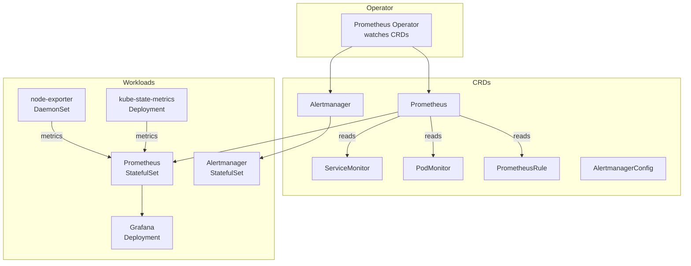

# 07 — kube-prometheus-stack (Helm)

The **kube-prometheus-stack** is the de facto monitoring bundle for Kubernetes. One Helm install gives you Prometheus + Alertmanager + Grafana + node-exporter + kube-state-metrics + the Prometheus Operator + ~30 prebuilt alerts and dashboards.

## What's in the box

<!-- mermaid:rendered -->
<p align="center"></p>

<details><summary>Mermaid source</summary>

<!-- mermaid:rendered -->
<p align="center"></p>

<details><summary>Mermaid source</summary>

<!-- mermaid:rendered -->
<p align="center"></p>

<details><summary>Mermaid source</summary>



</details>

</details>

</details>

## Why Operator + CRDs?

You define monitoring **declaratively**:

```yaml
apiVersion: monitoring.coreos.com/v1
kind: ServiceMonitor
metadata:
  name: my-app
spec:
  selector:
    matchLabels: { app: my-app }
  endpoints:
    - port: metrics
      interval: 30s
```

The operator notices the new ServiceMonitor and **regenerates Prometheus's scrape config automatically**. No more editing `prometheus.yml` by hand.

## Files

- `values.yaml` — opinionated overrides (resource limits, persistence, ingress)
- `install.md` — step-by-step Helm install + verification

## Quick install

```bash
helm repo add prometheus-community https://prometheus-community.github.io/helm-charts
helm repo update

kubectl create ns monitoring

helm install kps prometheus-community/kube-prometheus-stack \
  -n monitoring \
  -f values.yaml \
  --version 65.x.x      # pin in real life

# Grafana admin password
kubectl -n monitoring get secret kps-grafana \
  -o jsonpath="{.data.admin-password}" | base64 -d
```

Port-forward:
```bash
kubectl -n monitoring port-forward svc/kps-grafana 3000:80
kubectl -n monitoring port-forward svc/kps-kube-prometheus-stack-prometheus 9090
kubectl -n monitoring port-forward svc/kps-kube-prometheus-stack-alertmanager 9093
```

## Adding your own scrape

Annotate your Service or create a ServiceMonitor with the right `release` label:
```yaml
metadata:
  labels:
    release: kps    # MUST match values.yaml -> prometheus.prometheusSpec.serviceMonitorSelector
```

Without this label, the operator ignores it. **#1 reason "my metrics aren't appearing".**
