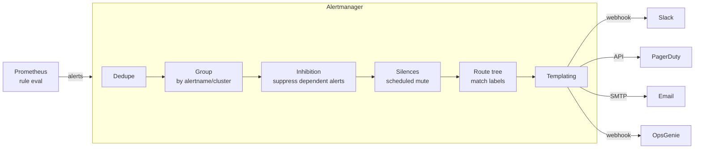

# 08 — Alerting with Alertmanager

Prometheus **fires** alerts; Alertmanager **routes** them. Separation of concerns: the TSDB doesn't know who's on call.

## Pipeline

<!-- mermaid:rendered -->

Mermaid source

## Concepts

| Concept | Why |
|---------|-----|
| **Grouping** | One incident = many alerts. Group by `alertname,cluster,namespace` so on-call gets ONE message, not 50. |
| **Inhibition** | A `NodeDown` alert can suppress all `PodNotReady` for that node. |
| **Silence** | Scheduled mute (e.g., during a known maintenance). Set in UI; expires automatically. |
| **Receiver** | A destination: Slack, PagerDuty, email, webhook, MS Teams... |
| **Routing tree** | Match alert labels to receivers. First match wins unless `continue: true`. |

## Severity convention

| Severity | Reaction | Channel |
|----------|----------|---------|
| `critical` | Page someone NOW | PagerDuty + Slack |
| `warning`  | Look at it within business hours | Slack |
| `info`     | Dashboard only | None |

Set `severity` as a label on every alert rule.

## Anti-patterns

- **Alert fatigue:** every cluster admin can recall ignoring alerts. Route ruthlessly. If an alert fires and no one acts, delete it.
- **Alerting on causes, not symptoms:** alert on user-visible failure (high error rate), not "CPU high" (which may be fine). Use USE method only for the underlying RCA.
- **No `for:` clause:** alerts will flap. Always require sustained breach (`for: 10m`).
- **Email-only critical alerts:** no one reads email at 3am.

## File

- `alertmanager.yaml` — production-grade routing with Slack + PagerDuty + inhibition
