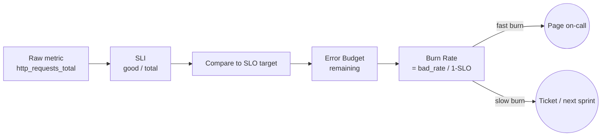

# 09 — SLO Engineering

SLOs translate "the service must be reliable" into a number you can defend with math.

## Vocabulary refresher

- **SLI** = the measurement (e.g., `successful_requests / total_requests`)
- **SLO** = the target over a window (e.g., `99.9% over 28 days`)
- **Error Budget** = `1 - SLO` (e.g., `0.1%` ≈ 40m 19s/month)
- **Burn Rate** = how fast you're consuming the budget (multiplier vs the SLO rate)

## Mental model

<!-- mermaid:rendered -->

Mermaid source

## Multi-window, multi-burn-rate alerts

The Google SRE workbook recipe — fires fast on real outages, doesn't flap on noise.

| Severity | Burn rate | Long window | Short window | Budget exhausted in |
|----------|-----------|-------------|--------------|---------------------|
| Page     | 14.4×     | 1h          | 5m           | 2 days |
| Page     | 6×        | 6h          | 30m          | 5 days |
| Ticket   | 3×        | 24h         | 2h           | 10 days |
| Ticket   | 1×        | 72h         | 6h           | 30 days |

The **short window** is a "fresh data" check — both must breach. This avoids alerting on a budget already burned hours ago.

## Tooling

- **[Sloth](https://sloth.dev/)** — generates Prometheus rules from a small SLO YAML.
- **[Pyrra](https://github.com/pyrra-dev/pyrra)** — runs as an operator, exposes a UI, generates rules.

Both produce equivalent recording + alerting rules. Pick one and stay consistent.

## File

- `slo-rules.yaml` — Sloth-style SLO definition that compiles into recording + multi-burn-rate alerting rules

## Worked example: 99.9% checkout availability

- Total requests window: 28 days
- Allowed bad: 0.1% × total
- 1h burn rate of 14.4 means we'd burn the **entire** monthly budget in `28d / 14.4 ≈ 2 days` if it continued.

## Common SLI types

| Service kind | SLI |
|--------------|-----|
| HTTP API | `2xx_3xx / total` over 5m |
| Latency  | `requests faster than 300ms / total` |
| Job/queue | `processed_within_SLA / total` |
| Pipeline | `runs_succeeded / runs_started` |
| Storage | `successful_reads / read_attempts` |

## Don'ts

- Don't set SLO at 100%. You will burn out chasing zero. Aim for "just barely good enough for users."
- Don't average over a year. Use 28-day rolling windows so problems are visible.
- Don't pick SLIs nobody understands. If product can't explain it to a customer, it's wrong.
