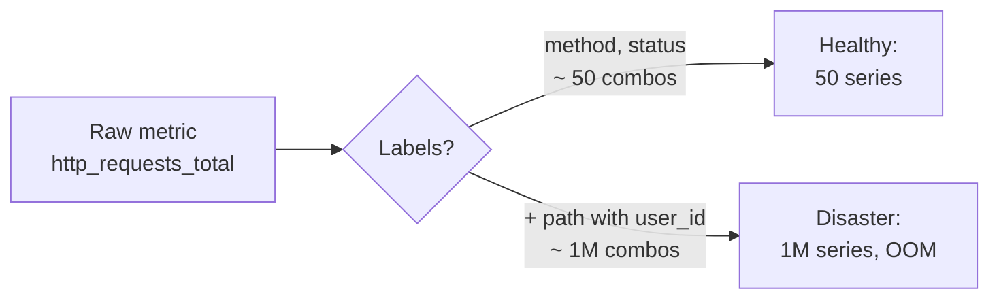

# 10 — Cost & Cardinality

The single biggest reason monitoring bills explode (and Prometheus OOMs) is **label cardinality**.

## What is cardinality?

Each **unique combination of labels** for a metric is one **time series**. Prometheus stores one chunk per series, so:

```
http_requests_total{method="GET", status="200", path="/api/users/123"}
http_requests_total{method="GET", status="200", path="/api/users/124"}
http_requests_total{method="GET", status="200", path="/api/users/125"}
...
```

If you put `user_id` in `path`, you get one series **per user**. Million users = million series. Prometheus dies.

<!-- mermaid:rendered -->
<p align="center"></p>

<details><summary>Mermaid source</summary>

<!-- mermaid:rendered -->
<p align="center"></p>

<details><summary>Mermaid source</summary>

<!-- mermaid:rendered -->
<p align="center"></p>

<details><summary>Mermaid source</summary>



</details>

</details>

</details>

## Rules of label hygiene

1. **Bounded sets only.** Labels must have a small, finite set of values: `method` (6), `status` (~10), `region` (~5).
2. **Never IDs as labels.** No `user_id`, `request_id`, `trace_id`, `order_id`. Use logs/traces for those.
3. **Drop noisy labels at scrape time** with `metric_relabel_configs`:
   ```yaml
   metric_relabel_configs:
     - action: labeldrop
       regex: 'pod_template_hash|controller_revision_hash|.*uuid'
   ```
4. **Aggregate via recording rules** before storing long-term.
5. **Audit cardinality regularly:**
   ```promql
   topk(20, count by (__name__)({__name__=~".+"}))
   ```
   That gives you the worst-offender metric names.

## Downsampling & long-term storage

Prometheus is great for **15 days at high resolution**. Beyond that you want:

| Tool | What it adds |
|------|--------------|
| **Thanos** | Sidecar uploads blocks to S3; querier federates across clusters; compactor downsamples (5m, 1h). |
| **Mimir** (Grafana) | Horizontally scalable, multi-tenant, ingests via remote_write. Handles billions of series. |
| **Cortex** | Mimir's predecessor; Mimir is the active project. |
| **VictoriaMetrics** | High-perf single-binary or cluster, lower resource footprint. |

## Thanos vs Mimir (one-liner)

- **Thanos:** keep your Prometheus servers, federate them after the fact.
- **Mimir:** replace Prometheus storage entirely with a scalable backend.

See `thanos-architecture.md` for the data flow.

## Quick cardinality kill-switches

```yaml
# In prometheus.yml — drop a runaway metric
scrape_configs:
  - job_name: 'noisy-app'
    metric_relabel_configs:
      - source_labels: [__name__]
        regex: 'app_request_duration_seconds_bucket'
        action: drop
```

## Cost levers (in order of impact)

1. Reduce active series (label hygiene)
2. Increase scrape interval (15s → 60s halves the volume)
3. Shorten local retention; offload to Thanos/Mimir + S3
4. Drop high-cardinality bucket histograms; use summaries or fewer buckets
5. Sample traces aggressively at the collector
