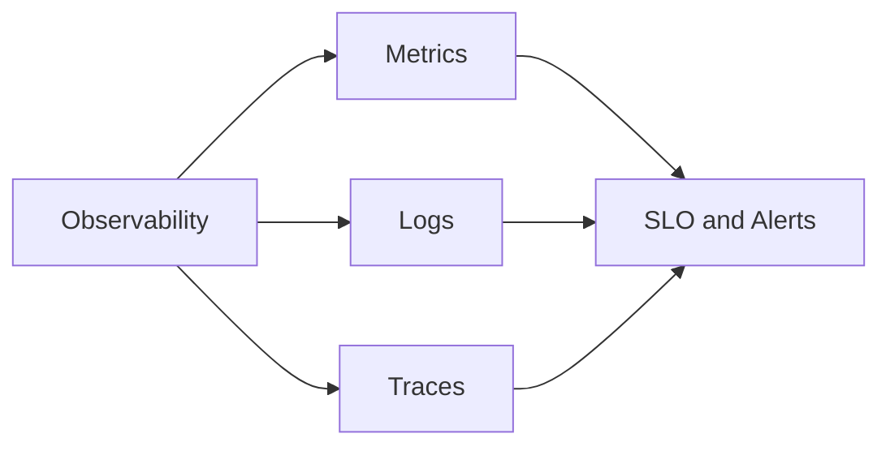
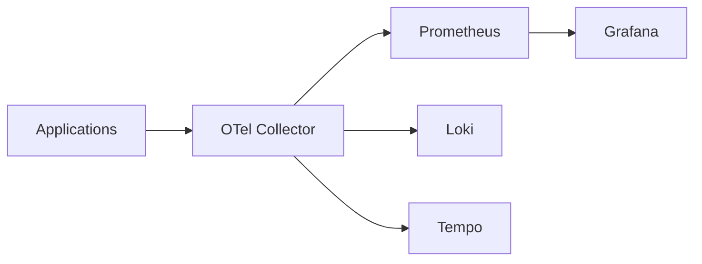
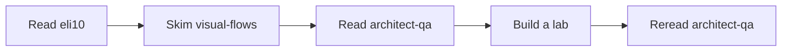
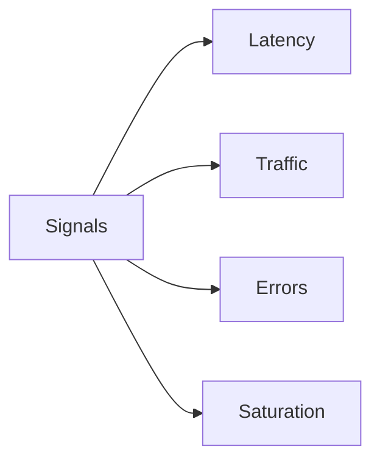
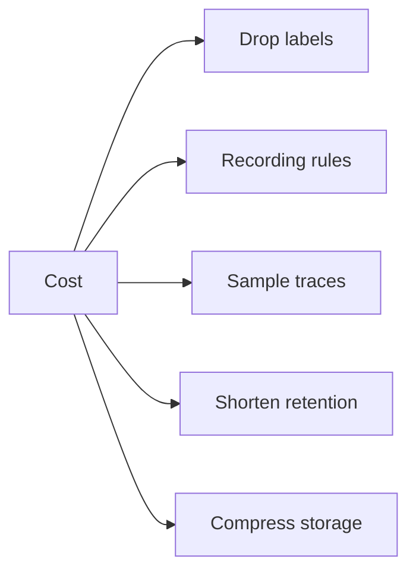
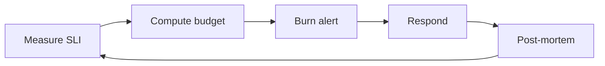
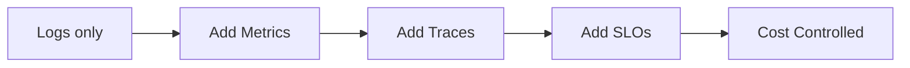

# Monitoring Mastery

Index for the Monitoring & Observability mastery track. Covers metrics, logs, traces, dashboards, alerts, SLOs, and the operational architecture behind Prometheus, Loki, Tempo, OpenTelemetry, and Grafana at scale.

## Files in this folder

| File | Audience | Purpose |
|------|----------|---------|
| `README.md` | Everyone | Index + topic map |
| `architect-qa.md` | Senior / Architect | 50+ deep Q&A on scaling and design |
| `eli10.md` | Beginners (and busy seniors) | Plain-English analogies + 1 real query each |
| `visual-flows.md` | Visual learners | 10 mermaid flowcharts of pipelines |

## Topic organization

## Telemetry stack at a glance

## Recommended reading order

## What lives where (parent folder map)

| Folder | Topic |
|--------|-------|
| `01-three-pillars` | Metrics, logs, traces fundamentals |
| `02-prometheus` | Scrape config, PromQL, storage |
| `03-grafana` | Dashboards, variables, alerts UI |
| `04-loki` | Log aggregation, LogQL |
| `05-tempo-tracing` | Distributed tracing, TraceQL |
| `06-opentelemetry` | OTel SDK + Collector |
| `07-kube-prometheus-stack` | Helm-based deployment |
| `08-alerting` | Alertmanager, routing, silences |
| `09-slo-engineering` | Error budgets, burn-rate alerts |
| `10-cost-and-cardinality` | Series control, log volume, sampling |

## Key concepts (one-liners)

- **Metric**: a number measured over time (CPU, requests/sec).
- **Log**: a timestamped text record of an event.
- **Trace**: the path of one request across many services.
- **Cardinality**: number of unique label combinations on a metric.
- **SLI**: a measured thing (latency, success rate).
- **SLO**: a target for an SLI (99.9% under 200 ms).
- **Error budget**: 100% minus SLO; the amount of "bad" you may spend.
- **Burn rate**: how fast you are consuming the error budget.
- **Federation**: one Prometheus pulling from another.
- **Sampling**: keeping only a fraction of traces (head or tail).
- **WAL**: write-ahead log; durability before flushing.
- **Recording rule**: a precomputed PromQL expression saved as a new series.
- **Alert rule**: a PromQL expression that fires when true for a duration.
- **Routing tree**: Alertmanager's matcher hierarchy that decides receivers.

## The four golden signals

## RED vs USE vs Four Golden Signals

| Method | For | Measures |
|--------|-----|----------|
| RED | Request services | Rate, Errors, Duration |
| USE | Resources | Utilization, Saturation, Errors |
| Four Golden Signals | Anything user-facing | Latency, Traffic, Errors, Saturation |

## Pillar comparison

| Property | Metrics | Logs | Traces |
|----------|---------|------|--------|
| Volume per request | Tiny | Medium | Large |
| Cost per byte | Low | High | Highest |
| Cardinality risk | High | Low | Medium |
| Query latency | ms | seconds | seconds |
| Best for | Trends, alerts | Forensics | Causality |
| Retention typical | 15-90 days | 7-30 days | 3-14 days |

## Tooling choice cheat sheet

| Need | Pick |
|------|------|
| Single cluster, < 1M active series | Prometheus alone |
| Multi-cluster, long retention | Mimir or Thanos |
| Cheap log storage | Loki on S3 |
| High-fidelity traces | Tempo with tail sampling |
| Vendor-neutral pipeline | OTel Collector |
| Hosted, no ops | Grafana Cloud, Datadog, New Relic |

## Cost levers (most impactful first)

## SLO loop

## Anti-patterns to avoid

| Anti-pattern | Why bad | Fix |
|--------------|---------|-----|
| `user_id` as a label | Unbounded cardinality | Move to log line |
| Alert on raw CPU | Not symptom-based | Alert on SLO burn |
| One Alertmanager receiver | No routing | Use matchers per team |
| 100% trace sampling | Cost explosion | Tail sample errors and slow only |
| Long single dashboard | Slow load | Split per service |
| Logging the request body | PII + cost | Log structured fields only |
| Polling logs for alerts | Slow | Use metrics or log-derived metrics |
| Storing high-card labels | OOM Prometheus | Drop in relabel_configs |

## Skill ladder

| Level | You can... |
|-------|------------|
| L1 | Read a Grafana dashboard |
| L2 | Write basic PromQL (`rate`, `sum by`) |
| L3 | Build an alert with `for:` and runbook |
| L4 | Define SLOs with multi-window burn-rate alerts |
| L5 | Design federation, sharding, tail sampling |
| L6 | Run cost-controlled telemetry for 1000+ services |

## Definitions worth memorizing

- **Pull model**: Prometheus calls targets. Targets must be reachable.
- **Push model**: agents send to a collector. Targets stay private.
- **Exemplar**: a trace ID attached to a metric sample.
- **Histogram bucket**: `le` label that powers `histogram_quantile`.
- **Native histogram**: Prometheus 2.40+ float histograms, lower cardinality than buckets.
- **Mimir**: Grafana's horizontally scalable Prometheus.
- **Thanos**: sidecar + compactor + querier model for long-term Prometheus.

## Where to start tomorrow

1. Read `eli10.md` — 30 min.
2. Skim `visual-flows.md` — 15 min.
3. Read `architect-qa.md` Q1 to Q15 — 1 hour.
4. Spin up `kube-prometheus-stack` in a dev cluster.
5. Build one SLO with a burn-rate alert.
6. Reread `architect-qa.md` Q30 to Q50 — by then it will click.

## One promise

> If you can answer 40 of the 50 architect questions without notes, you can run observability for any organization.

## Glossary deep-dive

| Term | One-line meaning |
|------|------------------|
| TSDB | Time-series database backing Prometheus |
| Head block | The active in-memory 2-hour window |
| Block | A persisted 2h to 31d chunk of TSDB data |
| Chunk | Compressed sample run inside a block |
| Series | Unique combination of metric name + labels |
| Sample | One (timestamp, value) pair on a series |
| Scrape | One HTTP GET to a target's /metrics |
| Relabel | Mutate labels before storage |
| Federation | Prom pulling metrics from another Prom |
| Ruler | Component that evaluates recording and alerting rules |
| Alertmanager | Routes, groups, dedupes, silences alerts |
| Receiver | The destination of an alert (Slack, PagerDuty) |
| Inhibition | A rule that suppresses other alerts when one is active |
| Silence | Manual mute for a label matcher and time window |
| Burn rate | Speed of error budget consumption relative to SLO |
| Exemplar | Trace ID attached to a metric sample |
| Span | One operation inside a trace |
| Root span | The first span in a trace |
| Propagation | Passing trace context across processes |
| Head sampling | Decide before the request is done |
| Tail sampling | Decide after the request completes |
| Stream | A unique label-set log series (Loki) |
| LogQL | Loki's query language |
| TraceQL | Tempo's query language |
| OTLP | OpenTelemetry Protocol |
| Collector | OTel agent or gateway process |
| WAL | Write-ahead log for durability |
| Compaction | Merging small blocks into larger ones |

## Common runbook headers

Every alert should link to a runbook with these sections:
1. **Description** — what the alert means in one sentence.
2. **Impact** — who is hurt and how badly.
3. **Diagnosis** — first three commands to run.
4. **Mitigation** — fastest known fix or rollback.
5. **Root cause analysis** — links to past incidents.
6. **Owner** — team and Slack channel.

## Maturity model

| Stage | Signal | Pain when missing |
|-------|--------|-------------------|
| L1 | Centralized logs | Cannot search across hosts |
| L2 | Metrics + alerts | Wake on threshold spikes |
| L3 | Distributed traces | Cannot find slow service |
| L4 | SLO + burn alerts | Alert noise; no business signal |
| L5 | Quotas + tail sampling | Telemetry bill exceeds infra |

## Estimating telemetry cost (back-of-envelope)

| Signal | Per service per day |
|--------|---------------------|
| Metrics | 50 MB if low-cardinality, 5 GB if not |
| Logs | 100 MB to 50 GB depending on verbosity |
| Traces | 200 MB at 1% sample, 20 GB at 100% |

Multiply by service count, then by retention days, then by storage rate ($0.023/GB-month for S3 standard). Most orgs spend 5-15% of infra cost on telemetry; over 20% means tune.

## Quick references in this folder

- For analogies and learning: `eli10.md`
- For interview prep and design: `architect-qa.md`
- For pipeline understanding: `visual-flows.md`
- For day-to-day commands: `../cheatsheet.md`

## Final note

Observability is iterative. You do not get the labels right the first time. You do not pick the SLO target correctly the first quarter. The discipline is in the loop — measure, learn, prune, repeat — not in the initial design.
