# Observability for 10-Year-Olds (ELI10)

Imagine you and your friends are playing a giant playground game. There are slides, swings, monkey bars, and a big sandbox. Things sometimes go wrong — somebody slips, the swing breaks, a kid is missing.

How do the playground helpers know what's happening?

- They count things (metrics).
- They write down what happened (logs).
- They follow one kid's whole adventure (traces).
- They put it all on a big poster on the wall (dashboards).
- They ring a fire alarm when something is bad (alerts).
- They make a promise to parents (SLOs).

That's observability.

---

## 1. Metrics — the "scoreboard counts"

### The analogy
Think of the basketball scoreboard. It shows numbers that change over time:
- Score for team A: 24
- Score for team B: 18
- Time left: 4:32
- Fouls: 3

The numbers change, but they are always just numbers. You can look at them anytime and see "how are we doing right now?"

### The real thing
Metrics are numbers a computer measures and saves with a timestamp. Examples:
- How many web pages were served in the last second.
- How much memory the app is using.
- How many users are logged in.

### Simple diagram

<!-- mermaid:rendered -->
<p align="center"></p>

<details><summary>Mermaid source</summary>

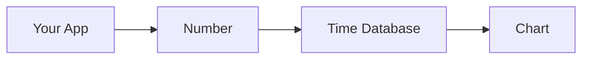

</details>

### A real query (PromQL)
```
rate(http_requests_total[5m])
```
Translation: "How many web requests per second, averaged over the last 5 minutes?"

---

## 2. Logs — the "diary entries"

### The analogy
You keep a diary. Every time something happens, you write it down with the time:
- 3:14 pm: I scored a goal!
- 3:15 pm: Sammy fell off the swing.
- 3:16 pm: I gave Sammy a band-aid.

Later, if mom asks "what happened today?" you flip through the diary and find the answer.

### The real thing
Logs are text lines a program writes when something happens. Each line has a timestamp and a message. Programs write thousands per minute.

### Simple diagram

<!-- mermaid:rendered -->
<p align="center"></p>

<details><summary>Mermaid source</summary>

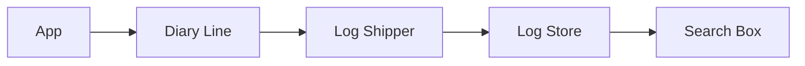

</details>

### A real query (LogQL)
```
{app="checkout"} |= "ERROR" | json
```
Translation: "Show me every diary entry from the checkout app that contains the word ERROR, and parse it as JSON."

---

## 3. Traces — "the path your message took to your friend"

### The analogy
You whisper a secret to Mia. Mia whispers to Leo. Leo whispers to Pat. Pat finally hears it and giggles.

If the secret comes back wrong, you want to know: where did it get garbled? Was it Mia? Leo? Pat? You retrace the path.

A trace is the whole journey of one whisper, with the time each kid took to pass it along.

### The real thing
When a user clicks "buy", their request travels through the website, the cart service, the payment service, and the email service. A trace shows that whole path with how long each step took.

### Simple diagram

<!-- mermaid:rendered -->
<p align="center"></p>

<details><summary>Mermaid source</summary>

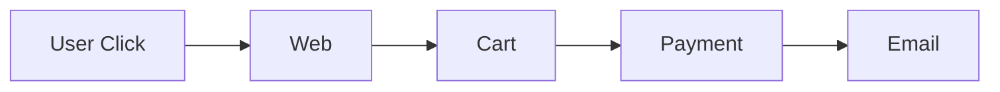

</details>

### A real query (TraceQL)
```
{ service.name = "payment" && duration > 500ms }
```
Translation: "Find traces where the payment service took longer than half a second."

---

## 4. Dashboards — the "wall of charts"

### The analogy
Walk into Mission Control at NASA. One huge wall of TVs, each showing one important thing — rocket fuel, oxygen, speed, temperature. The crew sees everything at a glance.

A dashboard is your team's mission control wall.

### The real thing
A dashboard is a screen with many charts (made from metrics, logs, traces). Engineers stare at it during a deploy or an incident.

### Simple diagram

<!-- mermaid:rendered -->
<p align="center"></p>

<details><summary>Mermaid source</summary>

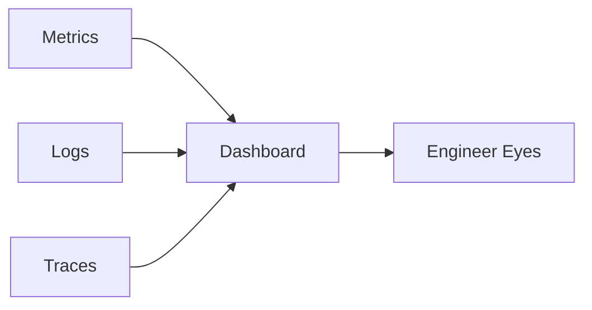

</details>

### A real query (PromQL on a dashboard panel)
```
sum by (service) (rate(http_requests_total{status=~"5.."}[5m]))
```
Translation: "For each service, how many error responses per second?"

---

## 5. Alerts — the "fire alarm"

### The analogy
The school has a fire alarm. It is silent 99.9% of the year. But when smoke is detected — RING! Everyone runs out. The alarm wakes you even if you are asleep.

An alert is the same: silent until something bad happens, then loud enough to wake an on-call engineer at 3 am.

### The real thing
An alert rule is a math expression that, when true for long enough, sends a notification. Rule of thumb: only alert on things humans must act on right now.

### Simple diagram

<!-- mermaid:rendered -->
<p align="center"></p>

<details><summary>Mermaid source</summary>

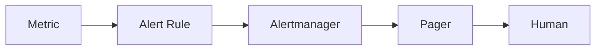

</details>

### A real query (PromQL alert)
```
sum(rate(http_requests_total{status=~"5.."}[5m])) > 10
```
Translation: "If more than 10 errors per second happen, fire."

With duration:
```
expr: rate(errors_total[5m]) > 10
for: 2m
```
"Has been bad for at least 2 whole minutes — only then ring."

---

## 6. SLO — the "promise to your customer"

### The analogy
You promise mom: "I'll do my homework on 9 out of every 10 school days."

That's a service level objective. You don't promise 10/10 — that's impossible because you'll get sick sometimes. But 9/10 keeps mom happy.

The 1 day per 10 you can skip = your error budget. If you skip 2 days in a row, you've used the budget early and the rest of the month you must be perfect.

### The real thing
- SLI = a measurement (e.g., % of fast responses).
- SLO = the target (99.9% must be fast).
- Error budget = 0.1% of requests are allowed to be slow.

### Simple diagram

<!-- mermaid:rendered -->
<p align="center"></p>

<details><summary>Mermaid source</summary>

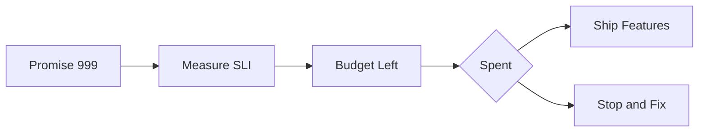

</details>

### A real query (PromQL SLO)
```
1 - (sum(rate(http_requests_total{status=~"5.."}[30d])) / sum(rate(http_requests_total[30d])))
```
Translation: "What fraction of requests in the last 30 days were NOT errors?" That's our availability.

---

## 7. Cardinality — "too many flavors of ice cream"

### The analogy
Mr. Joe runs an ice cream stand with one freezer. He sells vanilla, chocolate, strawberry — 3 flavors fit easily. Now imagine he tries to sell 1 million flavors, one for every customer's name. The freezer explodes.

That's cardinality. Each unique label combination is its own "flavor" the database must store.

### The rule
Don't put `user_id` or `request_id` as a metric label. Put it in a log line instead.

### Simple diagram

<!-- mermaid:rendered -->
<p align="center"></p>

<details><summary>Mermaid source</summary>

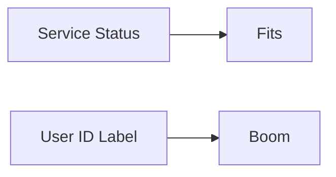

</details>

---

## 8. Sampling — "don't keep every selfie"

### The analogy
You take 1000 selfies on vacation. Saving them all fills your phone. Solution: keep the best 50, delete the rest. You still remember the trip; you just don't have every blink.

Trace sampling is the same. Keep all the interesting traces (errors, slow ones); drop most of the boring ones.

### The rule
Tail sampling > head sampling. Decide AFTER you see how the request went.

### Simple diagram

<!-- mermaid:rendered -->
<p align="center"></p>

<details><summary>Mermaid source</summary>

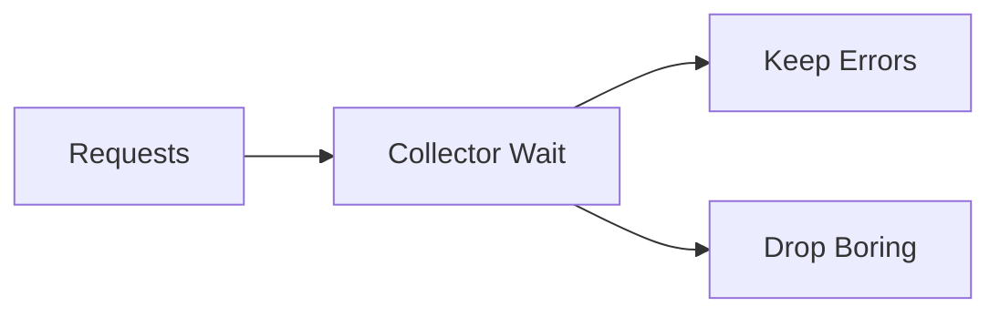

</details>

---

## 9. Pull vs Push — "the teacher takes attendance"

### The analogy
**Pull (Prometheus)**: the teacher walks down the rows and asks each kid "are you here?" The teacher controls when. The kids must be in their seats.

**Push (StatsD, OTLP)**: each kid raises their hand and shouts "I'm here!" whenever they want. The kid controls when. The teacher just listens.

Most observability picks pull for long-living things and push for short-lived (a kid who arrives late and leaves early).

### Simple diagram

<!-- mermaid:rendered -->
<p align="center"></p>

<details><summary>Mermaid source</summary>

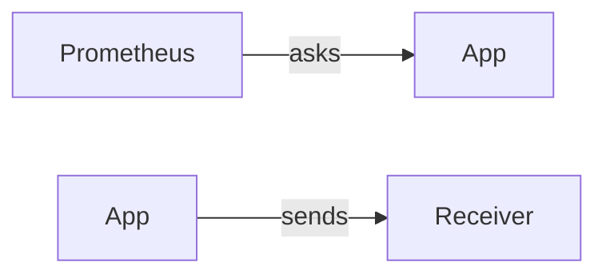

</details>

---

## 10. Federation — "the teacher of teachers"

### The analogy
Each classroom has a teacher who tracks attendance for that class. The principal collects a summary from each teacher (just the totals, not every name) and shows the school board.

That's federation: a top-level Prometheus pulls aggregated metrics from many lower Prometheuses.

### Simple diagram

<!-- mermaid:rendered -->
<p align="center"></p>

<details><summary>Mermaid source</summary>

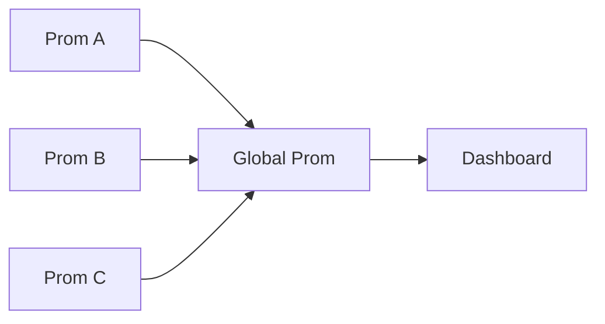

</details>

---

## 11. The four golden signals — "the four questions"

When something feels broken, ask:

1. **Latency** — is it slow? (How long does each request take?)
2. **Traffic** — how busy are we? (How many requests?)
3. **Errors** — is anything failing? (How many errors?)
4. **Saturation** — is the engine red-lining? (How full are CPU, memory, disk?)

### A real query covering them
```
histogram_quantile(0.99, sum by (le) (rate(http_request_duration_seconds_bucket[5m])))
```
Translation: "The slowest 1% of requests in the last 5 minutes — how long did they take?"

That one query answers the latency question.

---

## 12. Recap table

| Big word | Kid words | Real example |
|----------|-----------|--------------|
| Metric | Scoreboard count | requests/sec |
| Log | Diary entry | "ERROR: db timeout" |
| Trace | Whisper path | request → cart → pay → email |
| Dashboard | Wall of charts | Grafana page |
| Alert | Fire alarm | page on-call at 3 am |
| SLO | Promise | 99.9% fast |
| Error budget | Skip days | 43 min/month allowed bad |
| Cardinality | Flavors | unique label combos |
| Sampling | Keep best selfies | 1% trace retention |
| Federation | Teacher of teachers | hierarchy of Proms |

---

## 13. The promise

If you understand these 12 ideas, you understand more than half of what most "observability engineers" know. The rest is just learning the buttons.

Go build a tiny dashboard. Break it on purpose. Fix the alert. That's the way in.
