# Visual Flows — Monitoring Pipelines

10 mermaid flowcharts that explain the actual moving parts of an observability stack. Each diagram is followed by a 5-line plain-English walk-through and a one-line "why it matters".

Mermaid rules used: simple flowcharts, max 6 nodes each, no newlines, no nested quotes, square-bracket labels for safety.

---

## 1. Prometheus scrape pull cycle

<!-- mermaid:rendered -->

Mermaid source

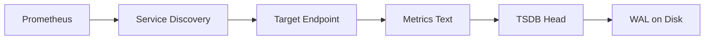

**Walk-through.** Prometheus reads its `scrape_configs`. Service discovery (Kubernetes, file_sd, EC2) returns the current target list. Every `scrape_interval` Prom does an HTTP GET to `/metrics` on each target. The text format is parsed into samples, written to the in-memory head block, and appended to the write-ahead log on disk. After 2 hours the head flushes to a persistent block.

**Why it matters.** Pull means Prom controls cadence and instantly knows when a target disappears (`up == 0` is a free liveness signal).

---

## 2. Log shipping pipeline (apps to Loki)

<!-- mermaid:rendered -->

Mermaid source

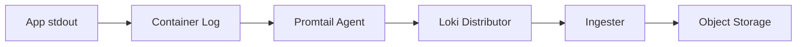

**Walk-through.** App writes JSON to stdout. Container runtime captures it to a node-level file. Promtail tails the file, parses it, attaches labels (pod, namespace, app), and pushes to the Loki distributor. Distributor hashes the stream by labels and forwards to ingesters which buffer chunks. After ~5 minutes the chunks are flushed compressed to S3.

**Why it matters.** Storing log bodies in S3 makes Loki ~10× cheaper than Elasticsearch.

---

## 3. Distributed trace context propagation

<!-- mermaid:rendered -->


Mermaid source

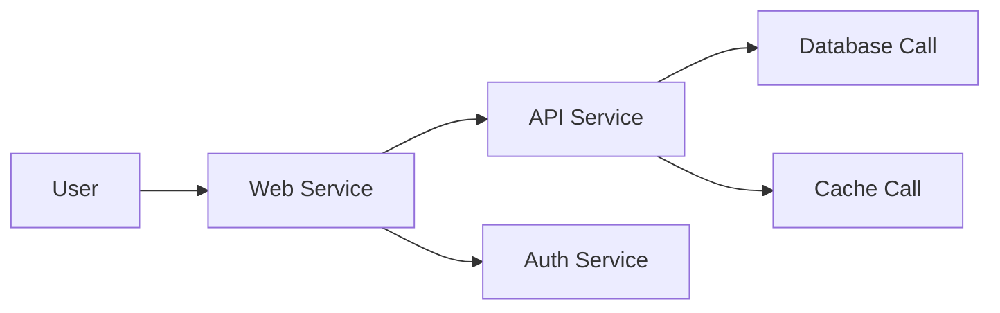

**Walk-through.** User hits Web. Web creates the root span and a `traceparent` header. Every downstream call (API, Auth) carries the header so each service creates a child span with the same trace ID. Each span is exported to the OTel Collector. The collector groups spans by trace ID into one trace.

**Why it matters.** Without `traceparent` propagation, traces fracture into single-service blobs that hide cross-service problems.

---

## 4. Alert routing tree

<!-- mermaid:rendered -->


Mermaid source

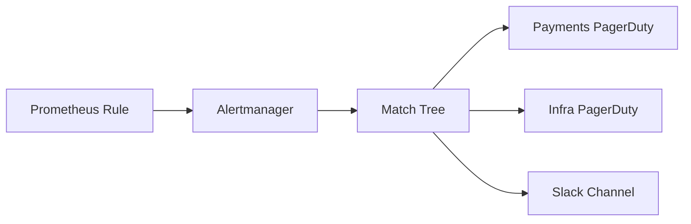

**Walk-through.** Prom evaluates alert rules every `evaluation_interval`. When `expr` is true for `for:` duration, Prom POSTs the firing alert to Alertmanager. AM groups by `group_by`, applies inhibitions and silences, then walks the route tree. Matching labels (e.g., `team=payments`) decide the receiver. Receivers send to PagerDuty, Slack, email, or webhooks.

**Why it matters.** A clean route tree is the difference between "right human paged in 30 s" and "everyone paged for everything".

---

## 5. OpenTelemetry Collector pipeline

<!-- mermaid:rendered -->

Mermaid source

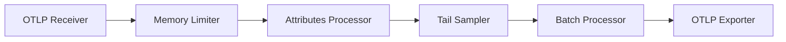

**Walk-through.** Spans arrive at the OTLP gRPC receiver. Memory limiter rejects if RAM is tight (back-pressure). Attributes processor scrubs PII or adds env labels. Tail sampler holds spans in a decision window (e.g., 30 s) and keeps only errors and slow ones. Batch processor groups by export size for efficiency. OTLP exporter ships to Tempo / Mimir / vendor.

**Why it matters.** Order matters. Memory limiter MUST be first; batch MUST be last.

---

## 6. Trace tail sampling at scale

<!-- mermaid:rendered -->


Mermaid source

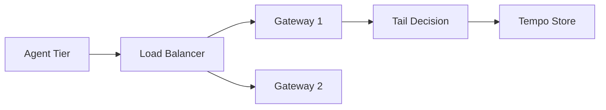

**Walk-through.** Agents on every node forward all spans to a gateway tier through the `loadbalancing` exporter, which hashes by trace ID so all spans of one trace land on the same gateway. The gateway holds spans for the decision window. Sampling policy keeps 100% errors, 100% slow, 1% baseline. Sampled traces flow to Tempo; the rest are dropped. Result: 99% storage reduction with no loss of interesting data.

**Why it matters.** Hash-by-trace-id is the only way tail sampling works in a multi-collector deployment.

---

## 7. Downsampling and long-term retention

<!-- mermaid:rendered -->

Mermaid source

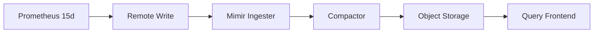

**Walk-through.** Local Prom retains 15 days hot. Every sample is also sent via remote_write to Mimir. Mimir ingesters buffer 12 h of data. Compactor merges blocks and creates downsampled (5-min, 1-h) versions for cheaper long-term queries. All blocks land in S3. Query frontend reads from ingesters for recent and S3 for historical, transparently.

**Why it matters.** Downsampling makes 1-year dashboards load in seconds instead of timing out.

---

## 8. SLO burn-rate alert flow

<!-- mermaid:rendered -->


Mermaid source

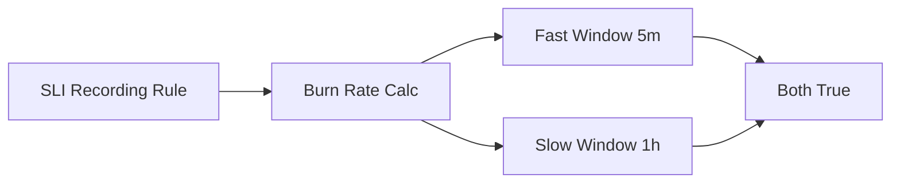

**Walk-through.** A recording rule produces the SLI ratio every minute. The burn-rate calc compares current ratio against the SLO target. Two windows run side by side: a fast 5-min window (catches incidents) and a slow 1-h window (catches slow degradation). The alert fires only when BOTH exceed their thresholds. This kills false positives from one-off spikes.

**Why it matters.** Multi-window burn-rate alerts are the modern SRE standard for SLO-based paging.

---

## 9. Multi-cluster Prometheus federation

<!-- mermaid:rendered -->


Mermaid source

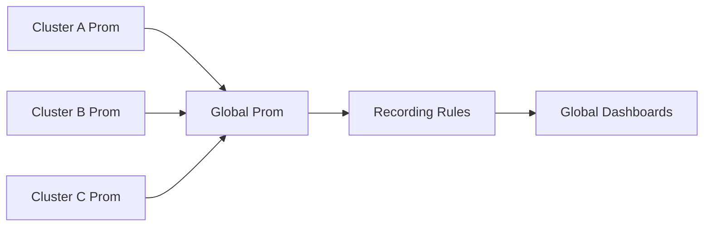

**Walk-through.** Each cluster runs its own Prom that scrapes local targets. The global Prom uses `honor_labels: true` and a `federate` job that pulls only pre-aggregated series matching `match[]={__name__=~"slo:.*|cluster:.*"}`. Recording rules at the global level produce org-wide rollups. Grafana points at the global Prom for cross-cluster dashboards and at local Proms for per-cluster deep dives.

**Why it matters.** Federation pulls only aggregates — never federate raw metrics, that's what remote_write to Mimir is for.

---

## 10. Exemplars — metric to trace jump

<!-- mermaid:rendered -->


Mermaid source

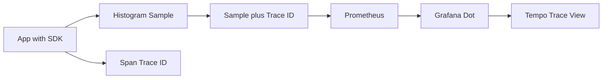

**Walk-through.** Modern client SDKs (Prometheus Java, Go, Python ≥ 1.0) attach the current trace ID to histogram samples as an exemplar. Prom stores it alongside the sample. Grafana renders exemplars as small dots on the latency chart. Click a dot, Grafana queries Tempo for that trace ID, and the trace view opens. End to end: from "p99 spiked" to "this exact slow trace" in two clicks.

**Why it matters.** Exemplars collapse the metrics-to-traces investigation loop from minutes to seconds.

---

## Combined view — the whole telemetry pipeline

<!-- mermaid:rendered -->


Mermaid source

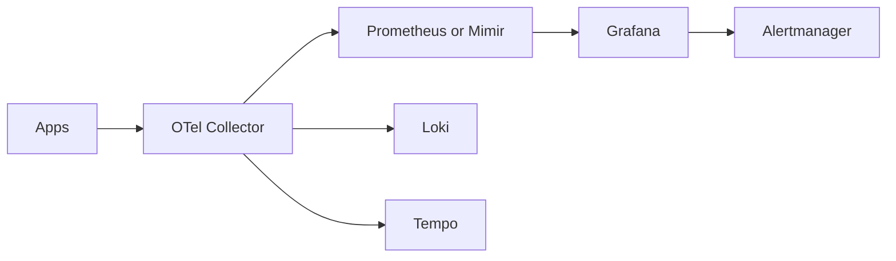

**Walk-through.** All apps emit metrics, logs, and traces in OTLP to a local OTel agent, then to a gateway tier. The gateway fans the three signals to their respective backends — Mimir for metrics, Loki for logs, Tempo for traces. Grafana queries all three through a single UI; click an alert, jump to a metric, jump to an exemplar trace, jump to the log lines for the failing pod. Alertmanager handles routing.

**Why it matters.** This is the canonical 2026 open-source observability stack — vendor-neutral, horizontally scalable, and deeply integrated.

---

## Cheat sheet — what flow to look at when

| You are debugging... | Look at flow # |
|----------------------|----------------|
| "Why is this metric missing?" | 1 |
| "Why are logs delayed?" | 2 |
| "Why does my trace stop mid-way?" | 3 |
| "Why didn't I get paged?" | 4 |
| "Why is collector OOMing?" | 5 |
| "Why is trace storage bill huge?" | 6 |
| "Why are old dashboards slow?" | 7 |
| "Why is my SLO alert flapping?" | 8 |
| "Why is global Prom OOM?" | 9 |
| "How do I jump from metric to trace?" | 10 |

---

## Closing rule

> Read these flows once a quarter. The system changes; the topology doesn't.

---

## Bonus 1 — Recording rule lifecycle

<!-- mermaid:rendered -->


Mermaid source

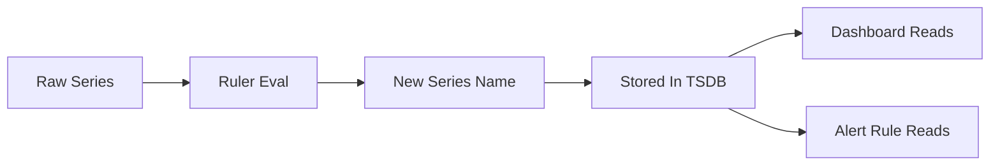

**Walk-through.** The ruler runs every `interval` (often 30 s). It evaluates the recording rule expression against raw series. The result is written as a new series whose name follows the `level:metric:operations` convention (e.g., `cluster:cpu_usage:rate5m`). Dashboards and alert rules then read the precomputed series instead of the raw one. Faster queries, lower CPU on every eval.

**Why it matters.** A dashboard that takes 8 s on raw data takes 50 ms on a recording rule.

---

## Bonus 2 — Alert silence and inhibition

<!-- mermaid:rendered -->


Mermaid source

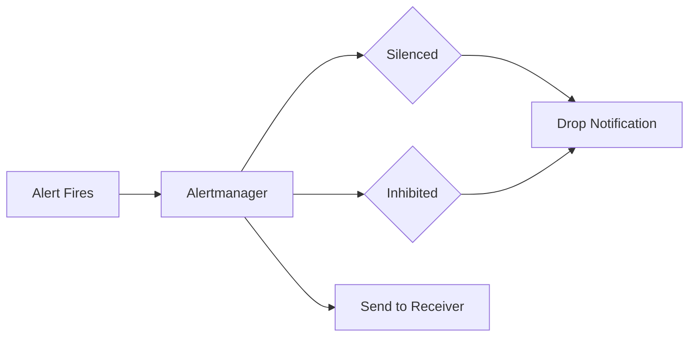

**Walk-through.** A firing alert enters Alertmanager. AM checks active silences (manual mutes for a label matcher and time range) — if matched, suppress. Next checks inhibitions — if a higher-severity alert is active that inhibits this one (e.g., `cluster_down` inhibits all `pod_down`), suppress. Only alerts that pass both gates reach the receiver and the route tree.

**Why it matters.** Without inhibitions a single cluster outage produces a thousand pages.

---

## Bonus 3 — Grafana data source query path

<!-- mermaid:rendered -->

Mermaid source

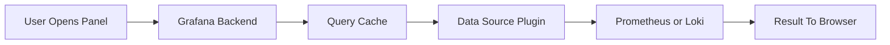

**Walk-through.** User opens a dashboard panel. Grafana's backend looks up the panel query, applies template variables, and checks the query cache (per-org, per-query hash). On miss, the data source plugin formats the query for the backend (PromQL, LogQL, TraceQL) and forwards it. Result returns to the backend, gets cached, and streams to the browser as JSON. The browser renders it with the panel plugin.

**Why it matters.** Slow dashboards are usually backend slowness, not Grafana — measure with `prometheus_engine_query_duration_seconds`.
