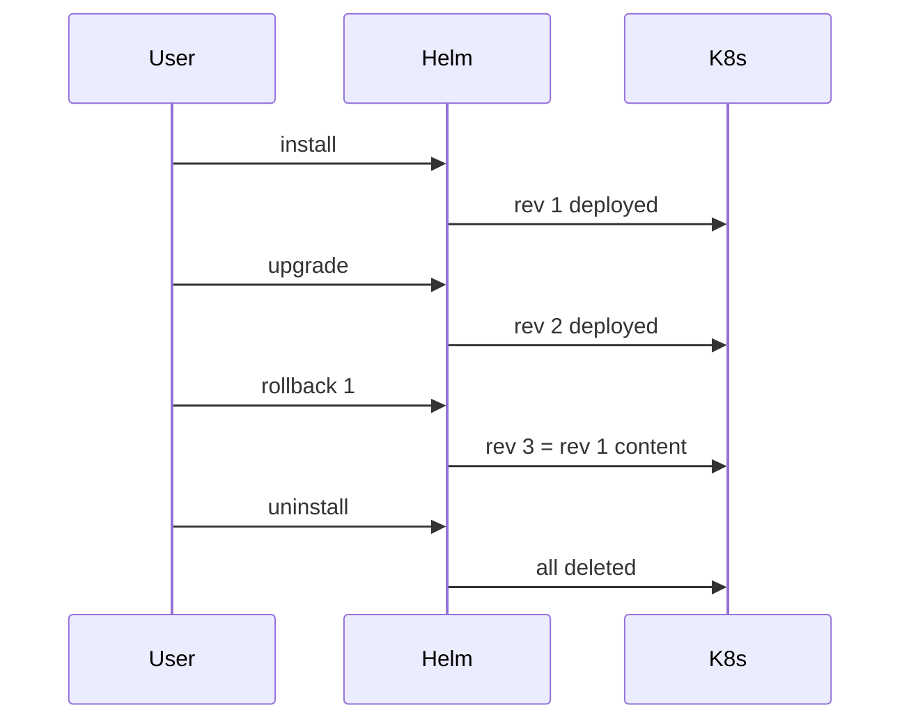

# 03 — Using Existing Charts

The fastest way to get value from Helm: install community charts.

## Lifecycle Commands



## Cheat Sheet

```bash
# install
helm install <release> <chart> [-n <ns>] [--create-namespace] [-f vals.yaml] [--set k=v]

# upgrade (or install if missing)
helm upgrade --install <release> <chart> -f vals.yaml

# inspect
helm list -A                       # all releases, all namespaces
helm status <release> -n <ns>
helm history <release> -n <ns>
helm get values <release>          # user-supplied values
helm get values <release> --all    # computed (defaults + overrides)
helm get manifest <release>        # rendered YAML
helm get notes <release>

# rollback
helm rollback <release> <revision> -n <ns>

# uninstall
helm uninstall <release> -n <ns>
helm uninstall <release> -n <ns> --keep-history
```

## Safe Preview Flags

| Flag | Use |
|---|---|
| `--dry-run` | Render + validate, do not apply |
| `--debug` | Print rendered manifests + extra info |
| `--atomic` | Roll back automatically if install/upgrade fails |
| `--wait` | Wait for resources to be Ready (default 5m) |
| `--timeout 10m` | Override wait timeout |
| `--cleanup-on-fail` | Delete partial resources on failure |

```bash
helm install demo bitnami/nginx --dry-run --debug | less
```

## Diff Plugin (highly recommended)

```bash
helm plugin install https://github.com/databus23/helm-diff
helm diff upgrade demo bitnami/nginx -f vals.yaml
```

See [walkthrough-nginx.md](./walkthrough-nginx.md) for a full example.
