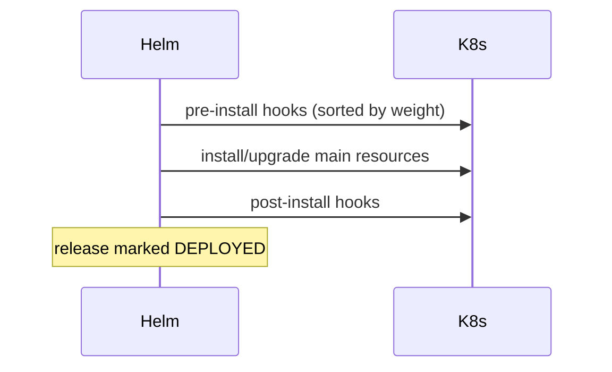

# 08 — Helm Hooks

Hooks let you inject manifests at specific points in a release lifecycle.

## Hook Events

| Annotation value | Fires at |
|---|---|
| `pre-install` | Before any resource is loaded |
| `post-install` | After all resources are loaded |
| `pre-delete` | Before any resource is deleted |
| `post-delete` | After all resources are deleted |
| `pre-upgrade` | Before an upgrade |
| `post-upgrade` | After an upgrade |
| `pre-rollback` / `post-rollback` | Around rollback |
| `test` | Run by `helm test` (see module 09) |

## Lifecycle



## Annotations

```yaml
metadata:
  annotations:
    "helm.sh/hook": pre-upgrade,pre-install
    "helm.sh/hook-weight": "-5"     # lower = runs first
    "helm.sh/hook-delete-policy": before-hook-creation,hook-succeeded
```

`hook-delete-policy` values:
- `before-hook-creation` (default) — delete previous hook before new one
- `hook-succeeded` — delete after success
- `hook-failed` — delete after failure

## Example: DB Migration Job

```yaml
apiVersion: batch/v1
kind: Job
metadata:
  name: {{ include "hello-app.fullname" . }}-migrate
  labels:
    {{- include "hello-app.labels" . | nindent 4 }}
  annotations:
    "helm.sh/hook": pre-upgrade,pre-install
    "helm.sh/hook-weight": "-5"
    "helm.sh/hook-delete-policy": before-hook-creation,hook-succeeded
spec:
  backoffLimit: 2
  template:
    metadata:
      name: migrate
    spec:
      restartPolicy: Never
      containers:
        - name: migrate
          image: "{{ .Values.image.repository }}:{{ .Values.image.tag }}"
          command: ["/app/migrate", "up"]
          env:
            - name: DATABASE_URL
              valueFrom:
                secretKeyRef:
                  name: {{ include "hello-app.fullname" . }}-db
                  key: url
```

## Gotchas

- Hook resources are **not** part of the release manifest — `helm get manifest` won't show them.
- Hooks are applied with `kubectl apply`; failures abort the install/upgrade (when using `--atomic`).
- For one-shot Jobs, set `hook-delete-policy: hook-succeeded` to avoid stale Job objects.
