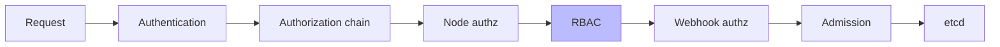
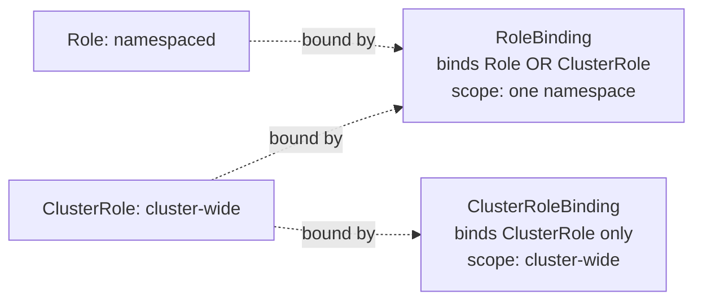
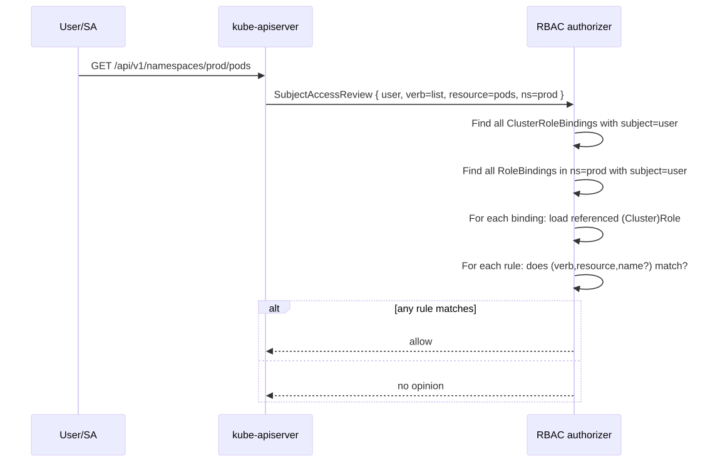
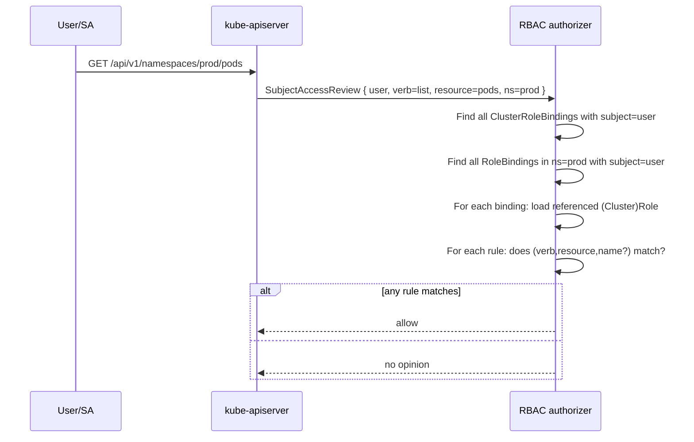
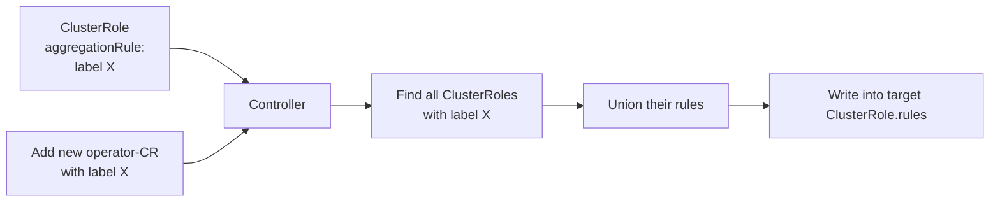

# Kubernetes RBAC Evaluation Deep Dive

## Why this matters

Every API request to kube-apiserver is authorized by RBAC (when enabled, which is always). Misunderstanding how role bindings combine, how aggregation works, or what subjects actually mean leads to either over-privileged service accounts (CVE waiting to happen) or "Forbidden" loops where you grant the right verb on the wrong scope. Knowing the evaluation algorithm cold lets you debug authz failures in seconds instead of hours.

## Mental Model

RBAC is **purely additive, deny-by-default**. There's no Deny rule. The api-server checks every authorization module in order; the FIRST module that returns "allow" or "deny" wins. RBAC's answer is always either `allow` (if any rule matches) or `no opinion` (defer to the next authorizer). If no module allows, the request is denied.

<!-- mermaid:rendered -->
<p align="center"></p>

<details><summary>Mermaid source</summary>



</details>

## The Four Resources

<!-- mermaid:rendered -->
<p align="center"></p>

<details><summary>Mermaid source</summary>



</details>

| Combination | Effect |
|-------------|--------|
| Role + RoleBinding | Permissions in ONE namespace |
| ClusterRole + RoleBinding | ClusterRole's rules but scoped to ONE namespace (very useful — re-use cluster-wide role definitions per namespace) |
| ClusterRole + ClusterRoleBinding | Permissions cluster-wide AND on cluster-scoped resources |
| Role + ClusterRoleBinding | INVALID — api-server rejects |

## Evaluation Algorithm

<!-- mermaid:rendered -->
<p align="center"></p>

<details><summary>Mermaid source</summary>



</details>

The api-server effectively computes:
```text
permissions(user, namespace) =
    rules_from(ClusterRoleBindings_for_user)        # cluster-wide
    ∪
    rules_from(RoleBindings_for_user_in_namespace)  # namespaced
```

Union, not intersection. Adding a binding can only grant more.

## Subjects

```yaml
subjects:
  - kind: User
    name: alice@example.com         # opaque string from authenticator
    apiGroup: rbac.authorization.k8s.io
  - kind: Group
    name: dev-team                  # group from authenticator (OIDC, certs)
    apiGroup: rbac.authorization.k8s.io
  - kind: ServiceAccount
    name: ci-bot
    namespace: ci                   # SA is namespaced — REQUIRED
```

| Kind | Identity source |
|------|-----------------|
| User | Whatever the authenticator says (OIDC `sub`, x509 CN, etc.). K8s has no User CRD. |
| Group | Authenticator-provided groups. OIDC `groups` claim, x509 O fields. |
| ServiceAccount | Stored as `system:serviceaccount:<ns>:<name>`. Token-mounted into pods. |

**Trap:** There is no User object — typos in `name` silently produce no permissions. Always test with `kubectl auth can-i`.

## Annotated Role + Binding

```yaml
# A namespaced Role: read-only access to pods + their logs
apiVersion: rbac.authorization.k8s.io/v1
kind: Role
metadata:
  name: pod-reader
  namespace: prod
rules:
  - apiGroups: [""]                 # core API group is empty string
    resources: ["pods"]
    verbs: ["get", "list", "watch"]
  - apiGroups: [""]
    resources: ["pods/log"]         # subresource — separate rule needed
    verbs: ["get"]
  - apiGroups: [""]
    resources: ["pods"]
    verbs: ["get"]
    resourceNames: ["api-canary"]   # narrow to specific named resources
---
apiVersion: rbac.authorization.k8s.io/v1
kind: RoleBinding
metadata:
  name: alice-pod-reader
  namespace: prod
subjects:
  - kind: User
    name: alice@example.com
    apiGroup: rbac.authorization.k8s.io
roleRef:
  apiGroup: rbac.authorization.k8s.io
  kind: Role                        # could be ClusterRole here
  name: pod-reader
```

### Subresource gotchas

`pods/exec`, `pods/log`, `pods/portforward`, `deployments/scale` are subresources. Granting `get pods` does NOT grant `get pods/log`. Always list subresources explicitly.

### resourceNames

Restricts the rule to specific named instances. **Does not work with `list`, `watch`, `create`, `deletecollection`** (those don't carry a resource name in the request) — use only with `get`, `update`, `patch`, `delete`.

## Aggregated ClusterRoles

ClusterRoles can declaratively merge rules from other ClusterRoles via label selectors. Used heavily by `view`, `edit`, `admin`, `cluster-admin` to absorb rules contributed by CRDs/operators.

```yaml
apiVersion: rbac.authorization.k8s.io/v1
kind: ClusterRole
metadata:
  name: monitoring
  labels:
    rbac.example.com/aggregate-to-monitoring: "true"
rules:
  - apiGroups: ["monitoring.coreos.com"]
    resources: ["servicemonitors"]
    verbs: ["get", "list", "watch"]
---
# Aggregate target — rules empty, populated by selector
apiVersion: rbac.authorization.k8s.io/v1
kind: ClusterRole
metadata:
  name: view-with-monitoring
aggregationRule:
  clusterRoleSelectors:
    - matchLabels:
        rbac.example.com/aggregate-to-monitoring: "true"
rules: []   # auto-populated by controller; do NOT manually edit
```

<!-- mermaid:rendered -->
<p align="center"></p>

<details><summary>Mermaid source</summary>



</details>

The aggregation controller reconciles continuously — installing a new operator that labels a ClusterRole correctly automatically extends `view`/`edit`/`admin`.

## Debugging Authz Decisions

```bash
# Quickest answer
kubectl auth can-i get pods --as=alice@example.com -n prod
# yes / no

# As a service account
kubectl auth can-i list deployments \
  --as=system:serviceaccount:ci:bot -n prod

# Full breakdown of all permissions
kubectl auth can-i --list --as=alice@example.com -n prod

# Inspect what bindings reference a subject
kubectl get rolebindings,clusterrolebindings -A \
  -o jsonpath='{range .items[?(@.subjects[*].name=="alice@example.com")]}{.metadata.namespace}{"\t"}{.metadata.name}{"\n"}{end}'
```

## Common Interview Questions

> [!IMPORTANT]
> **Q1: Can you write a Deny rule in RBAC?**
> A: No. RBAC is additive only. Use admission webhooks (OPA/Kyverno) or remove bindings to deny.
>
> **Q2: How do RoleBindings and ClusterRoleBindings combine?**
> A: Union. Effective permissions = rules from all ClusterRoleBindings + rules from RoleBindings in the relevant namespace, all containing the user as a subject (directly or via group).
>
> **Q3: ClusterRole bound by RoleBinding — what's the scope?**
> A: The ClusterRole's rules apply ONLY in the namespace of the RoleBinding. Useful for re-using a "developer" ClusterRole across many namespaces with different bindings.
>
> **Q4: Why is `pods/log` a separate rule from `pods`?**
> A: It's a subresource. RBAC verbs are checked per `<resource>/<subresource>` pair. Grant `get pods` and `get pods/log` separately.
>
> **Q5: How does ClusterRole aggregation work?**
> A: A target ClusterRole declares an `aggregationRule` with label selectors. A controller continuously merges `rules` from all ClusterRoles matching those labels into the target's `rules`. Operators contribute by labeling their roles.
>
> **Q6: How do you identify a ServiceAccount as a subject?**
> A: Either `kind: ServiceAccount, name, namespace` OR via the implicit group `system:serviceaccounts:<ns>` for all SAs in a namespace, OR `system:serviceaccounts` for all SAs cluster-wide.
>
> **Q7: Why does `resourceNames` not work with `list`?**
> A: List requests don't carry a single name — they enumerate all matching resources. The api-server can't filter by `resourceNames` mid-list.
>
> **Q8: How do you debug "Forbidden" errors?**
> A: `kubectl auth can-i ... --as=<subject> -n <ns>` to confirm. Check api-server audit logs for the SubjectAccessReview decision. Use `--list` to see all granted permissions.

## Sources

- RBAC reference: https://kubernetes.io/docs/reference/access-authn-authz/rbac/
- Authorization overview: https://kubernetes.io/docs/reference/access-authn-authz/authorization/
- Aggregated ClusterRoles: https://kubernetes.io/docs/reference/access-authn-authz/rbac/#aggregated-clusterroles
- kubectl auth: https://kubernetes.io/docs/reference/generated/kubectl/kubectl-commands#auth
