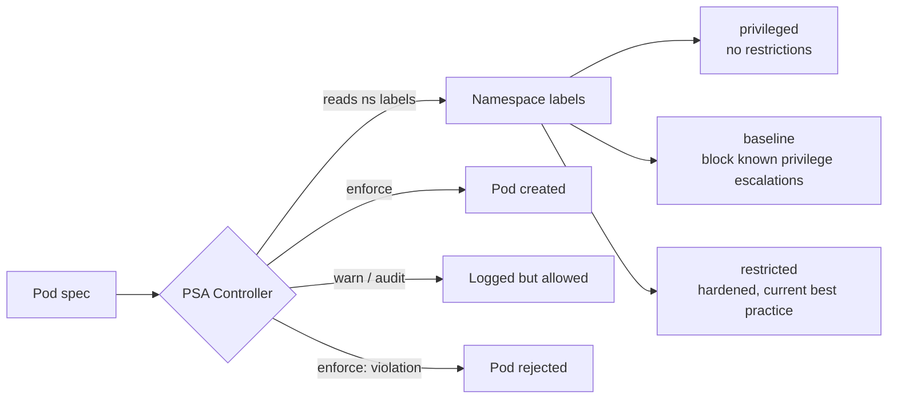

# 02 - Pod Security Admission (PSA)

PSA is the built-in admission controller that **replaced PodSecurityPolicy (PSP)** — PSP was removed in v1.25. PSA enforces the **Pod Security Standards** via namespace labels.

## The Three Profiles

<!-- mermaid:rendered -->
<p align="center"></p>

<details><summary>Mermaid source</summary>



</details>
| Profile | Use Case | Example Restrictions |
|---------|----------|---------------------|
| `privileged` | Trusted system workloads (CNI, CSI, log collectors) | None |
| `baseline` | Most application workloads | No `hostNetwork`, `hostPID`, `hostIPC`, `privileged`, host paths |
| `restricted` | Hardened apps | + `runAsNonRoot`, drop ALL capabilities, seccomp `RuntimeDefault`, no `allowPrivilegeEscalation` |

## Three Modes per Profile

Set independently via labels — common pattern is `warn=restricted, audit=restricted, enforce=baseline` while migrating, then flip enforce to `restricted`.

| Mode | Effect |
|------|--------|
| `enforce` | Reject violating pods |
| `audit` | Log violations to audit log, allow pod |
| `warn` | Return warning to client (kubectl), allow pod |

## Namespace Label Format

```text
pod-security.kubernetes.io/<mode>: <profile>
pod-security.kubernetes.io/<mode>-version: <k8s-version>   # pin profile version
```

## Migration Strategy

1. Label all namespaces with `warn=restricted, audit=restricted` — observe failures
2. Fix workloads (add securityContext, drop caps)
3. Flip `enforce=baseline` first — kicks out the egregious violations
4. Then flip `enforce=restricted` for app namespaces
5. Reserve `privileged` for `kube-system` style namespaces only

## Files
- `namespace-restricted.yaml` — restricted-tier namespace
- `examples-baseline.yaml` — baseline-tier namespace + a passing pod

## Bypass risks
- A user who can label namespaces can downgrade them — restrict `patch`/`update` on `namespaces`
- Some workloads need `privileged` (Cilium, kube-proxy in some modes) — keep those in `kube-system`
