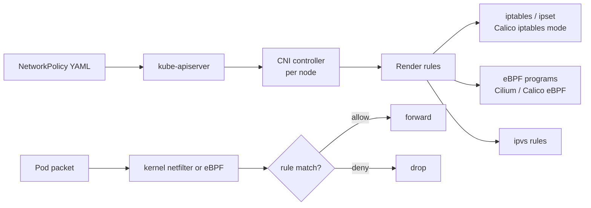
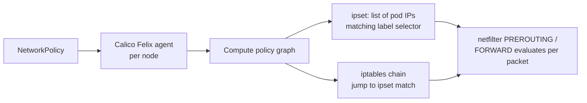
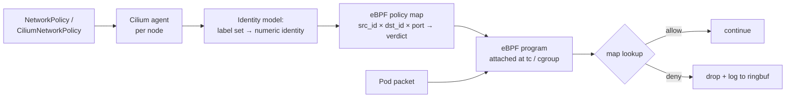
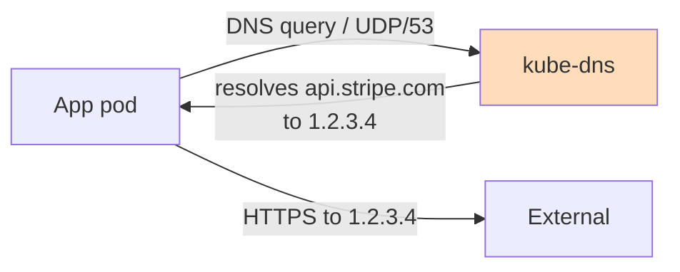

# Network Policy CNI Enforcement Deep Dive

## Why this matters

`NetworkPolicy` is just a Kubernetes API — without a CNI that implements it, applying one does NOTHING. Calico writes iptables/IPVS rules; Cilium compiles eBPF programs into the kernel. Understanding how the abstraction translates to actual kernel-level enforcement explains why some policies don't work as written, why hostNetwork pods bypass everything, and why default-deny is the only safe baseline.

## Mental Model

A `NetworkPolicy` is a declarative statement: "for pods matching X, allow only Y traffic". The CNI controller watches these objects and configures the data plane (iptables, ipset, eBPF maps) on every node so the kernel enforces the rule on every packet. The api-server NEVER sees a packet — enforcement is fully decentralized.

<!-- mermaid:rendered -->
<p align="center"></p>

<details><summary>Mermaid source</summary>



</details>

## Default Behavior — open until you close it

| Without any NetworkPolicy in namespace | All pods accept ALL ingress + egress |
| First NetworkPolicy selecting a pod | That pod becomes default-deny for the affected direction(s); only listed rules pass |

**Critical:** "Default deny" is per-pod, per-direction, per-namespace. Selecting a pod with an `Ingress` policy denies all unspecified ingress to that pod, but egress is still wide-open until you also write an `Egress` policy.

## Default-deny baseline

```yaml
# Apply this FIRST in every namespace
apiVersion: networking.k8s.io/v1
kind: NetworkPolicy
metadata:
  name: default-deny-all
  namespace: prod
spec:
  podSelector: {}                # empty = all pods in namespace
  policyTypes:
    - Ingress
    - Egress
  # No ingress/egress rules → deny all
```

Then layer narrow allow-policies on top. This is the only sane production baseline.

## Annotated allow-policy

```yaml
apiVersion: networking.k8s.io/v1
kind: NetworkPolicy
metadata:
  name: api-allow-frontend
  namespace: prod
spec:
  podSelector:
    matchLabels:
      app: api                   # policy applies to api pods
  policyTypes: [Ingress, Egress]

  ingress:
    - from:
        - podSelector:
            matchLabels:
              app: frontend      # frontend pods in SAME namespace
        - namespaceSelector:
            matchLabels:
              env: prod          # OR any pod in a namespace labeled env=prod
        - ipBlock:
            cidr: 10.0.0.0/8
            except: [10.0.5.0/24]   # CIDR with exclusions
      ports:
        - protocol: TCP
          port: 8080

  egress:
    # DNS — almost always required
    - to:
        - namespaceSelector: {}
          podSelector:
            matchLabels:
              k8s-app: kube-dns
      ports:
        - { protocol: UDP, port: 53 }
        - { protocol: TCP, port: 53 }
    # Database
    - to:
        - podSelector: { matchLabels: { app: postgres } }
      ports:
        - { protocol: TCP, port: 5432 }
```

### Selector semantics

Multiple entries in `from:` are OR'd. Multiple selectors WITHIN a single `from` entry are AND'd:

```yaml
# OR: frontend pods OR any pod in env=prod namespace
from:
  - podSelector: { matchLabels: { app: frontend } }
  - namespaceSelector: { matchLabels: { env: prod } }

# AND: frontend pods that are ALSO in env=prod namespace
from:
  - podSelector: { matchLabels: { app: frontend } }
    namespaceSelector: { matchLabels: { env: prod } }
```

This single character of indentation flips the semantics — the most common NetworkPolicy bug.

## How Calico Translates Policies

<!-- mermaid:rendered -->
<p align="center"></p>

<details><summary>Mermaid source</summary>



</details>

Felix on each node:
1. Watches NetworkPolicies + Pods.
2. Computes which pods on THIS node match each policy's selector.
3. Renders one or more iptables chains per policy + ipsets for the IP lists.
4. Hooks chains into the FORWARD path so packets entering/leaving local pods hit them.

Because rules use ipsets (kernel hash data structure), thousands of pod IPs match in O(1) — much faster than a long iptables chain.

## How Cilium Translates Policies

<!-- mermaid:rendered -->
<p align="center"></p>

<details><summary>Mermaid source</summary>



</details>

Cilium assigns each unique label set a numeric **security identity**. Policies become entries in eBPF maps keyed by `(src_identity, dst_identity, dst_port, protocol)`. The eBPF program does a single map lookup per packet — far cheaper than iptables chain traversal at scale.

CiliumNetworkPolicy (CRD) extends standard NetworkPolicy with L7 (HTTP method/path, Kafka topic, DNS name), FQDN egress, and identity-based policies impossible in vanilla NetworkPolicy.

## hostNetwork Pods Bypass Everything

Pods with `spec.hostNetwork: true` use the node's network namespace directly. Their packets do NOT traverse the per-pod veth pair where CNI hooks live, so:

- NetworkPolicies do NOT apply to hostNetwork pod traffic in either direction.
- Both ingress to and egress from these pods skip CNI enforcement.

Mitigation: avoid hostNetwork unless required (system DaemonSets like ingress-nginx in some configs). For those, use node-level firewalls (iptables, security groups) or HostFirewall (Cilium feature) outside the NetworkPolicy abstraction.

## Egress to External — DNS is the trap

<!-- mermaid:rendered -->
<p align="center"></p>

<details><summary>Mermaid source</summary>



</details>

A NetworkPolicy egress rule of `to: ipBlock: cidr: 1.2.3.4/32` works ONLY if the IP is stable. Most SaaS APIs rotate IPs across many CIDRs.

Solutions:
- Cilium: use `toFQDNs` selectors. Cilium watches DNS responses and dynamically populates allowed IPs.
- Calico: use `GlobalNetworkPolicy` with DNS lookup, or proxy egress through an explicit gateway.

## Common Interview Questions

> [!IMPORTANT]
> **Q1: What happens if you apply a NetworkPolicy on a cluster with no CNI implementing it?**
> A: Nothing. The object is stored in etcd but no enforcement occurs. Most managed clusters now ship with a NetworkPolicy-capable CNI; older flannel-only clusters do not.
>
> **Q2: How do you implement default-deny?**
> A: Apply a NetworkPolicy with empty `podSelector: {}` and `policyTypes: [Ingress, Egress]` and no rules. All pods become deny-all in both directions for that namespace.
>
> **Q3: What's the difference between two list entries in `from:` vs two selectors in one entry?**
> A: List entries OR. Selectors within one entry AND. Indentation matters — wrong indentation is the most common policy bug.
>
> **Q4: Why don't NetworkPolicies apply to hostNetwork pods?**
> A: They share the host's network namespace, so packets never traverse the per-pod veth where CNI hooks enforcement. Use node firewalls or Cilium HostFirewall.
>
> **Q5: Calico vs Cilium enforcement model?**
> A: Calico: iptables chains + ipsets per policy, evaluated by netfilter. Cilium: numeric security identities + eBPF map lookups per packet. Cilium scales better at high pod counts and supports L7 / FQDN policies.
>
> **Q6: How do you allow egress to a SaaS endpoint with rotating IPs?**
> A: Use Cilium `toFQDNs` (intercepts DNS, populates IPs dynamically) or proxy through a stable egress gateway. Plain `ipBlock` rules will break.
>
> **Q7: Selecting a pod with an Ingress-only policy — what happens to its egress?**
> A: Egress remains fully open. NetworkPolicies are direction-specific. You must add a separate Egress policy (or include `Egress` in `policyTypes`) to restrict outbound.
>
> **Q8: Why do you almost always need an explicit DNS egress rule after default-deny?**
> A: Pods need UDP/53 to kube-dns to resolve any service name. Default-deny blocks it. Without a DNS allow-rule, nothing resolves and your app fails opaquely.

## Sources

- NetworkPolicy reference: https://kubernetes.io/docs/concepts/services-networking/network-policies/
- Calico architecture: https://docs.tigera.io/calico/latest/reference/architecture/overview
- Cilium eBPF & identity: https://docs.cilium.io/en/stable/network/concepts/security-identities/
- CiliumNetworkPolicy: https://docs.cilium.io/en/stable/security/policy/
- NetworkPolicy editor: https://editor.networkpolicy.io/
