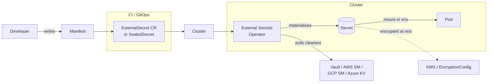

# 04 - Secrets Management

## The base64 trap

```bash
$ kubectl get secret db-creds -o jsonpath='{.data.password}' | base64 -d
hunter2
```

Kubernetes Secrets are **base64-encoded, not encrypted**. By default they sit in plain bytes inside etcd. Anyone with `get secret` permission, raw etcd access, or an etcd backup has the cleartext.

## Layers of defence

<!-- mermaid:rendered -->
<p align="center"></p>

<details><summary>Mermaid source</summary>

<!-- mermaid:rendered -->
<p align="center"></p>

<details><summary>Mermaid source</summary>

<!-- mermaid:rendered -->
<p align="center"></p>

<details><summary>Mermaid source</summary>



</details>

</details>

</details>

## Approaches compared

| Approach | Where secret lives | Rotation | Best for |
|---------|-------------------|----------|----------|
| Plain Secret | etcd (encoded) | manual | Almost never |
| Encrypted etcd (`EncryptionConfiguration`) | etcd (encrypted via KMS) | manual on app side | Cluster-level baseline — always do this |
| Sealed Secrets (Bitnami) | git (encrypted), etcd (decrypted) | re-seal & re-apply | Small teams, GitOps without external SM |
| External Secrets Operator | external SM, synced to Secret | automatic | Production, multi-cloud |
| CSI Secrets Store driver | mounted directly from SM, no Secret object | live | When you don't want a Secret object at all |
| HashiCorp Vault Agent injector | injected into pod via init/sidecar | dynamic, short-lived | High-security, dynamic DB creds |

## Always-do baseline

1. **Encrypt etcd at rest** — see `09-cluster-hardening/encryption-config.yaml`
2. **RBAC**: `get secrets` is a privileged verb. Audit who has it.
3. **Don't put secrets in env vars** if avoidable — they leak via `/proc`, crash dumps, child processes. Mount as files instead.
4. **No secrets in git, ever** — use sealed-secrets or ESO references.
5. **Short TTL** — prefer dynamic secrets (Vault DB engine, IRSA) over long-lived keys.

## Files
- `external-secret.yaml` — ESO ExternalSecret + ClusterSecretStore for AWS Secrets Manager
- `sealed-secret.md` — kubeseal walkthrough
