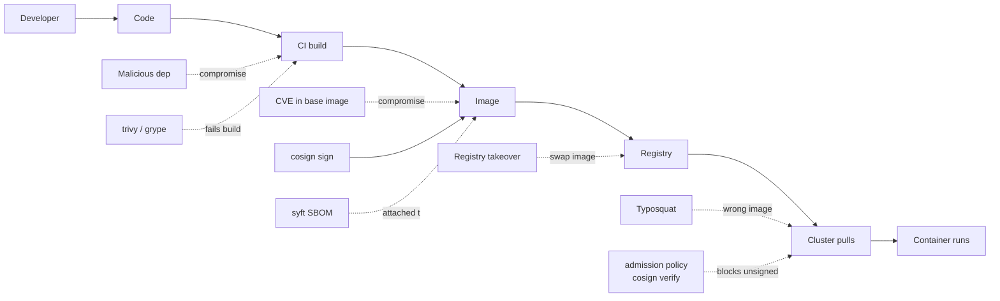

# 05 - Image Security

The container image is your software supply chain in a tarball. Three pillars: **build minimal, scan continuously, sign and verify**.

## Threat flow

<!-- mermaid:rendered -->
<p align="center"></p>

<details><summary>Mermaid source</summary>



</details>
## Build rules

| Rule | Why |
|------|-----|
| No `:latest` — pin by digest (`@sha256:...`) | `:latest` is mutable, bypasses cache, and re-pulls silently |
| Distroless / scratch / chainguard / wolfi base | No shell = no `kubectl exec` lateral movement, fewer CVEs |
| Multi-stage builds | Build deps don't ship to prod |
| `USER 10001` (non-root) | PSA restricted requires it |
| `--no-install-recommends` (apt) | Smaller surface |
| Multi-arch (`linux/amd64,linux/arm64`) | Mixed-fleet K8s, Graviton/ARM nodes |
| Reproducible (`SOURCE_DATE_EPOCH`) | Provenance, byte-for-byte rebuilds |

## Scanning

```dockerfile
# Build
docker buildx build --platform linux/amd64,linux/arm64 -t myapp:1.2.3 --push .
```

See [trivy-scan.md](./trivy-scan.md) for image, filesystem, IaC, and live-cluster scans.

## Signing & verification (Sigstore)

See [cosign-sign-verify.md](./cosign-sign-verify.md) — keyless signing via OIDC, then verify in admission with Kyverno or policy-controller.

## SBOM

See [sbom-syft.md](./sbom-syft.md) — generate SPDX/CycloneDX SBOMs and attach them to images as attestations.

## Files
- `trivy-scan.md`
- `cosign-sign-verify.md`
- `sbom-syft.md`
