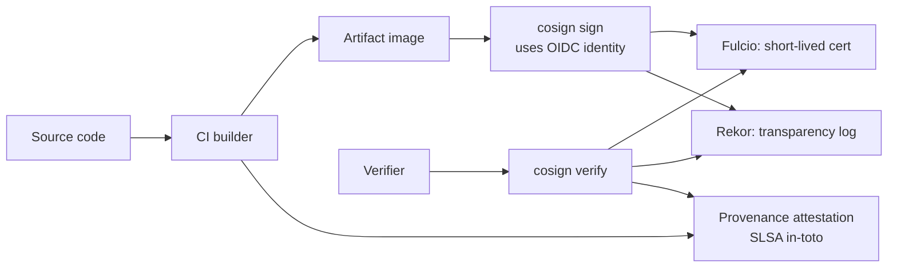
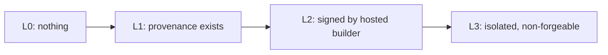
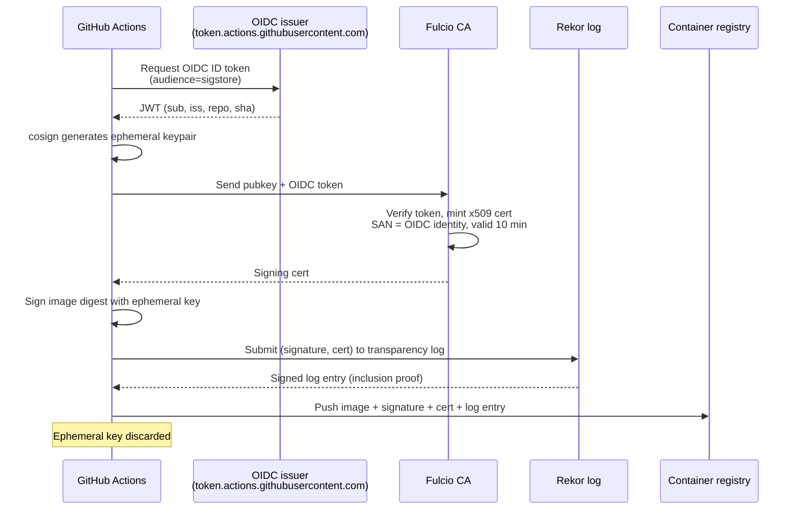
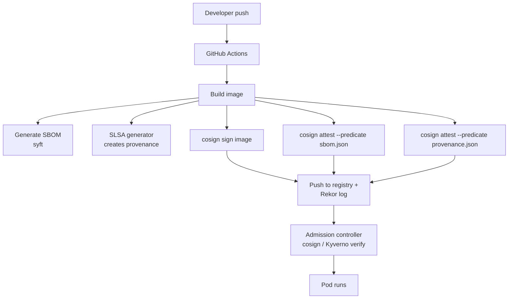

# Supply Chain Security & SLSA Deep Dive

## Why this matters

SolarWinds, Codecov, xz-utils — supply chain attacks compromise upstream so YOUR pipeline ships malware. SLSA (Supply-chain Levels for Software Artifacts) is the industry framework for proving an artifact's provenance, and Sigstore (cosign + rekor + fulcio) is how we sign and verify everything from container images to language packages without managing long-lived keys. If you can't answer "who built this image, from what source, with what tools, and where's the proof?" you don't have a supply chain story.

## Mental Model

Three independent problems:
1. **Provenance** — what built this artifact, from what inputs? (SLSA + in-toto attestations)
2. **Integrity** — has this artifact been tampered with? (cryptographic signing)
3. **Authenticity** — who signed it, and can I verify without trusting them long-term? (Sigstore: short-lived OIDC-issued certs + transparency log)



## SLSA Levels

SLSA v1.0 has progressive Build Track levels. Each level adds requirements on the build process, NOT the artifact itself.

| Level | Requirements | What it prevents |
|-------|--------------|------------------|
| L0 | None | Nothing |
| L1 | Provenance generated by build system, distributed with artifact | Tampering by ignorant attackers (no proof of build process) |
| L2 | Provenance signed by hosted build platform (e.g. GitHub Actions OIDC); tamper-evident | Forged provenance |
| L3 | Build platform isolates builds; provenance is non-forgeable even by tenants of the same platform; hardened build environment | Tenant-on-tenant attacks; build-time tampering by malicious code in the pipeline |

L4 was in early SLSA drafts (hermetic, reproducible builds) but is removed from v1.0 — may return as a separate track.



## in-toto Attestations

An attestation is a signed JSON document making a claim about a software artifact:

```json
{
  "_type": "https://in-toto.io/Statement/v1",
  "subject": [{
    "name": "ghcr.io/acme/api",
    "digest": { "sha256": "abc123..." }
  }],
  "predicateType": "https://slsa.dev/provenance/v1",
  "predicate": {
    "buildDefinition": {
      "buildType": "https://github.com/actions/runner/...",
      "externalParameters": {
        "workflow": ".github/workflows/release.yml@refs/tags/v1.2.3",
        "repository": "https://github.com/acme/api"
      }
    },
    "runDetails": {
      "builder": { "id": "https://github.com/actions/runner/v2.310.0" },
      "metadata": {
        "invocationId": "https://github.com/acme/api/actions/runs/123456",
        "startedOn": "2026-04-25T10:00:00Z"
      }
    }
  }
}
```

Predicates can be SLSA Provenance, SBOM (CycloneDX/SPDX), VEX (vulnerability disclosure), or any custom claim. The same envelope format covers all of them.

## Sigstore — Keyless Signing

Traditional code signing requires managing long-lived private keys (HSMs, key rotation, theft risk). Sigstore inverts this: identity proven via OIDC at sign-time, ephemeral cert issued for the signing operation only, all signatures recorded in a public transparency log.



| Component | Role |
|-----------|------|
| **Cosign** | CLI/library: signs and verifies artifacts (images, blobs, attestations) |
| **Fulcio** | Free CA. Mints short-lived (10-min) x509 certs whose SAN = the OIDC identity (e.g. `https://github.com/acme/api/.github/workflows/release.yml@refs/tags/v1.2.3`) |
| **Rekor** | Append-only transparency log (Trillian-backed). Every signature is publicly auditable |

### What's verified at verify-time

```bash
cosign verify ghcr.io/acme/api@sha256:abc123 \
  --certificate-identity-regexp "https://github.com/acme/api/.+" \
  --certificate-oidc-issuer "https://token.actions.githubusercontent.com"
```

Verifier checks:
1. Signature matches image digest with the cert's pubkey.
2. Cert was issued by Fulcio's root.
3. Cert SAN matches the expected OIDC identity (workflow + repo).
4. Cert was valid at signing time (proven by Rekor inclusion timestamp).
5. Signature is in the Rekor transparency log.

No long-lived keys, no key rotation, full public auditability.

## Verifying SLSA Provenance with Policy

```yaml
# Kyverno policy: only allow images signed by our release workflow
apiVersion: kyverno.io/v1
kind: ClusterPolicy
metadata:
  name: verify-image-signatures
spec:
  validationFailureAction: Enforce
  webhookTimeoutSeconds: 30
  rules:
    - name: verify-cosign-signature
      match:
        any:
          - resources:
              kinds: [Pod]
      verifyImages:
        - imageReferences: ["ghcr.io/acme/*"]
          attestors:
            - entries:
                - keyless:
                    subject: "https://github.com/acme/api/.github/workflows/release.yml@refs/tags/v*"
                    issuer: "https://token.actions.githubusercontent.com"
                    rekor:
                      url: https://rekor.sigstore.dev
          attestations:
            - type: https://slsa.dev/provenance/v1
              attestors:
                - entries:
                    - keyless:
                        subject: "https://github.com/slsa-framework/slsa-github-generator/.github/workflows/generator_container_slsa3.yml@refs/tags/v*"
                        issuer: "https://token.actions.githubusercontent.com"
              conditions:
                - all:
                    - key: "{{ predicate.buildDefinition.externalParameters.repository }}"
                      operator: Equals
                      value: "https://github.com/acme/api"
```

This refuses to admit any pod whose image isn't signed AND whose SLSA provenance isn't attested by the official slsa-github-generator at v3.

## End-to-end pipeline



## Common Interview Questions

> [!IMPORTANT]
> **Q1: What does SLSA actually guarantee?**
> A: SLSA is about the BUILD PROCESS, not the code. L1: provenance exists. L2: provenance signed by hosted builder. L3: builder isolates tenants and provenance is non-forgeable. It does NOT certify the code is bug-free or vuln-free.
>
> **Q2: in-toto vs SLSA — what's the relationship?**
> A: in-toto is the format (signed attestation envelope). SLSA Provenance is one predicate type that can be carried in an in-toto envelope. Other predicates: SBOM, VEX, test results.
>
> **Q3: How does Sigstore avoid long-lived signing keys?**
> A: At sign-time, the signer authenticates via OIDC, gets a 10-minute x509 cert from Fulcio whose SAN = the OIDC identity. They sign with the ephemeral key, then discard it. Rekor's transparency log proves the signature existed during cert validity.
>
> **Q4: What is Rekor and why do we need it?**
> A: An append-only public transparency log (Trillian-backed). It proves a signature was created within the cert's 10-minute validity window — necessary because the signing cert has long expired by verify-time.
>
> **Q5: What's verified by `cosign verify --certificate-identity`?**
> A: That the cert's SAN matches the expected OIDC identity (e.g. specific GitHub workflow at a specific ref). This is what binds the signature to "the official release pipeline" rather than "anyone with a GitHub account".
>
> **Q6: How do you enforce signature verification in Kubernetes?**
> A: Admission controller — Kyverno's `verifyImages`, OPA Gatekeeper with cosign policy, or Sigstore's policy-controller. Refuses pods whose images don't have matching signatures + attestations.
>
> **Q7: Difference between signing and attesting in cosign?**
> A: `cosign sign` produces a bare signature over the image digest. `cosign attest --predicate <file>` produces an in-toto attestation (signed JSON document making claims) — used for SBOMs, provenance, VEX.
>
> **Q8: Why do SLSA L3 builds need to be "isolated"?**
> A: To prevent build steps from forging provenance about themselves. The builder must run user-controlled steps in an environment that cannot influence the provenance generation, so an attacker controlling the build can't lie about what they built.

## Sources

- SLSA spec: https://slsa.dev/spec/v1.0/
- in-toto attestations: https://github.com/in-toto/attestation
- Sigstore: https://www.sigstore.dev/
- Cosign: https://docs.sigstore.dev/cosign/overview/
- Fulcio: https://docs.sigstore.dev/fulcio/overview/
- Rekor: https://docs.sigstore.dev/rekor/overview/
- Kyverno verifyImages: https://kyverno.io/docs/writing-policies/verify-images/
