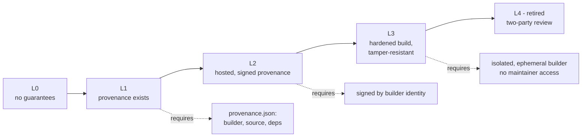
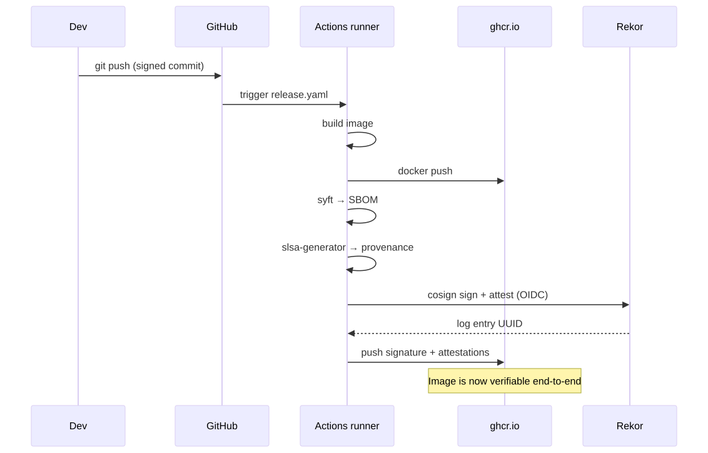
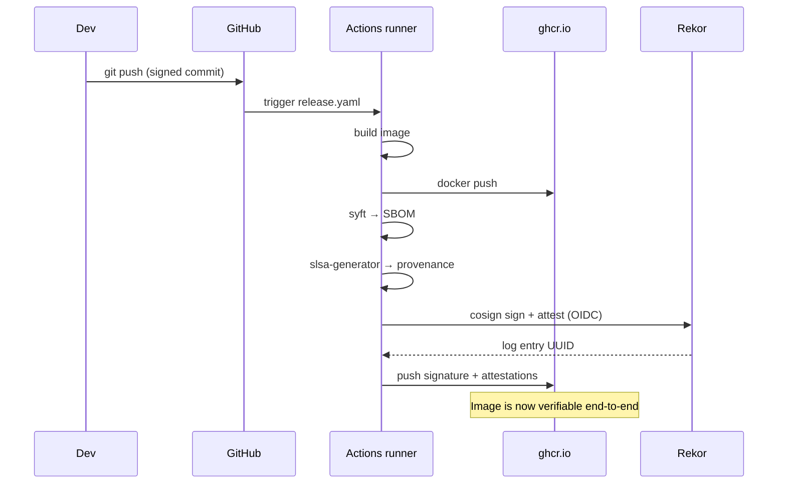

# 08 - Supply Chain Security

The build and release pipeline is now the highest-leverage attack surface (SolarWinds, Codecov, xz-utils). The defence framework is **SLSA** — Supply-chain Levels for Software Artifacts.

## SLSA Levels

<!-- mermaid:rendered -->

Mermaid source

<!-- mermaid:rendered -->

Mermaid source

<!-- mermaid:rendered -->

Mermaid source

| Level | Requirement |
|-------|-------------|
| L0 | None |
| L1 | Provenance exists, can be inspected |
| L2 | Hosted build service, signed provenance |
| L3 | Hardened, isolated, ephemeral builder; no admin can tamper |
| L4 | (retired in v1.0) was two-party review + hermetic |

GitHub Actions + the [`slsa-github-generator`](https://github.com/slsa-framework/slsa-github-generator) reusable workflow gets you SLSA L3 for free for OSS repos.

## Building blocks

| Concept | What it is |
|---------|-----------|
| **in-toto** | Framework for attestations (statement + predicate + signature) |
| **Provenance** | A signed predicate describing how an artifact was built |
| **SBOM** | What's *inside* the artifact (see `05-image-security/sbom-syft.md`) |
| **VEX** | Whether SBOM CVEs are actually exploitable |
| **Sigstore (cosign + Fulcio + Rekor)** | The signing + transparency log infrastructure |
| **Signed commits** | `git commit -S` with GPG/SSH key, verified by GitHub |

## A signed-and-attested release

<!-- mermaid:rendered -->

Mermaid source

<!-- mermaid:rendered -->

Mermaid source

<!-- mermaid:rendered -->

Mermaid source

## Files
- `github-actions-slsa.yaml` — full pipeline: build, SBOM, sign, SLSA provenance

## Verification at deploy time
- Use **Kyverno `verifyImages`** or **sigstore policy-controller** to enforce provenance + signature at admission
- Pin to the specific workflow identity, not just "any signed image"
