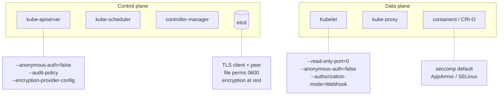

# 09 - Cluster Hardening

Kubernetes ships secure-by-default for most settings — but distros, managed providers, and cluster age cause drift. The **CIS Kubernetes Benchmark** is the canonical hardening checklist.

## What to harden

<!-- mermaid:rendered -->
<p align="center"></p>

<details><summary>Mermaid source</summary>

<!-- mermaid:rendered -->
<p align="center"></p>

<details><summary>Mermaid source</summary>



</details>

</details>

## kube-bench

[Aqua kube-bench](https://github.com/aquasecurity/kube-bench) runs the CIS checks for you. Single binary or DaemonSet.

```bash
# Run on a node, against the matching CIS version
docker run --rm --pid=host -v /etc:/etc:ro -v /var:/var:ro \
  aquasec/kube-bench:latest run --benchmark cis-1.10

# As a Job in the cluster
kubectl apply -f https://raw.githubusercontent.com/aquasecurity/kube-bench/main/job.yaml
kubectl logs job.batch/kube-bench
```

See [kube-bench.md](./kube-bench.md) for full workflow.

## kube-hunter

[kube-hunter](https://github.com/aquasecurity/kube-hunter) — penetration-testing oriented. Probes the cluster from outside or inside.

```bash
# External probe
docker run -it --rm --network host aquasec/kube-hunter:latest --remote <api-server-ip>

# Inside-cluster probe (worst-case attacker model)
kubectl run kube-hunter --rm -it --image=aquasec/kube-hunter:latest -- --pod
```

## API server flags (production)

```
--anonymous-auth=false
--authorization-mode=Node,RBAC
--audit-log-path=/var/log/audit.log
--audit-log-maxage=30
--audit-policy-file=/etc/kubernetes/audit-policy.yaml
--encryption-provider-config=/etc/kubernetes/enc/encryption-config.yaml
--tls-min-version=VersionTLS12
--tls-cipher-suites=TLS_ECDHE_RSA_WITH_AES_256_GCM_SHA384,...
--profiling=false
--service-account-lookup=true
--request-timeout=60s
--admission-control-config-file=...   # for PSA defaults
```

## etcd encryption at rest

By default etcd stores Secret bytes in plaintext. Enable an EncryptionConfiguration that wraps with KMS or aescbc.

See `encryption-config.yaml` (KMS preferred — keys never on disk).

After enabling, **rewrite all existing secrets** so they get encrypted:

```bash
kubectl get secrets --all-namespaces -o json \
  | kubectl replace -f -
```

## Files
- `encryption-config.yaml` — KMS-backed EncryptionConfiguration for the API server
- `kube-bench.md` — running and triaging CIS results

## Other table-stakes
- Pull `kubeadm` upgrades regularly — control plane stays patched
- Restrict kubelet → API server with `RBAC + Node authorizer`
- Disable read-only kubelet port (10255)
- Run nodes with auto-patching (e.g. EKS managed node groups, GKE auto-upgrade)
- Use Bottlerocket / Talos / GKE COS as host OS — read-only root, fewer CVEs
