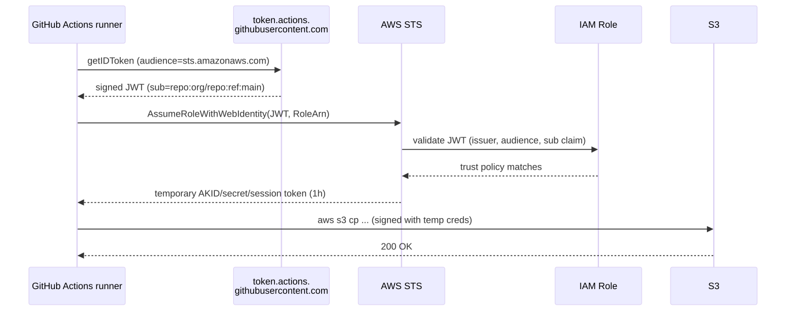
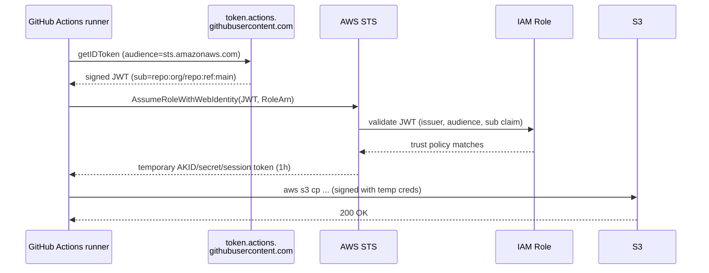

# 10 - Secrets in CI (OIDC to Cloud)

The old way: store an AWS access key as a GitHub secret. The new way: **OIDC federation** — the CI runner presents a short-lived JWT, the cloud trusts the issuer, and exchanges it for short-lived credentials. **No long-lived keys anywhere.**

## OIDC trust flow

<!-- mermaid:rendered -->
<p align="center"></p>

<details><summary>Mermaid source</summary>



</details>
The IAM trust policy pins the **subject claim** — typically `repo:OWNER/REPO:ref:refs/heads/main` — so only that exact branch can assume the role. Forks, PRs, other repos are denied.

## Setup (one-time, AWS)

```bash
# 1. Register GitHub as an OIDC provider in AWS (once per account)
aws iam create-open-id-connect-provider \
  --url https://token.actions.githubusercontent.com \
  --client-id-list sts.amazonaws.com \
  --thumbprint-list 6938fd4d98bab03faadb97b34396831e3780aea1
```

Then create an IAM role with the trust policy in `github-oidc-aws.yaml`.

## Provider equivalents

| Cloud | Mechanism | Action |
|-------|-----------|--------|
| AWS | IAM OIDC provider + AssumeRoleWithWebIdentity | `aws-actions/configure-aws-credentials@v4` |
| GCP | Workload Identity Federation | `google-github-actions/auth@v2` |
| Azure | Workload identity / Federated credentials | `azure/login@v2` with `client-id` only |
| Vault | JWT auth backend | `hashicorp/vault-action@v3` |

## Subject claim patterns to allow

| Pattern | Allows |
|---------|--------|
| `repo:org/repo:ref:refs/heads/main` | Only main branch |
| `repo:org/repo:environment:production` | Only when using a `production` GH environment (review gates) |
| `repo:org/repo:pull_request` | Any PR — broad, audit before allowing |
| `repo:org/*` | Any repo in org — only for cross-repo platform roles |

**Best practice**: use GitHub Environments + protection rules + the `environment:` claim. PR runs can't assume prod roles.

## Files
- `github-oidc-aws.yaml` — IAM role trust policy + minimal Actions workflow
