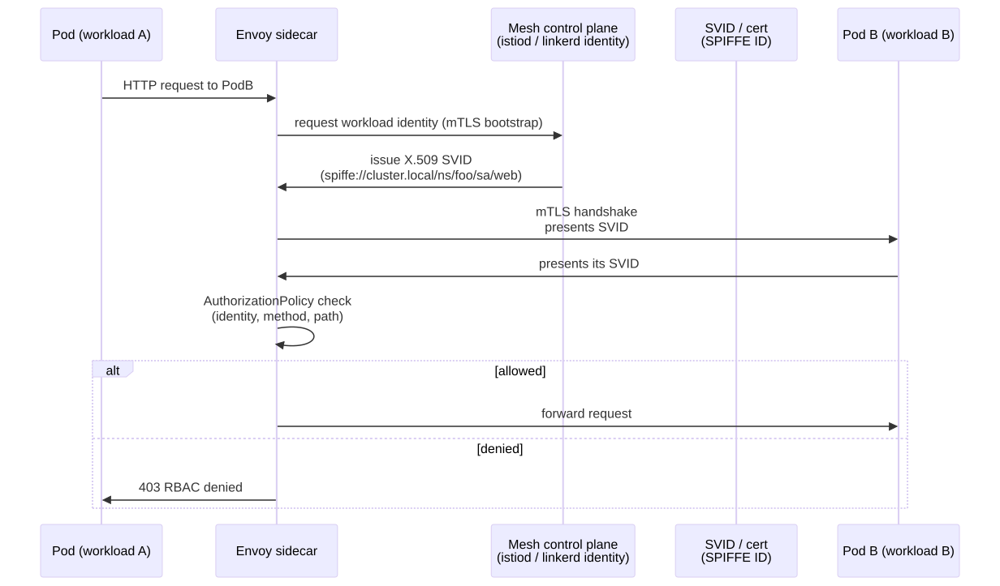
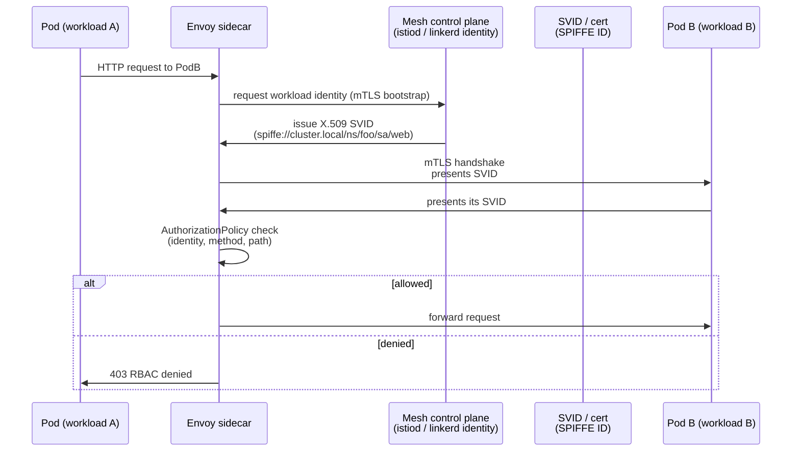

# 11 - Zero Trust Service Mesh

**Zero trust** = no implicit trust based on network location. Every request is authenticated and authorised, even pod-to-pod inside the cluster. Service mesh (Istio, Linkerd) is the standard implementation.

## Identity flow (SPIFFE)

<!-- mermaid:rendered -->

Mermaid source

## Building blocks

| Concept | What it is |
|---------|-----------|
| **mTLS** | Mutual TLS — both sides present certs. Mesh handles cert issuance + rotation automatically. |
| **SPIFFE ID** | Universal workload identity URI — `spiffe://trust-domain/ns/<ns>/sa/<sa>`. Same ID can be used across mesh / Vault / cloud IAM. |
| **SPIRE** | Reference SPIFFE implementation — node + workload attestor that issues SVIDs. |
| **AuthorizationPolicy** | Mesh-native L7 policy — "ServiceAccount X may POST /api/orders to Y" |
| **PeerAuthentication** | Mesh-wide mTLS mode — `STRICT` mandates mTLS for all in-mesh traffic |

## Mesh comparison

| | Istio | Linkerd |
|---|-------|---------|
| Data plane | Envoy sidecar (or ambient) | linkerd2-proxy (Rust, lightweight) |
| Identity | SPIFFE | SPIFFE (since 2.x) |
| L7 features | Rich (JWT, ext-authz, WASM) | Focused, less surface |
| Ops complexity | High | Low |
| When | Need fine-grained policy, multi-cluster, gateway features | Want mTLS + observability with minimal ops |

## Files
- `istio-authz-policy.yaml` — STRICT mTLS + AuthorizationPolicy that denies by default and allows specific service-to-service calls

## Practical zero-trust adoption

1. Install mesh; enable mTLS in `PERMISSIVE` mode (mesh + non-mesh both work)
2. Inject sidecars into all namespaces
3. Watch metrics — once 100% mTLS, flip to `STRICT`
4. Add a default-deny `AuthorizationPolicy` at the namespace level
5. Add allow rules per service-to-service edge — your call graph becomes documented in YAML
