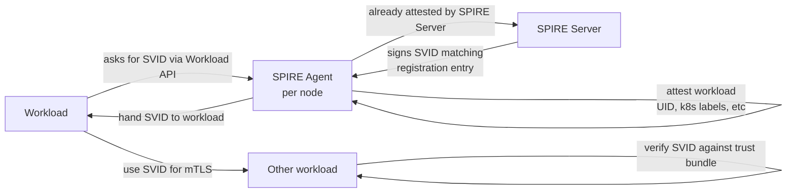
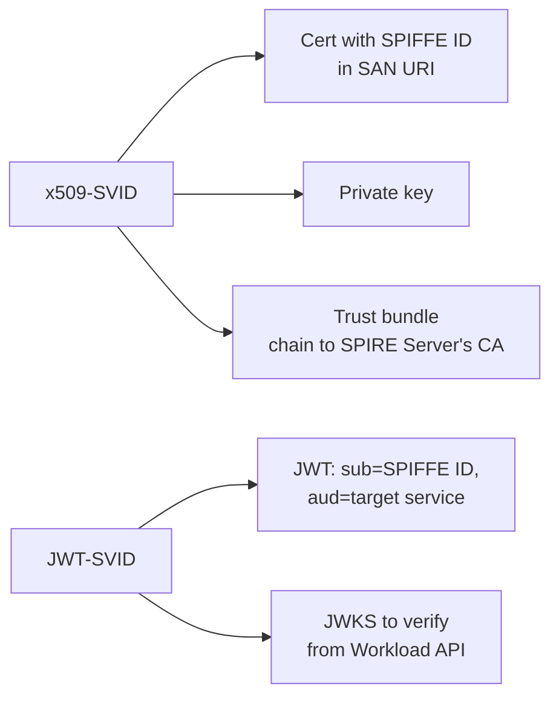
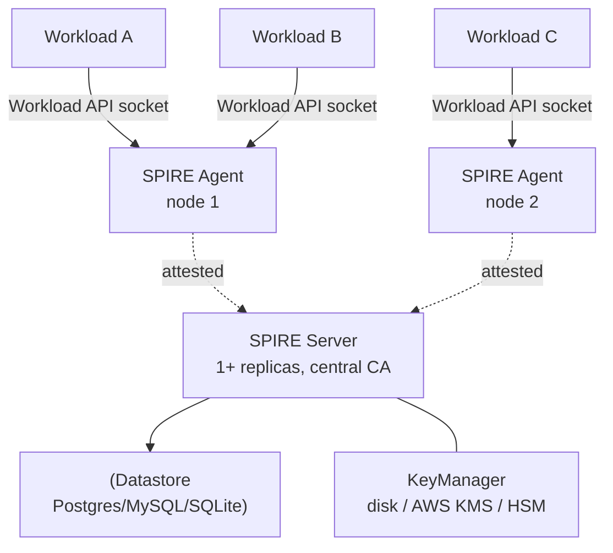
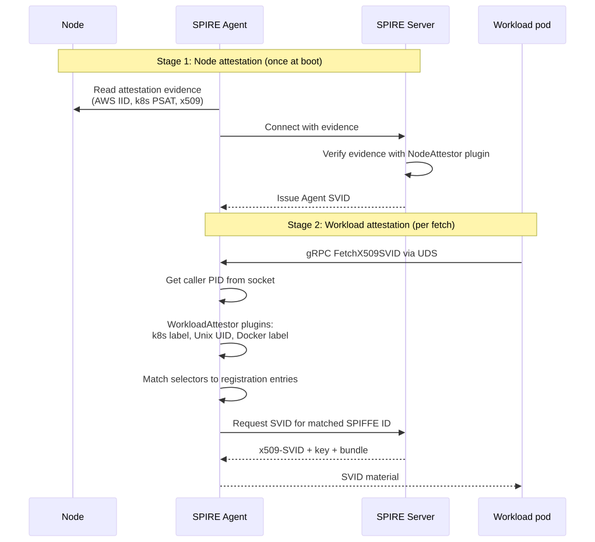
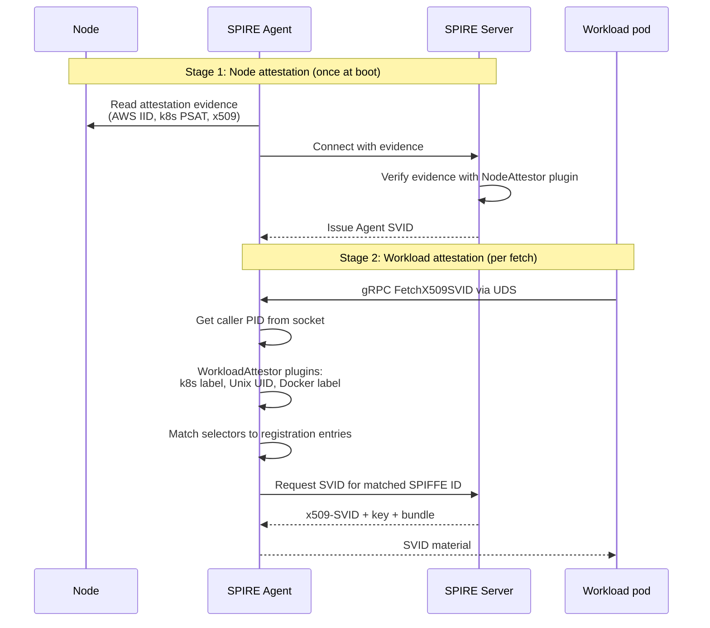
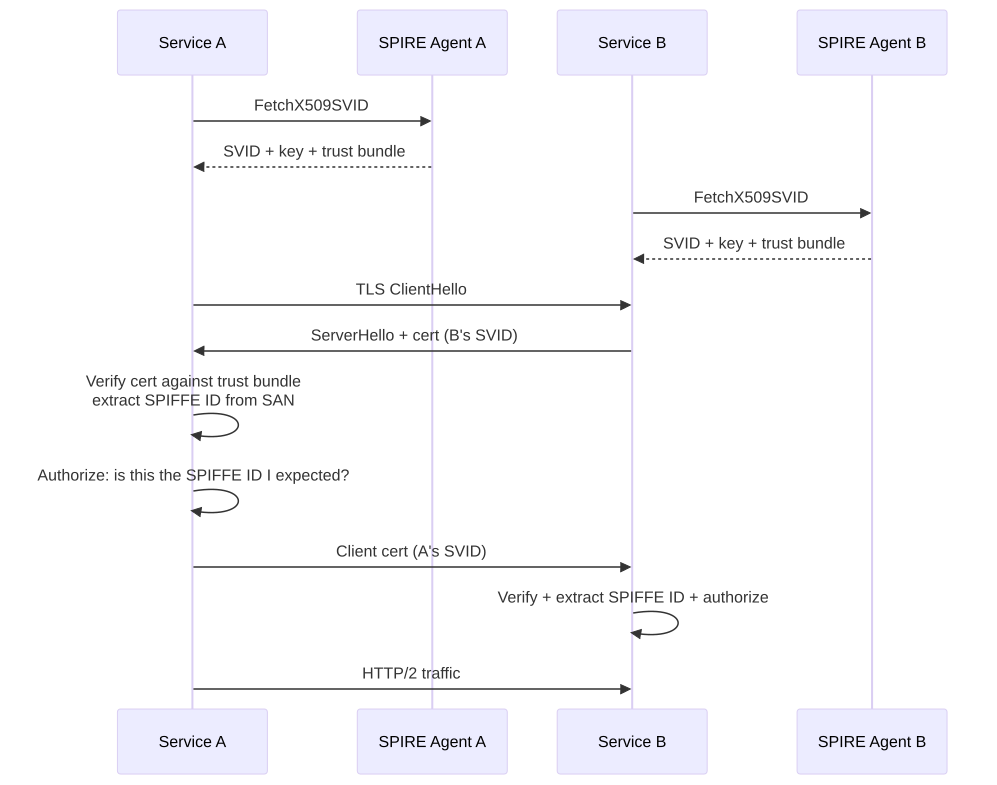
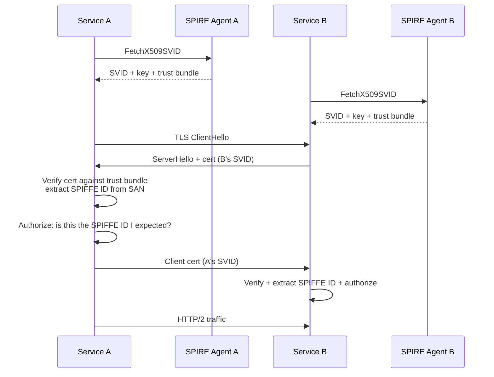

# SPIFFE & SPIRE Deep Dive

## Why this matters

Zero-trust architectures need workload identity that doesn't depend on network location, IP allowlists, or shared secrets. SPIFFE (Secure Production Identity Framework For Everyone) defines the identity standard; SPIRE is the reference implementation. Together they let services prove who they are using cryptographic identities issued automatically based on platform attestation — no API keys to rotate, no certs to manage, mTLS that "just works" across clusters and clouds.

## Mental Model

Every workload gets a **SPIFFE ID** (a URI like `spiffe://acme.com/payments/api`). The platform proves what the workload is via **attestation** (k8s pod metadata, AWS instance identity doc, etc.), and SPIRE issues a short-lived **SVID** (SPIFFE Verifiable Identity Document) — either x509 (for mTLS) or JWT (for API calls). Workloads consume SVIDs over a local Unix socket — they never see private keys cross the network.

<!-- mermaid:rendered -->
<p align="center"></p>

<details><summary>Mermaid source</summary>



</details>

## SPIFFE Identity

```text
spiffe://<trust-domain>/<workload-path>
        e.g. spiffe://acme.com/ns/prod/sa/payments-api
```

| Part | Meaning |
|------|---------|
| `trust-domain` | Administrative boundary (org, team, cluster). Trust bundles are scoped here. |
| `workload-path` | Hierarchical, organization-defined. No reserved meaning. Common: `/ns/<namespace>/sa/<service-account>` for k8s. |

Trust domains are equivalent to a CA's authority — workloads in the same trust domain implicitly trust the same root.

## SVID Forms

| Form | Format | Use |
|------|--------|-----|
| **x509-SVID** | x509 cert with SPIFFE ID in URI SAN, plus private key | mTLS — TLS handshake authenticates BOTH sides |
| **JWT-SVID** | JWT with `sub` = SPIFFE ID, signed by trust-domain key | API auth where TLS is terminated upstream (e.g. behind a load balancer or for RPC headers) |

Both are short-lived (typical default: 1 hour for x509, 5 min for JWT) and rotated automatically by SPIRE Agent before expiry.

<!-- mermaid:rendered -->
<p align="center"></p>

<details><summary>Mermaid source</summary>



</details>

## SPIRE Architecture

<!-- mermaid:rendered -->
<p align="center"></p>

<details><summary>Mermaid source</summary>



</details>

| Component | Role |
|-----------|------|
| **SPIRE Server** | Root CA for the trust domain. Holds registration entries (rules: "if X, issue SPIFFE ID Y"). Signs SVIDs. |
| **SPIRE Agent** | Runs on every node (DaemonSet on k8s). Attests itself to Server, then attests local workloads and proxies SVIDs. |
| **Workload API** | gRPC API exposed via a Unix domain socket (`/run/spire/agent.sock`). Workloads call `FetchX509SVID` / `FetchJWTSVID`. |
| **Registration Entries** | Rules in Server's datastore: selectors (k8s label, AWS instance tag, Unix UID) → SPIFFE ID to issue. |

## Two-Stage Attestation

<!-- mermaid:rendered -->
<p align="center"></p>

<details><summary>Mermaid source</summary>



</details>

The two-stage model means: a compromised workload cannot impersonate another, because the AGENT (not the workload) proves identity using kernel-level data the workload can't forge (PID → cgroup → k8s pod → labels).

## Annotated Registration Entry

```yaml
# Register that any pod in namespace "prod" with SA "payments-api"
# running on a node in the "us-east-1a" trust group gets this SPIFFE ID
spire-server entry create \
  -spiffeID spiffe://acme.com/ns/prod/sa/payments-api \
  -parentID spiffe://acme.com/spire/agent/k8s_psat/prod-cluster/abc123 \
  -selector k8s:ns:prod \
  -selector k8s:sa:payments-api \
  -selector k8s:pod-label:app:payments-api \
  -ttl 3600
```

Selectors are AND'd within an entry. A workload must satisfy ALL selectors for the entry to apply. Multiple entries can apply — workload gets multiple SVIDs.

## mTLS Without Secrets

<!-- mermaid:rendered -->
<p align="center"></p>

<details><summary>Mermaid source</summary>



</details>

Both sides authenticate AND authorize on SPIFFE ID, not on IP/hostname. Trust bundle is auto-rotated by the agent — if SPIRE Server rotates its CA, agents fetch the new bundle and push to workloads BEFORE old certs expire.

## Integration: Envoy SDS

Envoy fetches SVIDs via the SPIFFE-flavored SDS (Secret Discovery Service). The application code doesn't change — Envoy sidecar terminates and originates mTLS using SPIRE-issued certs. This is how Istio (with `--set values.global.spiffe.enabled`) and Consul Connect can layer on SPIRE.

## Common Interview Questions

> [!IMPORTANT]
> **Q1: What is a SPIFFE ID?**
> A: A URI of the form `spiffe://<trust-domain>/<workload-path>` that uniquely identifies a workload. It's embedded in the URI SAN of x509-SVIDs and the `sub` claim of JWT-SVIDs.
>
> **Q2: x509-SVID vs JWT-SVID — when to use which?**
> A: x509-SVID for mTLS (TCP-level mutual auth between services). JWT-SVID for API auth where TLS is terminated upstream (load balancer) or for RPC headers / cross-cluster requests.
>
> **Q3: How does SPIRE attest a workload running in a pod?**
> A: Two stages. First, the SPIRE Agent on the node attests ITSELF to the SPIRE Server via a NodeAttestor plugin (e.g. k8s PSAT, AWS IID). Then, when a workload calls the Workload API, the agent uses the caller PID to introspect cgroups → pod → labels/SA, and matches against registration entry selectors.
>
> **Q4: Why is mTLS with SPIRE "without secrets"?**
> A: Workloads never see long-lived keys. SVIDs are issued per workload, short-lived (1h default), and rotated automatically. Compromise window is bounded; there's no API key to leak or rotate.
>
> **Q5: What's a trust domain and why does it matter?**
> A: An administrative boundary (e.g. `acme.com` or `prod.acme.com`). Each trust domain has its own root CA. Workloads in the same trust domain implicitly trust each other. Cross-domain trust uses **federation**: each domain publishes its bundle for the other to trust selectively.
>
> **Q6: How does the Workload API prevent workload-to-workload impersonation?**
> A: The agent identifies the caller via the Unix socket peer PID, then introspects kernel-level metadata (cgroups, namespaces) the workload can't forge. The workload doesn't tell the agent who it is — the agent observes.
>
> **Q7: What happens when SPIRE Server's CA needs to rotate?**
> A: SPIRE Server generates a new CA, signs new SVIDs with it, and publishes both old and new in the trust bundle. Agents push the updated bundle to workloads. After all old SVIDs expire, the old CA is removed from the bundle. Zero downtime.
>
> **Q8: How is SPIRE different from a service mesh's mTLS?**
> A: SPIRE is identity infrastructure; service meshes consume identities. Istio/Linkerd have built-in identity (Citadel/identity service) but they're mesh-scoped. SPIRE is mesh-independent, can identify non-mesh workloads (databases, edge functions, lambdas), and supports federation across clouds.

## Sources

- SPIFFE spec: https://github.com/spiffe/spiffe/blob/main/standards/SPIFFE.md
- SVID spec: https://github.com/spiffe/spiffe/blob/main/standards/X509-SVID.md
- SPIRE docs: https://spiffe.io/docs/latest/spire-about/
- Workload API: https://github.com/spiffe/spiffe/blob/main/standards/SPIFFE_Workload_API.md
- SPIRE concepts: https://spiffe.io/docs/latest/spire-about/spire-concepts/
- Envoy + SPIRE: https://spiffe.io/docs/latest/microservices/envoy/
