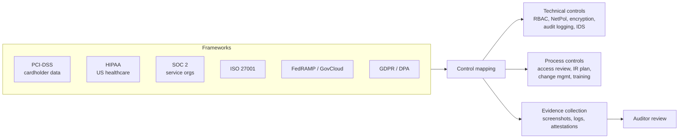

# 12 - Compliance

Compliance frameworks aren't a list of K8s settings — they're control objectives. You map your existing security controls to those objectives and produce evidence.

## Framework landscape

<!-- mermaid:rendered -->

Mermaid source

## K8s control → framework mapping (selected)

| K8s control | PCI-DSS | HIPAA | SOC 2 |
|-------------|---------|-------|-------|
| RBAC + audit | 7.x, 10.x | §164.308(a)(4) | CC6.1, CC6.3 |
| etcd encryption at rest | 3.4 | §164.312(a)(2)(iv) | CC6.7 |
| mTLS in mesh | 4.1 | §164.312(e)(1) | CC6.7 |
| NetworkPolicy segmentation | 1.x | §164.308(a)(4) | CC6.6 |
| Image signing + admission | 6.4 | §164.308(a)(5) | CC8.1 |
| Audit log → SIEM | 10.x | §164.312(b) | CC7.2 |
| Secrets management | 8.2 | §164.312(d) | CC6.1 |
| Vulnerability scanning | 6.2, 11.2 | §164.308(a)(8) | CC7.1 |

## Audit logging

The api-server's audit subsystem produces JSON events for every API call. Configure with `--audit-policy-file` and `--audit-log-path` (or webhook to SIEM).

See `audit-policy.yaml` — the canonical "log enough but not too much" policy.

Levels:
- `None` — drop event
- `Metadata` — request metadata only (who/what/when, not body)
- `Request` — metadata + request body (no response)
- `RequestResponse` — full body both ways

Rule of thumb:
- Secrets / TokenReviews → `Metadata` (never log the body!)
- Pods/exec/portforward → `RequestResponse` (forensics)
- Read-only verbs on non-sensitive resources → `None` (volume control)

## Tooling

| Tool | Use |
|------|-----|
| **kube-bench** | CIS benchmark evidence |
| **Trivy / Grype** | Vuln scan reports |
| **Falco** | Runtime detection logs |
| **OPA Gatekeeper / Kyverno** | Policy attestation — every workload screened |
| **Open Policy Agent (general)** | Cross-system compliance evaluation |
| **Steampipe / CloudQuery** | Cloud config evidence |
| **Wiz / Lacework / Prisma** | Commercial CSPM with framework mappings |

## Files
- `audit-policy.yaml` — production-ready audit policy

## Practical tips

1. **Automate evidence**: every report should be reproducible from a script. Manual screenshots = audit hell.
2. **Treat policies as code**: every Kyverno/Gatekeeper policy *is* a control attestation.
3. **Pre-stage scope**: PCI/HIPAA workloads in dedicated clusters or namespaces with stricter controls — avoid scoping the entire org.
4. **Continuous, not point-in-time**: SOC 2 Type 2 needs operating effectiveness over months, not one-off snapshots.
